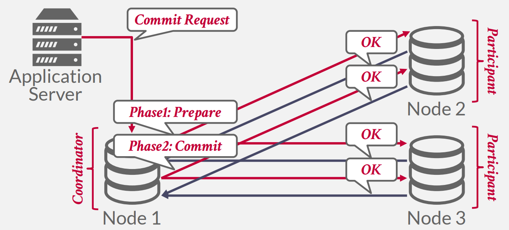
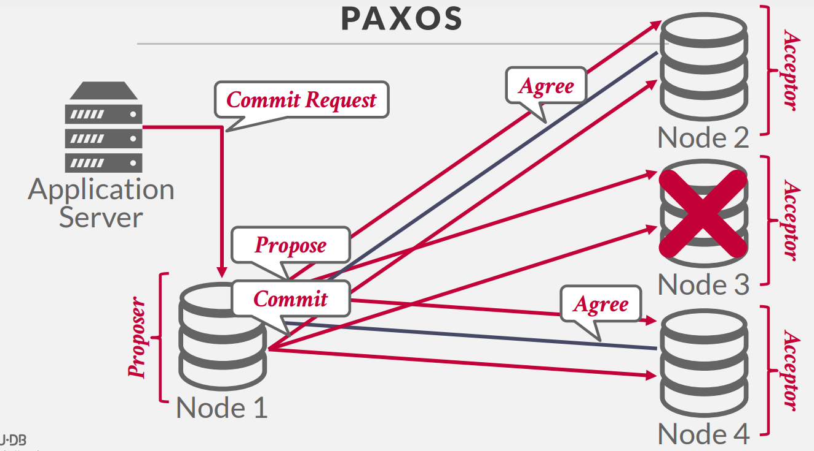
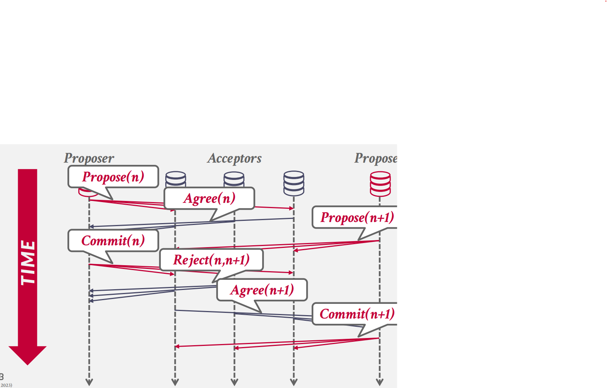

## **OLTP VS. OLAP**

联机事务处理 (OLTP) 的工作负载的特点是：

- 短暂的读/写事务。通常事务运行在 50ms 以内，超过这个时间的事务我们就认为它是长时间运行的事务。

- 只涉及较少的数据。

- 重复操作。重复的 SQL 更方便进行查询优化

在线分析处理（OLAP）的工作负载的特点是：

- 长时间运行的只读查询。分析操作可能涉及表中几乎所有的数据。

- 复杂的连接。分析操作也可能涉及库中几乎所有的表。

- 探索性查询。每次数据分析的目的可能都不同，所以每次的 SQL 可能都不一样，所以难以进行 SQL 的定向优化。

因为两种系统的工作负载的不同，涉及分布式系统时的决策也会有所不同，本篇讨论分布式 OLTP 系统的设计。。

我们会在 Decentralized Coordinator 环境下讨论本节的内容。即：有一个应用程序和多个数据分区，这些分区之一被选为主节点，交易的开始请求从应用程序到主节点，查询将直接发送到各个节点。提交请求从应用程序服务器转到主节点，并且主节点负责收集所有参与节点的提交意见，如果所有参与的节点都同意可以安全地提交，那么我们可以 commit 交易。使用 2PL、MVCC、OCC 或其他策略来确定是否可以在每个节点上安全地进行交易。

<figure markdown="span">
    { width="550" }
</figure>

以下各节将讨论如何确保所有节点都认同事务提交，如何确保所有节点在同意之后成功执行了提交，以及如果节点宕机/消息延迟/系统可能不会等待所有节点都同意的情况下如何处理。

首先假设所有节点都是可信任的，不会做出损害系统的行为。如果我们不能信任其它节点，就需要 Byzantine Fault Tolerant 协议来实现分布式事务，大部分分布式系统都不需要考虑这个问题，除了区块链，但没有人会在区块链上运行一个系统来处理事务。

我们将讨论：

- Replication

- Atomic Commit Protocols

- Consistency Issues (CAP)

- Federated Databases

## **Replication**

DBMS 可以添加冗余节点来复制数据以提高可用性。复制的方式有两种：Primary-Replica 和 Multi-Primary。

在 Primary-Replica 中，对每个数据对象的更新操作都会被发送到主副本中，在主副本一般会通过 WAL 将修改传递到其他副本中(无需使用 atomic commit protocol)。如果不需要最新信息，则可以允许只读事务访问副本。如果主数据库出现故障，则举行选举以选择新的主数据库。

在 Multi-Primary 中，事务可以更新任何副本上的数据对象。副本必须使用原子提交协议相互同步。

<figure markdown="span">
    { width="550" }
</figure>

### **K-Safety**

K-safty 指的是同步复制节点 (In-sync Replica) 数量与复制数据库的容错性的关系。通常如果同步复制节点小于 K 个，数据库就会停止接收新请求，直到同步复制节点的数量重新满足要求。K 的大小取决于你对数据丢失的容忍度。

### **Propagation Scheme**

当事务在复制的数据库上提交时，DBMS 决定是否必须等待该事务的更改传播到其他节点，然后才能将确认发送到应用程序客户端。有两个传播级别：Synchronous（强一致性）和 Asynchronous（最终一致性）。

在 Synchronous 方案中，主节点将更新发送到副本，然后等待它们确认它们已完全应用（即记录）更改。然后，主服务器可以通知客户端更新成功。它保证了 DBMS 不会因为强一致性而丢失任何数据。这在传统的 DBMS 中更为常见。

在 Asynchronous 方案中，主节点立即将确认返回给客户端，而无需等待副本应用更改。在此方法中，可能会出现过时的读取，因为在发生读取时，更新可能无法完全应用于副本。如果可以容忍一些数据丢失，则此选项可能是一种可行的优化。这在 NoSQL 系统中常用。

### **Propagation Timing**

主节点将日志同步给复制节点的时机。

- Continuous：对于连续传播计时，主副本在生成日志消息时立即发送日志消息到其他副本中。DBMS 还需要将事务提交或中止的信息也传播给复制节点，保证事务在复制节点也能统一提交或中止。缺点在于：如果事务最终中止，那么复制节点就做了无用功。大多数系统都使用此方法。

- On Commit：DBMS 只在一个事务彻底执行完成时才将日志传播给复制节点，这样如果事务中止，复制节点就什么事都不用做。缺点在于，由于需要等待事务结束时才同步数据，整体同步效率较低。

### **Active vs Passive**

主节点与复制节点执行事务的顺序。

- Active-Active：事务同时在多个复制节点上独立执行，在执行结束时需要检查两边数据是否一致。

- Active-Passive：事务先在一个复制节点上执行，然后将数据的变动传播给其它复制节点。大部分系统采用这种方式。

## **Atomic Commit Protocols**

当多节点事务完成时，DBMS 需要询问所有涉及的节点是否可以安全地提交。根据协议，可能需要大多数节点或所有节点来提交。示例包括：

- Two-Phase Commit (1970s)

- Three-Phase Commit (1983)

- Viewstamped Replication (1988)

- Paxos (1989)

- ZAB (2008? Zookeeper Atomic Broadcast protocol, Apache Zookeeper)

- Raft (2013)

本课讨论 2PC 和 Paxos

### **Two-Phase Commit**

应用程序在发送事务提交请求到其选取的 master node/coordinator (下文称 coordinator) 后，进入 2PC 的第一阶段：准备阶段 (Prepare Phase)

<figure markdown="span">
    { width="550" }
</figure>

coordinator 向其它节点发送 prepare 请求，待所有节点回复 OK 后，进入第二阶段：提交阶段 (Commit Phase)

<figure markdown="span">
    { width="550" }
</figure>

待所有节点在本地提交，并返回 OK 后，coordinator 返回成功消息给应用程序。

<figure markdown="span">
    { width="550" }
</figure>

在 Prepare 阶段，其它节点如果无法执行该事务，则返回 Abort 消息，此时 coordinator 可以立即将事务中止的信息返回给应用程序，同时向所有节点发送事务中止请求，coordinator 需要保证所有节点的事务全部回滚：

<figure markdown="span">
    { width="550" }
</figure>

2PC 有两个优化技巧：

- Early Prepare Voting：假如你向远端节点发送的请求是最后一个 (尚未发送提交请求)，远端节点就可以利用这个信息直接在最后一次响应后返回 Prepare 阶段的响应，即直接告诉 coordinator 事务是否可以提交。类似网络中的捎带应答。

- Early Acknowledgement After Prepare：实际上在准备阶段完成后，如果所有节点都已经回复 OK，即认为事务可以安全提交，此时 coordinator 可以直接回复应用程序事务提交已经成功。这符合 2PC 的语义，只要 Prepare Phase 通过，那么所有节点必须保证能够提交事务，Commit Phase 无论如何必须执行成功。

对于**Fault Tolerant**：

在 2PC 的任何阶段都可能出现节点崩溃。如何容错是 2PC 需要解决的重要问题。首先，所有节点都会将自己在每个阶段所做的决定落盘，类似 WAL，然后才将这些决定发送给其它节点。这就保证了每个节点在发生故障恢复后，能知道自己曾经做过怎样的决定。在 coordinator 收到所有其它节点 Prepare 节点的 OK 响应后，且 coordinator 将事务可以进入 Commit 阶段的信息写入日志并落盘后，这个事务才真正被认为已经提交。

如果 coordinator 在 Commit Phase 开始之前发生故障，那么其实该事务相关的任何改动都未落盘，不会产生脏数据，coordinator 在故障恢复后可以继续之前的工作；如果 coordinator 在 Commit Phase 开始之后发生故障，其它节点需要等待 coordinator 恢复，或用其它方式确定新的 coordinator，接替之前的 coordinator 完成剩下的工作。

如果 participant 在 Commit Phase 之前发生故障，那么 coordinator 可以简单地利用超时机制来直接认为事务中止；如果在 Commit Phase 之后发生故障，那么 coordinator 需要通过不断重试，保证事务最终能够完成。

由于 2PC 中许多决定都依赖于所有节点的参与，可能会出现 live lock，影响事务的推进效率，于是就有了共识算法。

### **Paxos**

paxos 属于共识协议，coordinator 负责提交 commit 或 abort 指令，participants 投票决定这个指令是否应该执行。与 2PC 相比，paxos 只需要等待大多数 participants 同意，因此在时延上比 2PC 更有保障。

我们可以将 2PC 理解成是 Paxos 的一种特殊情况。接下来我们看一下 Paxos 的工作过程。在 Paxos 中，coordinator 被称为 proposer，participants 被称为 acceptors。

paxos 需要存在多数节点，因此我们这里有 3 个 acceptors。应用程序首先向 proposer 发起事务提交请求

<figure markdown="span">
    { width="550" }
</figure>

然后 proposer 向所有节点发出 Propose，类似 2PC 的 Prepare 阶段，但与 2PC 不同，节点回复 Agree 时无需保证事务肯定能执行完成，此外如果其中一个 acceptor (Node 3) 发生故障，proposer 依然获得了大多数节点的同意，不会阻碍 Paxos 协议的推进。获得多数节点同意后，proposer 就会继续向所有节点发送 Commit 请求：

仅当多数节点回复 Accept 后 proposer 才能确定事务提交成功，回复给应用程序。

<figure markdown="span">
    { width="550" }
</figure>

即使在 Commit 阶段，每个 acceptor 仍然可以拒绝请求。举例如下：

<figure markdown="span">
    { width="550" }
</figure>

假设有两个 Proposer 同时存在，这是 proposer 1 提出逻辑时刻为 n 的 proposal，随后所有 acceptors 都回复 agree。

<figure markdown="span">
    { width="550" }
</figure>

随后 proposer 2 提出逻辑时刻为 n+1 的 proposal，接着 proposer 1 发起逻辑时刻为 n 的 commit 请求。由于 acceptors 收到了逻辑时刻更新的请求，因此它们拒绝 proposer 1 的请求：

<figure markdown="span">
    { width="550" }
</figure>

随后 proposer 2 完成剩下的协议步骤，成功提交事务：

<figure markdown="span">
    { width="550" }
</figure>

有没有可能出现两个 proposer 互相阻塞对方，导致 commit 永远不成功？这时就需要 Multi-Paxos。

**Multi-Paxos**：

如果系统中总是有任意数量的 proposer，达成共识就可能变得比较困难，那么我们是不是可以先用一次 Paxos 协议选举出 Leader，确保整个系统中只有一个 proposer，然后在一段时间内，它在提交事务时就不需要 Propose 操作，直接进入 Commit 即可。这样就能大大提高 Paxos 达成共识的效率。到达一段时间后，proposer 的 Leader 身份失效，所有参与者重新选举。

你可能会问，每次选举的时候会不会出现互相阻塞的现象？如果在实践上我们用一些合理的优先和随机退后 (backoff) 机制，就可以减少阻塞的次数，概率上保证选举能够最终成功。类似以太网协议中避免占用信道的方式。

## **CAP Theorem**

CAP 定理由 Eric Brewer 提出，后来于 2002 年在麻省理工学院得到证明，它解释说分布式系统不可能始终保持一致性（Consistent）、可用性（Available）和分区容忍（Partition Tolerant），只能保证这三个属性中的两个。

- Consistent：在一次更新操作 commit 后，所有的拷贝节点读到的数据都应该是最新的。NoSQL 系统为了支持后两者而牺牲了这一属性。其他系统将偏爱此属性和后两者之一。

- Availability：可用性是指所有处于运行状态的节点均能够处理全部请求。

- Partition tolerance：即使在节点间的数据交互出现一些错误，但系统仍然可以正常运行。

现代理论中存在一个权衡一致性与延迟的扩展版本：PACELC 定理。当分布式系统中发生网络分区（P，Partitioning）时，系统必须在可用性（A，Partitioning）和一致性（C，Consistency）之间做出选择；否则（E，Else），即使系统在无网络分区的正常运行状态下，也需要在延迟（L，Latency）和一致性（C，Consistency）之间进行取舍。

- 分区场景：若某数据库集群因网络中断分成两组节点，选择 A 则允许两组独立处理请求（数据可能不一致），选择 C 则暂停部分服务以维持数据一致性。

- 无分区场景：若需强一致性（如金融交易），可能需增加同步操作的延迟；若需低延迟（如实时聊天），可能需放宽一致性（如最终一致性）。