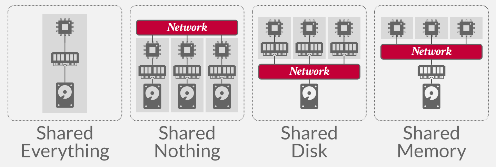

## **Distributed DBMSs**

分布式 DBMS 将单个逻辑数据库划分为多个物理资源。应用程序（通常）不知道数据分布在不同的硬件上。该系统依赖于单节点DBMS的技术和算法来支持分布式环境中的事务处理和查询执行。设计分布式 DBMS 的一个重要目标是容错（即避免单个节点故障导致整个系统瘫痪）。

当我们在谈论分布式数据库时，首先要明确什么是分布式系统：如果通信成本和通信的可靠性问题不可忽略，就是分布式系统。这也是区分 Parallel DBMS 和 Distributed DBMS 的依据所在：

|Parallel DBMSs|Distributed DBMSs|
|:-:|:-:|
|不同节点在物理上隔得很近|不同节点在物理上可能隔得很远
|不同节点通过高速局域网连接|不同节点通过普通公共网络相连接
|通信成本很小，基本不会产生问题|通信成本和通信问题不可忽略

## **System Architectures**

DBMS 的系统架构指定了 CPU 可以直接访问哪些共享资源。它影响 CPU 之间的协调方式以及它们在数据库中检索和存储对象的位置。

单节点 DBMS 使用所谓的 shared everything 架构。该单个节点使用其自己的本地内存地址空间和磁盘在本地 CPU 上执行工作程序。还有其他三种分布式架构：Shared Memory、Shared Disk、Shared Nothing：

<figure markdown="span">
    { width="750" }
</figure>

### **Shared Nothing**

在 *shared nothing* 环境中，每个节点都有自己的 CPU、内存和磁盘。节点之间仅通过网络进行通信。在云存储平台兴起之前，无共享架构曾经被认为是构建分布式DBMS的正确方法。

这种架构有更好的性能，并且比其他类型的分布式 DBMS 架构更高效。但是也有缺点：

- 很难扩容。在扩容时，DBMS 需要在不同节点间迁移、均衡数据，同时要保证服务在线，且数据一致，可以想象其复杂性。

- 确保系统一致性也很难，因为节点必须在事务状态上相互协调

使用 Shared Nothing 架构的数据库有很多，罗列如下：

<figure markdown="span">
    { width="750" }
</figure>

### **Shared Disk**

在共享磁盘架构中，所有CPU都可以通过互连直接读取和写入单个逻辑磁盘，但每个CPU都有自己的私有内存。每个计算节点上的本地存储可以充当缓存。这种方法在基于云的 DBMS 中更为常见。

DBMS 的执行层可以独立于存储层进行扩展。添加新的存储节点或执行节点不会影响另一层数据的布局或位置。

节点必须在它们之间发送消息以了解其他节点的当前状态。也就是说，由于存储器是本地的，如果数据被修改，则在该数据块位于其他CPU的主存储器中的情况下，必须将变化传送到其他CPU。

节点有自己的缓冲池，被认为是无状态的。节点崩溃不会影响数据库的状态，因为数据库单独存储在共享磁盘上。存储层在发生崩溃时保留状态。

<figure markdown="span">
    { width="750" }
</figure>

### **Shared Memory**

在 Shared Memory 架构下，不同的 CPU 通过网络访问同一块内存空间，每个 CPU 中都能看到所有内存数据结构，每个 DBMS 实例都知道其它实例的所有情况。这种架构实际上只出现在一些大型机上，在云原生环境下几乎见不到。

## **Design Issues**

分布式 DBMS 旨在保持数据透明度，这意味着用户不需要知道数据的物理位置，或者表如何分区或复制。数据存储方式的详细信息对应用程序是隐藏的。换句话说，在单节点 DBMS 上运行的 SQL 查询在分布式 DBMS 上应该同样运行。

分布式数据库系统必须解决的关键设计问题如下：

- 应用程序如何查找数据？

- 如何对分布式数据执行查询？是否应该将查询推送到数据所在的位置？或者应该将数据集中到一个公共位置来执行查询？

- DBMS 如何保证正确性？

另一个需要做出的设计决策涉及决定节点如何在集群中交互。有两种选择：同构节点和异构节点，它们都在现代系统中使用。

- **同质节点(Homogeneous Nodes)**:集群中的每个节点都可以执行相同的任务集（尽管可能在不同的数据分区上），这非常适合无共享架构。这使得配置和故障转移变得“更容易”。失败的任务将分配给可用节点。

- **异构节点(Heterogeneous Nodes)**:节点被分配了特定的任务，因此节点之间必须进行通信才能执行给定的任务。这允许单个物理节点托管多个“虚拟”节点类型来执行专用任务，这些任务可以独立地从一个节点扩展到另一个节点。 MongoDB 就是一个例子，它具有将查询路由到分片的路由器节点和存储从键到分片的映射的配置服务器节点。

<figure markdown="span">
    { width="750" }
</figure>

在 MongoDB 集群中有 3 种角色，Router、Config Server 以及 Shard。所有请求都打到 Router 上，Router 从 Config Server 中获取路由信息，即哪些数据存放在哪些分片上，然后根据这些路由信息将请求发送到对应的分片上执行。

## **Partitioning Schemes**