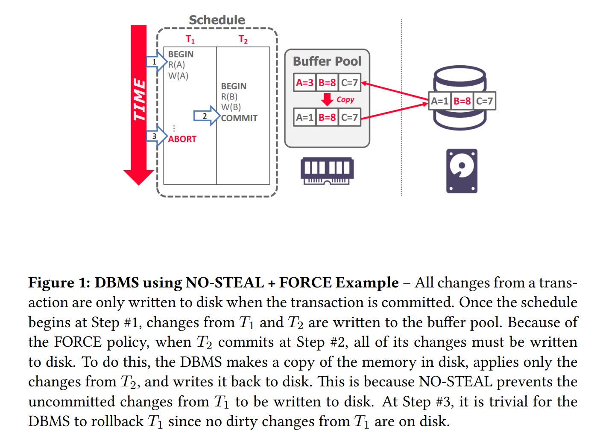
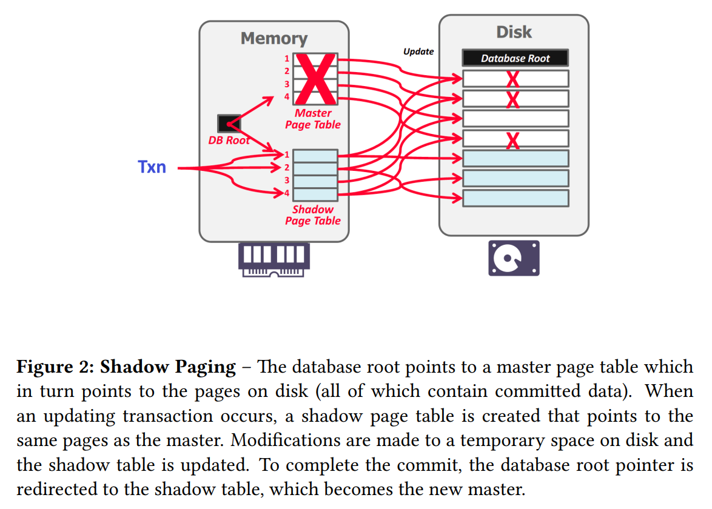

## **Crash Recovery**

恢复算法是在出现故障的情况下，确保数据库一致性、事务原子性和持久性的技术。当崩溃发生时，内存中所有尚未提交到磁盘的数据都有丢失的风险。恢复算法可防止崩溃后的信息丢失。

每个恢复算法都有两部分：

- 事务正常处理期间确保 DBMS 能够从故障中恢复的操作。

- 在出现错误后，讲 DBMS 恢复到满足一致性、原子性和持久性的操作。

恢复算法中使用的关键原语是 UNDO 和 REDO。但并非所有算法都使用这两种原语。

**UNDO**：消除不完整或中止事务影响的过程。

**REDO**：重新应用已提交事务的效果以实现持久性的过程。

## **Storage Types**

- Volatile Storage，易失性存储
  

<space><space> 断电或程序退出后数据不会保留。 如：DRAM, SRAM。

- Non-Volatile Storage，非易失性存储

<space><space> 断电或程序存在后数据仍然存在。如：HDD、SDD。

- Stable Storage，稳定存储

<space><space> 一种不存在的非易失性存储形式，可以在所有可能的故障情况下幸存下来。通常使用多个存储设备进行近似。一种理想情况。

## **Failure Classification**

由于 DBMS 根据底层存储设备分为不同的组件，因此 DBMS 需要处理许多不同类型的故障。其中一些故障是可以恢复的，而另一些则是不可恢复的。

### **Transaction Failures**

当事务发生错误且必须中止时，就会发生事务失败。可能导致事务失败的两种错误是逻辑错误和内部状态错误。

逻辑错误：由于某些内部错误情况（例如完整性、约束违规），事务无法完成。

内部状态错误：由于错误情况（例如死锁），DBMS 必须终止活动事务

### **System Failures**

系统故障是承载 DBMS 的底层软件或硬件中的意外故障。这些故障必须在崩溃恢复协议中加以考虑。

软件故障：DBMS 实现存在问题（例如，未捕获的被零除异常），系统必须停止。

硬件故障：托管 DBMS 的计算机崩溃（例如，电源插头被拔掉）。我们假设非易失性存储内容不会因系统崩溃而损坏。这称为“故障停止”假设并简化了进程恢复。

### **Storage Media Failure**

存储介质故障是指物理存储设备损坏时发生的不可修复的故障。当存储介质发生故障时，必须从存档版本恢复DBMS。 DBMS 无法从存储故障中恢复，需要人工干预。

不可修复的硬件故障：磁头崩溃或类似的磁盘故障会破坏全部或部分非易失性存储。假定破坏是可检测到的。

## **Buffer Pool Management Policies**

DBMS需要确保以下保证：

- 一旦 DBMS 告诉某人它已提交，任何事务的更改都是持久的。

- 如果事务中止，则任何部分更改都不会持久。

窃取策略指示 DBMS 是否允许未提交的事务覆盖非易失性存储中对象的最近提交的值（事务是否可以将属于不同事务的未提交的更改写入磁盘？）。

- 偷窃：允许
- 禁止偷窃：不允许。

强制策略指示 DBMS 在事务提交时，是否需要所有的修改都刷新到非易失性存储中：

- FORCE: Is required，如果选择强制，每次事务提交都必须将数据落盘，数据一致性可以得到完美保障，但 I/O 效率较低；

- NO-FORCE: Is not required，如果选择非强制，DBMS 则可以延迟批量地将数据落盘，数据一致性可能存在问题，但 I/O 效率较高。

最容易实施的缓冲池管理策略称为 NO-STEAL + FORCE。在此策略中，DBMS 永远不必撤消中止事务的更改，因为更改不会写入磁盘。它也永远不需要重做已提交事务的更改，因为所有更改都保证在提交时写入磁盘。Figure 1 显示了 NO-STEAL + FORCE 的示例。

<figure markdown="span">
    { width="650" }
</figure>

NO STEAL + FORCE 的限制是事务需要修改的所有数据（即写入集）内存中必须放的下。否则，该事务无法执行，因为在事务提交之前不允许 DBMS 将脏页写入磁盘。

## **Shadow Paging**

影子分页是对 NO STEAL + FORCE 的改进，其中 DBMS 在写入时复制页面以维护数据库的两个单独版本：

- master：仅包含已提交交易的更改。

- shadow：临时数据库，其中包含未提交事务所做的更改。

更新仅在卷影副本中进行。当事务提交时，卷影副本会自动切换为新的主副本。老 master 最终会被垃圾回收。这是 NO-STEAL + FORCE 系统的示例。图 2 显示了影子分页的高级示例。

<figure markdown="span">
    { width="650" }
</figure>

