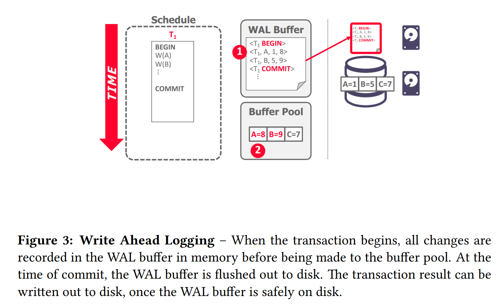

## **Crash Recovery**

恢复算法是在出现故障的情况下，确保数据库一致性、事务原子性和持久性的技术。当崩溃发生时，内存中所有尚未提交到磁盘的数据都有丢失的风险。恢复算法可防止崩溃后的信息丢失。

每个恢复算法都有两部分：

- 事务正常处理期间确保 DBMS 能够从故障中恢复的操作。

- 在出现错误后，讲 DBMS 恢复到满足一致性、原子性和持久性的操作。

恢复算法中使用的关键原语是 UNDO 和 REDO。但并非所有算法都使用这两种原语。

**UNDO**：消除不完整或中止事务影响的过程。

**REDO**：重新应用已提交事务的效果以实现持久性的过程。

## **Storage Types**

- Volatile Storage，易失性存储
  

<space><space> 断电或程序退出后数据不会保留。 如：DRAM, SRAM。

- Non-Volatile Storage，非易失性存储

<space><space> 断电或程序存在后数据仍然存在。如：HDD、SDD。

- Stable Storage，稳定存储

<space><space> 一种不存在的非易失性存储形式，可以在所有可能的故障情况下幸存下来。通常使用多个存储设备进行近似。一种理想情况。

## **Failure Classification**

由于 DBMS 根据底层存储设备分为不同的组件，因此 DBMS 需要处理许多不同类型的故障。其中一些故障是可以恢复的，而另一些则是不可恢复的。

### **Transaction Failures**

当事务发生错误且必须中止时，就会发生事务失败。可能导致事务失败的两种错误是逻辑错误和内部状态错误。

逻辑错误：由于某些内部错误情况（例如完整性、约束违规），事务无法完成。

内部状态错误：由于错误情况（例如死锁），DBMS 必须终止活动事务

### **System Failures**

系统故障是承载 DBMS 的底层软件或硬件中的意外故障。这些故障必须在崩溃恢复协议中加以考虑。

软件故障：DBMS 实现存在问题（例如，未捕获的被零除异常），系统必须停止。

硬件故障：托管 DBMS 的计算机崩溃（例如，电源插头被拔掉）。我们假设非易失性存储内容不会因系统崩溃而损坏。这称为“故障停止”假设并简化了进程恢复。

### **Storage Media Failure**

存储介质故障是指物理存储设备损坏时发生的不可修复的故障。当存储介质发生故障时，必须从存档版本恢复DBMS。 DBMS 无法从存储故障中恢复，需要人工干预。

不可修复的硬件故障：磁头崩溃或类似的磁盘故障会破坏全部或部分非易失性存储。假定破坏是可检测到的。

## **Buffer Pool Management Policies**

DBMS需要确保以下保证：

- 一旦 DBMS 告诉某人它已提交，任何事务的更改都是持久的。

- 如果事务中止，则任何部分更改都不会持久。

窃取策略指示 DBMS 是否允许未提交的事务覆盖非易失性存储中对象的最近提交的值（事务是否可以将属于不同事务的未提交的更改写入磁盘？）。

- 偷窃：允许
- 禁止偷窃：不允许。

强制策略指示 DBMS 在事务提交时，是否需要所有的修改都刷新到非易失性存储中：

- FORCE: Is required，如果选择强制，每次事务提交都必须将数据落盘，数据一致性可以得到完美保障，但 I/O 效率较低；

- NO-FORCE: Is not required，如果选择非强制，DBMS 则可以延迟批量地将数据落盘，数据一致性可能存在问题，但 I/O 效率较高。

最容易实施的缓冲池管理策略称为 NO-STEAL + FORCE。在此策略中，DBMS 永远不必撤消中止事务的更改，因为更改不会写入磁盘。它也永远不需要重做已提交事务的更改，因为所有更改都保证在提交时写入磁盘。Figure 1 显示了 NO-STEAL + FORCE 的示例。

<figure markdown="span">
    { width="650" }
</figure>

NO STEAL + FORCE 的限制是事务需要修改的所有数据（即写入集）内存中必须放的下。否则，该事务无法执行，因为在事务提交之前不允许 DBMS 将脏页写入磁盘。

## **Shadow Paging**

影子分页是对 NO STEAL + FORCE 的改进，其中 DBMS 在写入时复制页面以维护数据库的两个单独版本：

- master：仅包含已提交交易的更改。

- shadow：临时数据库，其中包含未提交事务所做的更改。

### **Implementation**

更新仅在卷影副本中进行。当事务提交时，卷影副本会自动切换为新的主副本。老 master 最终会被垃圾回收。这是 NO-STEAL + FORCE 系统的示例。Figure 2 是影子分页的示例。

<figure markdown="span">
    { width="750" }
</figure>

DBMS 以树形结构组织数据库页，其中根是单个磁盘页。树有两个副本，主副本和影子副本。根始终指向当前的主副本。当事务执行时，它仅对卷影副本进行更改。

正在写入的事务，会将修改应用在 Shadow Page 上，当事务提交时，会将根指针指向影子副本，使得影子副本变为主副本。为了提高效率，DBMS 不会复制整个数据库，只需要复制有变动的部分即可，即 copy-on-write。

**Recovery：**

- Undo：删除影子页即可。
  
- Redo：不需要做。因为在commit后会立即落盘。

**Disadvantages：**

**复制 page 代价较大**，尽管可以通过以下措施来降低这种代价：

  - 需要使用类似 B+ 树的数据结构来组织 page table

  - 无需复制整个树状架构，只需要复制到达有变动的叶子节点的路径即可

**事务提交的代价较大**：

  - 需要将所有发生更新的 data page、page table 以及根节点都落盘，会导致很多的随机写操作。

  - 容易产生磁盘碎片，使得原先距离近的数据渐行渐远

  - 需要做垃圾收集

  - 只支持一个写事务或一批写事务一次性持久化

### **Journal File**

SQLite 在 2010 年之前，就使用了一种 Shadow Paging 的变体 —— Journal File，之后 SQLite 改为使用 WAL（Write-Ahead Log）。

当事务修改页面时，DBMS 会在覆盖主版本之前将原始页面复制到单独的日志文件中。重新启动后，如果日志文件存在，则 DBMS 会恢复它以撤消未提交事务的更改。

## **Write-Ahead Logging（STEAL + NO-FORCE）**

通过预写日志记录，DBMS 在对磁盘页面进行更改之前，将对数据库所做的所有更改记录在日志文件（稳定存储上）中。该日志包含足够的信息来执行必要的 undo 和 redo 操作，以便在崩溃后恢复数据库。 DBMS 必须先将与对数据库对象所做的更改相对应的日志文件记录写入磁盘，然后才能将该对象刷新到磁盘。

在影子分页中，DBMS 需要对磁盘上的随机非连续页执行写入操作。预写日志记录允许 DBMS 将随机写入转换为顺序写入以优化性能。因此，几乎每个 DBMS 都使用预写日志记录 (WAL)，因为它具有最快的运行时性能。但是 DBMS 使用 WAL 的恢复时间比影子分页慢，因为它必须重播日志。

<figure markdown="span">
    { width="750" }
</figure>

### **Implementation**

DBMS 首先将事务的日志记录存储在易失性存储中，只有当所有的日志写入非易失性存储器中之后，才允许脏的数据页覆盖非易失性存储器中的数据。只有事务的所有日志都存储到非易失性存储器中，事务才会被视为 commited。

当事务开始时，为每个事务在日志中写入一条记录 `<BEGIN>` 以标记其起始点。

当事务完成时，将 `<COMMIT>` 记录写入日志，并确保所有日志记录都刷新之后，向应用程序返回成功提交。

每个日志条目包含倒回或重播对单个对象的更改所需的信息：

- Transaction ID

- Object ID.

- Before Value (used for UNDO)

- After Value (used for REDO)

DBMS 必须将事务的所有日志条目刷新到磁盘，然后才能告诉外界事务已成功提交，导致事务必须等待磁盘 IO。系统可以使用**“组提交”**优化来批量处理多个日志刷新，以均摊开销。只有当提交的事务组已满或设置的最长等待时间用尽，多个事务的提交会一并被写入磁盘，这样可以将多次分开的 IO，合并成一次 IO，从而提高系统吞吐。

### **Log-Structured Systems**

在日志结构的 DBMS 中，事务的日志记录被写入称为 MemTable 的内存缓冲区中。当该缓冲区已满时，会将其刷新到磁盘。这种方法仍然需要一个独特的预写日志。这是因为 WAL 的刷新通常比 MemTable 的刷新更频繁，并且 WAL 可能包含未提交的事务。 WAL 可用于在从崩溃中恢复时，重新创建内存中的 MemTable。如 LSM 就是 Log-Structured Systems。

## **Logging Schemes**

日志记录的内容可能因实现而异。

**Physical Logging**
  
- 记录对数据库中特定位置所做的字节级更改。

- 可能会受 record 位置变动的影响。

- 示例：git diff

**Logical Logging**

- 指的是记录逻辑操作内容，如 UPDATE、DELETE 和 INSERT 语句等等。

- 与物理日志记录相比，每条日志记录需要写入的数据更少，因为每条记录可以更新多个页面上的多个元组。然而，在非确定性并发控制方案中，当存在并发事务时，很难通过逻辑日志来实现恢复，因为很难确定故障时正在执行的语句已经修改了哪部分数据
  
- 并且恢复也需要更长的时间，因为必须重新执行每个事务。

**Physiological Logging**

这是一种混合策略。这种方案不会像 physical logging 一样记录 xx page xx 偏移量上的数据发生 xx 改动，而是记录 xx page 上的 id 为 xx 的数据发生 xx 改动，前者需要关心 data page 在磁盘上的布局，后者则无需关心。

<figure markdown="span">
    { width="750" }
</figure>

Physiological Logging 是 DBMS 中最常用的方法。

## **Checkpoints**

基于 WAL 的 DBMS 的主要问题是日志文件将永远增长。崩溃后，DBMS 必须重播整个日志，如果日志文件很大，这可能需要很长时间。因此，DBMS 可以定期采取检查点，将所有缓冲区刷新到磁盘。

DBMS 采取检查点的频率取决于应用程序的性能和停机时间要求。过于频繁地设置检查点会导致 DBMS 的运行时性能下降。但在检查点之间等待很长时间也可能同样糟糕，因为系统重新启动后的恢复时间会增加。需要根据场景来权衡。

### **Blocking Checkpoint Implementation**

- DBMS 停止接受新事务并等待所有活动事务完成。

- 将当前驻留在主内存中的所有日志记录和脏块刷新到稳定存储。

- 将 `<checkpoint>` 条目写入日志并刷新到稳定存储。

### **Recovery**

对于 checkpoint 以前的事务不需要检查，checkpoint 之后的数据，已经提交的事务，要进行 REDO，还未提交的数据，要进行 UNDO。

如右例：

- 对于 $T1$，我们不做任何操作，因为它在 checkpoint 之前，已经写入非易失性存储器中了。
  
- 对于 $T2$ 已提交的事务，要进行 REDO，因为它已经报告给用户事务已经持久化。
  
- 对于 $T3$ 需要 undo，因为它在 crash 之前尚未 commit，即尚未告诉用户事务提交成功。

