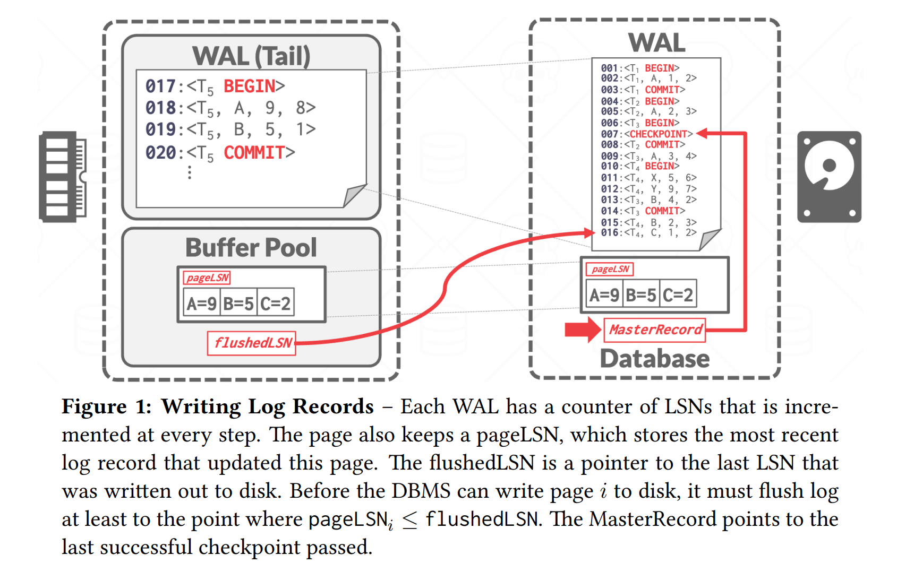
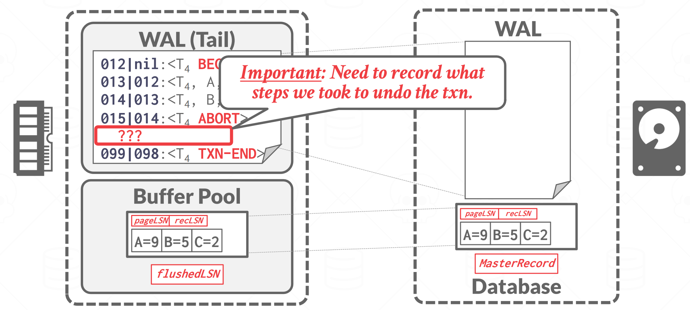
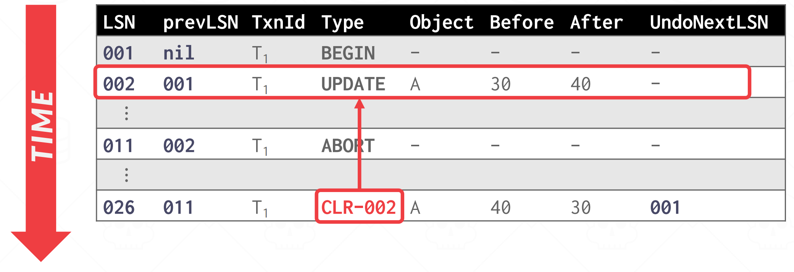
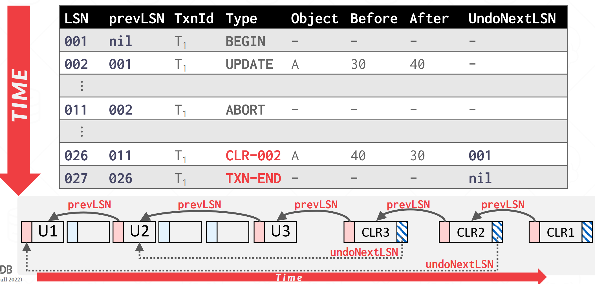

## **Crash Recovery**

DBMS 依靠其恢复算法来确保数据库一致性、事务原子性和故障时的持久性。每个恢复算法由两部分组成：

- 正常事务处理期间确保 DBMS 能够从故障中恢复的操作

- 将数据库恢复到确保事务的原子性、一致性和持久性的状态失败后的操作（本节）。

数据库弹性的关键是事务完整性和持久性的管理，特别是在故障情况下。这一基本概念为 ARIES 恢复算法的引入奠定了基础。

Algorithms for Recovery and Isolation Exploiting Semantics (ARIES) 是 IBM 研究中心在 20 世纪 90 年代初为 DB2 系统开发的恢复算法。到如今 ARIES 依旧是大部分 DBMS 首选的 Recovery Algorithms。

ARIES 恢复协议中有三个关键概念：

- **Write Ahead Logging**：在将数据库更改写入磁盘之前，任何更改都会记录在稳定存储上的日志中（STEAL + NO-FORCE）。

- **Repeating History During Redo**：重新启动时，回溯操作并将数据库恢复到崩溃之前的正确状态。

- **Logging Changes During Undo**：在 undo 过程中记录 undo 操作到日志中，确保在恢复期间再次出现故障时不会执行多次相同的 undo 操作

## **WAL Records**

我们需要扩展我们的 WAL Records 格式，以包含全局唯一的 log sequence number  (LSN)。DBMS 中很多组件都会记录多种 LSN，如：

|Name|Where|Definition|
|:-:|:-:|:-:|
|flushedLSN|memory|最后落盘的那个 LSN
|pageLSN|page|与某 page data 相关的最新的 LSN
|recLSN|page|该页在上次落盘之后，对该页进行修改的第一个 LSN 
|lastLSN|transaction|某事务最后一条日志的 LSN
|MasterRecord|disk|最近一次 checkpoint 的 LSN

在一个 $page_i$ 写入磁盘时，我们必须保证 $pageLSN_i \leq flushedLSN$，也就是说与 $page_i$ 有关的所有 WAL 都写入磁盘之后，$page_i$ 的脏数据才能落盘。

<figure markdown="span">
    { width="750" }
</figure>

当一个事务修改某 page 中的数据时，也需要更新该 page 的 pageLSN，在将操作日志写进 WAL 后，DBMS 会更新 flushedLSN 为最新写入的 LSN。

## **Normal Execution**

每个事务都会执行一系列读取和写入，最后是提交（commit）或中止（abort）。在讨论之前，我们需要约定 4 个假设，简化问题：

- 所有日志记录都能放进一个 page 中

- 写一个 page 到磁盘能保持原子性

- 在 Single-Version 的情况下且遵循严格的 2PL

- 使用 WAL 记录操作日志，buffer pool policy 为 Steal + No-Force

### **Transaction Commit**

当事务要提交时，DBMS 首先将 `<COMMIT>` 记录写入内存中的日志缓冲区。然后，DBMS 将所有日志记录（包括事务的 `<COMMIT>` 记录）刷新到磁盘。请注意，这些日志刷新是顺序、同步写入磁盘的。每个日志页可以有多个日志记录。事务提交图如图 2 所示。

<figure markdown="span">
    { width="750" }
</figure>

一旦 `<COMMIT>` 记录安全地存储在磁盘上，DBMS 就会向应用程序返回事务已提交的确认。在稍后的某个时刻，DBMS 将写入一个特殊的 TXN-END 记录到日志中。这表明该事务在系统中已完全完成，并且不会再有该事务的日志记录。这些 `<TXN-END>` 记录用于内部记录，不需要立即刷新。

### **Transaction Abort**

中止事务是仅应用于一个事务的 ARIES 撤消操作的一种特殊情况。我们需要对一个事务的所有 Log 执行 UNDO 操作。为此我们需要在 Log Record 中额外添加一个字段： **prevLSN**，事务 txn 上一个 Log Record 的 LSN。 

DBMS 使用这些 prevLSN 值来维护每个事务的 Log Record 链表，以便更轻松地浏览日志以查找其记录。

<figure markdown="span">
    { width="750" }
</figure>

事务 `<ABORT>` 后需要倒叙执行 UNDO 操作。为了防止在回滚过程中再次故障导致部分操作被执行多次，回滚操作也需要写入日志中，等待所有操作回滚完毕后，DBMS 再往 WAL 中写入 TXN-END 记录。那么，如何记录回滚操作呢？这就是我们马上要介绍的 CLR。

**Compensation Log Records**，CLR 记录的是 undo 操作，它除了记录原操作相关的记录，还记录了 undoNext 指针，指向下一个将要被 undo 的 LSN，CLR 本身也是操作记录，因此它也需要像其它操作一样写进 WAL 中。现在我们的 Log Records 变成了如下的样子：

<figure markdown="span">
    { width="750" }
</figure>

我们 Undo 了 002 号 Log 后，会创建 026 号 CLR，来记录 002 已经 Undo 过了，不需要重复执行。undoNext 告诉了我们下一个该 Undo 的 LSN。最后 Undo T1 的整个过程如下：

<figure markdown="span">
    { width="750" }
</figure>

> Notice: CLRs never need to be undone.

## **Checkpointing**

DBMS 定期设置检查点，将缓冲池中的脏页写入磁盘。这用于最大限度地减少恢复时必须 Redo 的日志量。

下面讨论的前两种阻塞检查点方法在检查点过程中暂停事务。这种暂停对于确保 DBMS 在检查点期间不会错过页面更新是必要的。然后，提出了一种更好的方法，允许事务在检查点期间继续执行，但要求 DBMS 记录附加信息以确定它可能错过了哪些更新。

### **Non-Fuzzy Checkpoints**

当 DBMS 采取检查点以确保将数据库的一致快照写入磁盘时，它会停止事务和查询的执行。这与上一节中讨论的方法相同：

- 停止开始任何新交易。

- 等待所有活动事务完成执行。

- 将脏页刷新到磁盘。

虽然此过程会影响运行时性能，但它显着简化了恢复。

### **Slightly Better Blocking Checkpoints**

与之前的检查点方案类似，不同之处在于 DBMS 不必等待活动事务完成执行。 DBMS 现在记录检查点开始时的内部系统状态。

- 停止开始任何新交易。

- 当 DBMS 获取检查点时暂停事务。

