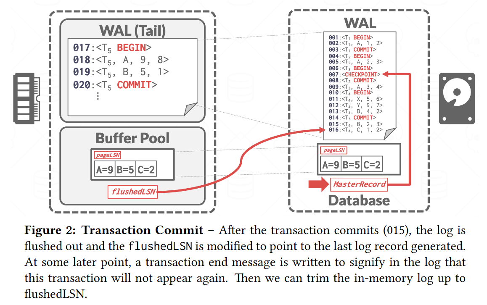
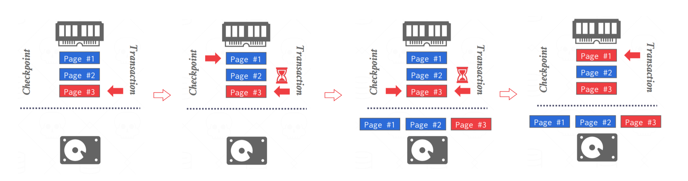
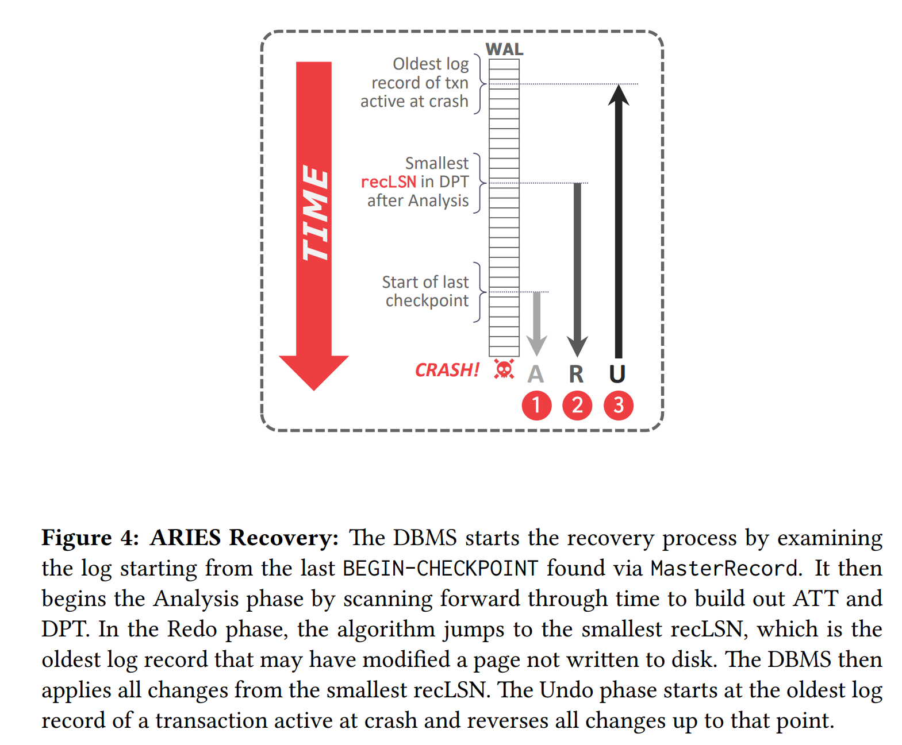

## **Crash Recovery**

DBMS 依靠其恢复算法来确保数据库一致性、事务原子性和故障时的持久性。每个恢复算法由两部分组成：

- 正常事务处理期间确保 DBMS 能够从故障中恢复的操作

- 将数据库恢复到确保事务的原子性、一致性和持久性的状态失败后的操作（本节）。

数据库弹性的关键是事务完整性和持久性的管理，特别是在故障情况下。这一基本概念为 ARIES 恢复算法的引入奠定了基础。

Algorithms for Recovery and Isolation Exploiting Semantics (ARIES) 是 IBM 研究中心在 20 世纪 90 年代初为 DB2 系统开发的恢复算法。到如今 ARIES 依旧是大部分 DBMS 首选的 Recovery Algorithms。

ARIES 恢复协议中有三个关键概念：

- **Write Ahead Logging**：在将数据库更改写入磁盘之前，任何更改都会记录在稳定存储上的日志中（STEAL + NO-FORCE）。

- **Repeating History During Redo**：重新启动时，回溯操作并将数据库恢复到崩溃之前的正确状态。

- **Logging Changes During Undo**：在 undo 过程中记录 undo 操作到日志中，确保在恢复期间再次出现故障时不会执行多次相同的 undo 操作

## **WAL Records**

我们需要扩展我们的 WAL Records 格式，以包含全局唯一的 log sequence number  (LSN)。DBMS 中很多组件都会记录多种 LSN，如：

|Name|Where|Definition|
|:-:|:-:|:-:|
|flushedLSN|memory|最后落盘的那个 LSN
|pageLSN|page|与某 page data 相关的最新的 LSN
|recLSN|page|该页在上次落盘之后，对该页进行修改的第一个 LSN 
|lastLSN|transaction|某事务最后一条日志的 LSN
|MasterRecord|disk|最近一次 checkpoint 的 LSN

在一个 $page_i$ 写入磁盘时，我们必须保证 $pageLSN_i \leq flushedLSN$，也就是说与 $page_i$ 有关的所有 WAL 都写入磁盘之后，$page_i$ 的脏数据才能落盘。

<figure markdown="span">
    { width="750" }
</figure>

当一个事务修改某 page 中的数据时，也需要更新该 page 的 pageLSN，在将操作日志写进 WAL 后，DBMS 会更新 flushedLSN 为最新写入的 LSN。

## **Normal Execution**

每个事务都会执行一系列读取和写入，最后是提交（commit）或中止（abort）。在讨论之前，我们需要约定 4 个假设，简化问题：

- 所有日志记录都能放进一个 page 中

- 写一个 page 到磁盘能保持原子性

- 在 Single-Version 的情况下且遵循严格的 2PL

- 使用 WAL 记录操作日志，buffer pool policy 为 Steal + No-Force

### **Transaction Commit**

当事务要提交时，DBMS 首先将 `<COMMIT>` 记录写入内存中的日志缓冲区。然后，DBMS 将所有日志记录（包括事务的 `<COMMIT>` 记录）刷新到磁盘。请注意，这些日志刷新是顺序、同步写入磁盘的。每个日志页可以有多个日志记录。事务提交图如图 2 所示。

<figure markdown="span">
    { width="750" }
</figure>

一旦 `<COMMIT>` 记录安全地存储在磁盘上，DBMS 就会向应用程序返回事务已提交的确认。在稍后的某个时刻，DBMS 将写入一个特殊的 TXN-END 记录到日志中。这表明该事务在系统中已完全完成，并且不会再有该事务的日志记录。这些 `<TXN-END>` 记录用于内部记录，不需要立即刷新。

### **Transaction Abort**

中止事务是仅应用于一个事务的 ARIES 撤消操作的一种特殊情况。我们需要对一个事务的所有 Log 执行 UNDO 操作。为此我们需要在 Log Record 中额外添加一个字段： **prevLSN**，事务 txn 上一个 Log Record 的 LSN。 

DBMS 使用这些 prevLSN 值来维护每个事务的 Log Record 链表，以便更轻松地浏览日志以查找其记录。

<figure markdown="span">
    { width="750" }
</figure>

事务 `<ABORT>` 后需要倒叙执行 UNDO 操作。为了防止在回滚过程中再次故障导致部分操作被执行多次，回滚操作也需要写入日志中，等待所有操作回滚完毕后，DBMS 再往 WAL 中写入 TXN-END 记录。那么，如何记录回滚操作呢？这就是我们马上要介绍的 CLR。

**Compensation Log Records**，CLR 记录的是 undo 操作，它除了记录原操作相关的记录，还记录了 undoNext 指针，指向下一个将要被 undo 的 LSN，CLR 本身也是操作记录，因此它也需要像其它操作一样写进 WAL 中。现在我们的 Log Records 变成了如下的样子：

<figure markdown="span">
    { width="750" }
</figure>

我们 Undo 了 002 号 Log 后，会创建 026 号 CLR，来记录 002 已经 Undo 过了，不需要重复执行。undoNext 告诉了我们下一个该 Undo 的 LSN。最后 Undo T1 的整个过程如下：

<figure markdown="span">
    { width="750" }
</figure>

> Notice: CLRs never need to be undone.

## **Checkpointing**

DBMS 定期设置检查点，将缓冲池中的脏页写入磁盘。这用于最大限度地减少恢复时必须 Redo 的日志量。

下面讨论的前两种阻塞检查点方法在检查点过程中暂停事务。这种暂停对于确保 DBMS 在检查点期间不会错过页面更新是必要的。然后，提出了一种更好的方法，允许事务在检查点期间继续执行，但要求 DBMS 记录附加信息以确定它可能错过了哪些更新。

### **Non-Fuzzy Checkpoints**

当 DBMS 采取检查点以确保将数据库的一致快照写入磁盘时，它会停止事务和查询的执行。这与上一节中讨论的方法相同：

- 停止开始任何新交易。

- 等待所有活动事务完成执行。

- 将脏页刷新到磁盘。

虽然此过程会影响运行时性能，但它显着简化了恢复。

### **Slightly Better Blocking Checkpoints**

与之前的检查点方案类似，不同之处在于 DBMS 不必等待活动事务完成执行。 DBMS 现在记录检查点开始时的内部系统状态。

- 停止开始任何新交易。

- 当 DBMS 获取检查点时暂停所有事务。

我们将当前的脏页都刷新进磁盘。但是会有一个问题：可能会将未完成事务的脏页带进磁盘以及部分修改持久化。如下例：

<figure markdown="span">
    { width="850" }
</figure>

还在运行的事务的数据，被写入了磁盘，但他的 WAL Records 还未完全写入磁盘，所以此时的磁盘中数据是 inconsistent。

而且事务修改的数据，只有一半被写入了磁盘（$Page_3$ 被写入磁盘，$Page_1$ 没有），就是说一个 SQL 语句涉及到的页面，只有一半被写入了磁盘。如果此时 Cash ，重启后就很难 recovery 了。

这里我们就需要维护额外的 Mate data：

**活跃事务表（Active Transaction Table，ATT）**：记录 `<Checkpoint>` 这个时刻，DBMS 中活跃的事务信息。这里的活跃指的是，还未写入 `<TXN-END>` 记录的事务。对于每个事务条目，ATT 包含以下信息：

- transactionId：事务 ID

- status：事务的当前“状态”（Running, Committing, Undo Candidate）

- lastLSN：事务最新的 LSN
  

**脏页表（Dirty Page Table DPT）**：记录活跃事务修改过的页信息。每个脏页有一个条目包含 recLSN（即第一个导致该页脏的日志记录的LSN）。

让我们来左边的例子：在第一个 checkpoint 处：活跃事务有 T2，脏页有 P11 和 P22；在第二个 checkpoint  处，活跃事务有 T3，脏页有 P11 和 P33。

我们在 checkpoint 中记录之前还未刷新的脏页，就可以避免将未完成事务的脏页带进磁盘以及部分修改持久化的问题。在 Cash 之后，`<checkpoint>` 会提供给我们足够用的信息，来进行 Undo 或 Redo。

这种方案尽管比 Non-fuzzy 好一些，不需要等待所有活跃事务执行完毕，但仍然需要在 checkpoint 期间暂停执行所有写事务。

### **Fuzzy Checkpoints**

模糊检查点允许 DBMS 中的其他事务继续运行。这就是 ARIES 在其协议中使用的方式。Fuzzy Checkpoints 不再是一个单独的时间点，而是一个时间段，由 `<CHECKPOINT-BEGIN>` 和 `<CHECKPOINT-END>` 组成：

- CHECKPOINT-BEGIN：指示 Checkpoint 的开始。此时，DBMS 会保存当前 ATT 和 DPT 的快照，这些快照在 `<CHECKPOINT-END>` 记录中引用。Checkpoint 启动后开始的事务不包含在 ATT 中。

- CHECKPOINT-END：Checkpoint 完成的时刻。它包含在写入 `<CHECKPOINT-BEGIN>` 日志记录时捕获的 ATT + DPT。

并且 Checkpoint 完成后， `<CHECKPOINT-BEGIN>` 记录的 LSN 会被被记录在 MasterRecord 中。

举例如右图。

## **ARIES Recovery**

ARIES 协议由三个阶段组成。崩溃后启动时，DBMS 将执行以下阶段，如 Figure 4 所示：

- 分析 (analysis)：从 WAL 中读取最近一次 checkpoint，找到 buffer pool 中相应的脏页以及故障时的活跃事务

- 重做 (redo)：从正确的日志点开始重做所有操作，包括将要中止的事务

- 撤销 (undo)：将故障前未提交的事务的操作撤销

<figure markdown="span">
    { width="600" }
</figure>

### **Analysis Phase**

从通过数据库的 MasterRecord LSN 找到的最后一个 checkpoint 开始。

1. 从检查点向前扫描日志。
2. 如果 DBMS 发现 TXN-END 记录，则从 ATT 中删除其事务。
3. 遇到其它日志记录时

    将事务放入 ATT 中，将 status 设置为 UNDO

    如果事务提交，将其状态修改为 COMMIT

    如果是 UPDATE 记录，如果页面 P 不在 DPT 中，则将 P 添加到 DPT 中，并将 P 的 recLSN 设置为日志记录的 LSN。
          
在重做阶段结束时，为所有状态为 COMMIT 的事务写入 TXN-END 日志记录，并将它们从 ATT 中删除。

当 Analysis Phase 结束时：

- ATT 告诉 DBMS 在发生故障时，哪些事务是活跃的

- DPT 告诉 DBMS 在发生故障时，哪些脏数据页可能尚未写入磁盘

### **Redo Phase**

此阶段的目标是让 DBMS 重复历史记录以重建其状态直至崩溃那一刻。它将重新应用所有更新（甚至中止的事务）并重做 CLR。

DBMS 从 DPT 中包含最小 recLSN 的日志记录开始向前扫描。对于具有给定 LSN 的每个更新日志记录或 CLR，DBMS 会重新应用更新，除非：

- 受影响的页面不在 DPT 中

- 受影响的页面在 DPT 中，但该日志记录的 LSN 小于该页面的 recLSN（更新已传播到磁盘）

- 受影响的页面在 DPT 中，并且受影响的页面在磁盘上的 pageLSN $\geq$ LSN

重做时，需要：

- 重新执行日志中的操作

- 将 pageLSN 修改成日志记录的 LSN

- 不再新增操作日志，也不强制刷盘

在 Redo Phase 结束时，会为所有状态为 COMMIT 的事务写入 TXN-END 日志，同时将它们从 ATT 中移除。

### **Undo Phase**

在最后一个阶段，DBMS 会将崩溃时所有正在活动的事务都撤销。这些都是分析阶段后 ATT 中处于 U​​NDO 状态的事务。

将所有 Analysis Phase 判定为 U (candidate for undo) 状态的事务的所有操作按执行顺序倒序撤销，并且为每个 undo 操作写一条 CLR。

一旦最后一个事务成功中止，DBMS 就会刷新日志，然后准备开始处理新事务。

### **Crash Issues**

- 如果在分析阶段数据库崩溃，则再次运行恢复。

- 如果数据库在重做阶段恢复期间崩溃，则重做所有内容。

- 为了提高重做阶段恢复期间的性能，假设它不会再次崩溃并在后台将所有更改异步刷新到磁盘。

- Lazy Rollback：在新的事务访问数据页时才回滚数据

## **Conclusion**

WAL with Steal/No-Force

Fuzzy Checkpoints

Redo everything since the earliest dirty page

Undo txns that never commit

Write CLRs when undoing, to survive failures during restarts