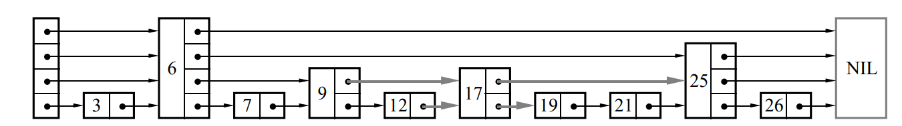

## **简介**

跳表是一种分层的链表结构：

<figure markdown="span">
  { width="850" }
</figure>

可以做到 $O(\log n)$ 复杂度的增删查改，以及 $O(n)$ 的空间复杂度。相比一般的平衡树，调表有如下的优势和劣势：

| **场景**               | **跳表** | **平衡树**               |
|------------------------|----------|--------------------------|
| 高并发读写             | ✅ 更优   | ❌ 需要复杂锁策略         |
| 频繁范围查询           | ✅ 更优   | ❌ 中序遍历效率低        |
| 实现简单性             | ✅ 更优   | ❌ 复杂                  |
| 严格有序性要求         | ❌ 一般   | ✅ 更优（如数据库索引）   |
| 内存敏感场景           | ❌ 一般   | ✅ 更优（如嵌入式系统）   |

## **基本思想**

顾名思义，跳表是一种类似于链表的数据结构。更加准确地说，跳表是对有序链表的改进。

为方便讨论，后续所有有序链表默认为 **升序** 排序。

一个有序链表的查找操作，就是从头部开始逐个比较，直到当前节点的值大于或者等于目标节点的值。很明显，这个操作的复杂度是 $O(n)$。

跳表在有序链表的基础上，引入了 **分层** 的概念。首先，跳表的每一层都是一个有序链表，特别地，最底层是初始的有序链表。每个位于第 $i$ 层的节点有 $p$ 的概率出现在第 $i+1$ 层，$p$ 为常数。

参考：

[Oi Wiki](https://oi-wiki.org/ds/skiplist/){target=_blank}

[Skip Lists: A Probabilistic Alternative to Balanced Trees](https://15721.courses.cs.cmu.edu/spring2018/papers/08-oltpindexes1/pugh-skiplists-cacm1990.pdf){target=_blank}