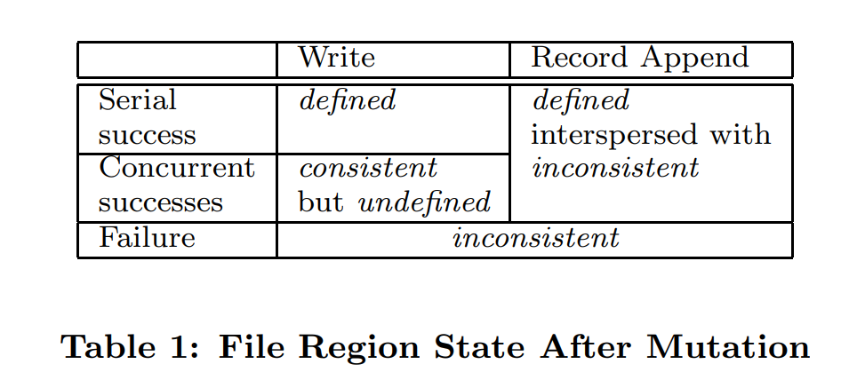
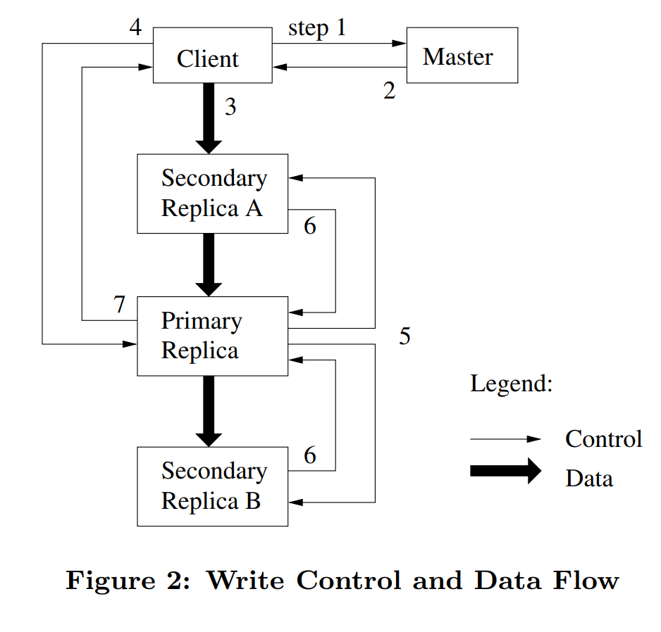

??? question "为什么分布式存储系统很难设计？"

    首先人们设计大型分布式系统或大型存储系统出发点通常是，他们想获取巨大的性能加成，进而利用数百台计算机的资源来同时完成大量工作。性能问题就成为了最初的诉求。之后，很自然的想法就是将数据分割放到大量的服务器上，这样就可以并行的从多台服务器读取数据。我们将这种方式称之为分片（Sharding）。如果你在成百上千台服务器进行分片，你将会看见常态的故障。如果你有数千台服务器，那么总是会有一台服务器宕机，每天甚至每个小时都可能会发生错误。所以，我们需要自动化的方法而不是人工介入来修复错误。我们需要一个自动的容错系统，这就引出了容错这个话题（fault tolerance）。实现容错最有用的一种方法是使用复制，只需要维护2-3个数据的副本，当其中一个故障了，你就可以使用另一个。所以，如果想要容错能力，就得有复制（replication）。如果有复制，那就有了两份数据的副本。可以确定的是，如果你不小心，它们就会不一致。所以，你本来设想的是，有了两个数据副本，你可以任意使用其中一个副本来容错。但是如果你不够小心，两个数据的副本就不是完全一致，严格来说，它们就不再互为副本了。而你获取到的数据内容也将取决于你向哪个副本请求数据。这对于应用程序来说就有些麻烦了。所以，如果我们有了复制，我们就有不一致的问题（inconsistency）。通过聪明的设计，你可以避免不一致的问题，并且让数据看起来也表现的符合预期。但是为了达到这样的效果，你总是需要额外的工作，需要不同服务器之间通过网络额外的交互，而这样的交互会降低性能。所以如果你想要一致性，你的代价就是低性能。但这明显不是我们最开始所希望的：

    性能 -> 分片 -> 容错及可用性 -> 复制 -> 一致性 -> 低性能

    现实中，如果你想要好的一致性，你就要付出相应的代价。如果你不想付出代价，那就要忍受一些不确定的行为。我们之后会在很多系统中看到这里介绍的循环。通常，人们很少会乐意为好的一致性付出相应的性能代价。这就是 CAP 理论，现在的系统通常是 CP 或者 AP 的。

## 文章总结

本文介绍了谷歌内部设计并使用的一款分布式文件系统 GFS，文章详细了介绍了 GFS 

## 1. Introduction

[论文原文](https://static.googleusercontent.com/media/research.google.com/zh-CN//archive/gfs-sosp2003.pdf){target=_blank}

Google File System (GFS) 是谷歌实现的一款分布式文件系统。在分布式场景下的文件系统的设计目标与传统的文件系统是有所不同的：

1. 故障或失败应该是常态，而不是异常。GFS 是由数百台或数千台廉价机器组成的，并且还有相当大的客户端访问量，所以组件的数量和质量几乎保证了组件无法一直保持正常工作，所以**容错（fault tolerance）和自动恢复（automatic recovery）**尤为重要。

2. 相比传统文件系统，分布式场景下，文件数量是巨大的。工作负载一般是由数十亿对象组成的 TB 级数据集，传统文件系统直接管理数十亿个 KB 级小文件会导致元数据爆炸，尽管可以支持，但会显著降低性能。所以 IO 操作的参数以及块大小应该重新设计。

3. 大多数的文件都是追加写，而不是覆盖写。随机写的操作基本是不存在的。数据一旦写入，文件就只能被读取，而且通常只能按顺序读取。各种数据都具有这些特征，一些可能构成被数据分析程序扫描的大型存储库；有些可能是运行应用程序连续生成的数据流；鉴于这种对大型文件的访问模式，追加成为性能优化和原子性保证的重点，而在客户端缓存数据块则相对没那么重要（预取？）。

4. 同时设计应用程序和文件系统 API 大大提高了灵活性，从而使整个系统受益。自己设计应用程序肯定更加了解怎样的 API 使用起来是更方便的。

## 2 Design Overview

### 2.1 Assumptions

针对上文提出的工作负载，这里我们对系统的设计提出以下假设：

- 该系统由许多经常发生故障的廉价商品组件构建而成。它必须不断自我监控，并定期检测、容忍组件故障并迅速恢复。

- 该系统存储了少量的大文件。我们预计会有几百万个文件，每个文件的大小通常为100 MB或更大。好几 GB 的文件是常见的情况，应该有效地管理。必须支持小文件，但我们不需要对其进行优化。

- 工作负载主要由两种读取组成：大型流式读取和小型随机读取。在大型流式读取中，单个操作通常读取数百KB，更常见的是 1 MB 或更多。来自同一客户端的连续操作通常会读取文件的连续区域。小型随机读取通常以任意偏移量读取几KB。注重性能的应用程序通常会对它们的小读取进行批处理和排序，以便在文件中稳定地前进，而不是来回移动。

- 工作负载还具有许多将数据附加到文件的大型连续写入。典型的操作大小与读取操作大小相似。一旦写入，文件很少再被修改。支持在文件中任意位置进行小写入，但不一定要高效。

- 系统必须为并发附加到同一文件的多个客户端有效地实现定义良好的语义。

- 高持续带宽比低延迟更重要。我们的大多数目标应用程序都非常重视以高速率批量处理数据，而很少有应用程序对单个读写有严格的响应时间要求。

### 2.2 Interface

GFS提供了一个熟悉的文件系统接口，尽管它没有实现诸如POSIX之类的标准API。文件在目录中按层次组织，并通过路径名标识。我们支持创建、删除、打开、关闭、读取和写入文件的常规操作。

此外，GFS 具有快照和记录追加操作。快照以低成本创建文件或目录树的副本。记录追加允许多个客户端同时向同一文件追加数据，同时保证每个客户端追加的原子性。

### 2.3 Architecture

GFS集群由单个 master 和多个 chunkservers 组成，可由多个客户端访问，如下图所示。

文件被划分为固定大小的块。每个块由 master 在块创建时分配的不可变且全局唯一的 64 位块句柄标识。chunkservers 将块作为 Linux 文件存储在本地磁盘上，并读取或写入由块句柄和字节范围指定的块数据。为了提高可靠性，每个块都在多个块服务器上复制。

master 维护所有文件系统元数据。这包括命名空间、访问控制信息、从文件到块的映射以及块的当前位置。master 定期在心跳消息中与每个chunkserver通信，向其发出指令并收集其状态。

应用程序通过链接到 GFS 客户端代码来使用文件系统 API，并与 master 和 chunkservers 通信，进行读取或写入数据。客户端与主服务器交互进行元数据操作，但所有承载数据的通信都直接发送到 chunkservers。

### 2.4 Single Master

拥有一个主控器大大简化了我们的设计，master 可以通过全局的信息做出复杂的 chunk placement 和 replication decisions。然而，我们必须尽量减少它在读写中的参与，避免它成为系统瓶颈。客户端从不通过主机读写文件数据。相反，客户端会询问主机应该联系哪些组块服务器。它在有限的时间内缓存这些信息，并直接与 chunkservers 交互以进行许多后续操作。

接下来我们介绍一下上图中的交互过程。首先，客户端通过块大小将应用程序指定的文件名和字节偏移量转换为文件中的块索引。然后，它向主机发送一个包含文件名和块索引的请求。主服务器用相应的块句柄和副本的位置进行回复。客户端使用文件名和块索引作为 key 缓存此信息。

然后，客户端向其中一个副本发送请求，大概率是最接近的副本。请求指定了块句柄和该块内的字节范围。在 key 过期或文件重新打开之前，对同一块的进一步读取不需要再进行 client-master 间的交互。事实上，客户端通常会在同一请求中请求多个块，master 也可以在请求的块之后立即包含块的信息。这些额外的信息避免了多次的 client-master 交互，并且几乎没有额外的成本。

### 2.5 Chunk Size

块尺寸是关键的设计参数之一。我们选择了64 MB，这比典型的文件系统块大小大得多。每个块副本都作为普通 Linux 文件存储在块服务器上，并且文件不会预先分配完整的 64 MB 物理空间，而是根据实际写入的数据量逐步扩展。

大 Chunk Size 有如下几个优点：

1. 它减少了客户端与主服务器交互的次数。这种减少对于我们的工作负载尤其重要，因为应用程序大多按顺序读写大型文件，即使是小的随机读取，客户端也可以轻松地缓存 TB 级的数据的所有块位置信息。

2. 由于在大块上，客户端更有可能在给定的块上执行许多操作，因此可以通过在较长一段时间内保持与 chunkservers 的持久TCP连接来减少网络开销。

3. 它减小了存储在主服务器上的元数据的大小。这使我们能够将元数据保存在内存中，这反过来又带来了我们将在第2.6.1节中讨论的其他优势。

即使采用延迟空间分配，大 Chunk Size 也有其缺点。一个小文件由少量块组成，可能只有一个。如果许多客户端正在访问同一文件，则存储这些块的块服务器可能会成为热点。在实践中，热点并不是一个主要问题，因为我们的应用程序大多按顺序读取大型多块文件。

然而，当GFS首次被批处理队列系统使用时，热点问题确实出现了：可执行文件作为单个块文件写入GFS，然后同时在数百台机器上启动。存储此可执行文件的少数组块服务器因数百个同时进行的请求而过载。我们通过以更高的复制因子存储此类可执行文件并使批处理队列系统错开应用程序启动时间来解决这个问题。另一个可能的解决方案是允许客户端在这种情况下从其他客户端读取数据。

### 2.6 Metadata

master 在内存中会存储两个表单：

- 第一个是文件名到 Chunk ID 或者 Chunk Handle 数组的对应。这个表单告诉你，文件对应了哪些Chunk。但是只有 Chunk ID 是做不了太多事情的，所以有了第二个表单。

- 第二个表单记录了 Chunk ID 到 Chunk 元数据的对应关系。这里的数据又包括了：Chunk Locations、Version ID、Primary、Lease Expiration。
 
首先第一个表单（Filename 到 Chunk ID List 的映射）要持久化，它一旦丢失，意味着所有文件数据的丢失。版本号也要持久化，这个之后讨论。所以 master 节点读数据只会从内存读，但是写数据的时候，至少有一部分数据会接入到磁盘中。关于元数据持久化在 2.6.3 详细讨论。

master 不会持久存储 Locations、Primary、Lease Expiration。因为 master 在主启动时以及每当有 chunkserver 加入集群时，都会向每个 chunkserver 询问其存储的块，并且在等待 60 秒租约超时时间后，master 就会知道对于这个 Chunk 来说没有 Primary Chunk，这个时候，master 节点可以安全指定一个新的 Primary Chunk。

#### 2.6.1 In-Memory Data Structures

由于元数据可以存储在内存中，因此 master 操作很快。此外，master 可以很高效且容易的在后台定期扫描其整个状态。这种定期扫描用于实现块垃圾收集、在出现块服务器故障时进行重新复制，以及块迁移以平衡多 chunkserver 的负载和磁盘空间。 第4.3节和第4.4节将进一步讨论这些活动。   

这种只使用内存的方法的一个潜在问题是，块的数量以及整个系统的容量都受到主设备拥有多少内存的限制。这在实践中并不是一个严重的问题。master为每个64MB的chunk维护少于64字节的元数据。因为大多数文件包含多个chunk，所以大部分chunk是满的，仅最后一个chunk被部分填充。

即使当有必要支持更大型的文件系统时，增加额外的内存的成本，远远低于通过内存存储元数据所带来的简单性、可靠性、性能和灵活性。

#### 2.6.2 Chunk Locations

主服务器不保留哪些块服务器具有给定块的副本的持久记录。它只是在启动时轮询chunkservers以获取该信息。此后，主服务器可以保持最新状态，因为它控制所有块的存放位置，并使用常规的心跳消息监视块服务器状态。

最初我们试图让master持久化保存chunk位置信息，但是后来我们意识到在chunkserver启动时和启动后周期性请求数据要简单的多。这样做消除了当chunkserver加入或离开集群、更改名称、故障、重启等问题时，保持master和chunkserver同步的问题。在有着数百台服务器的集群中，这些事件都会经常发生。

另一种理解这种设计的方法是，chunkserver对其磁盘上有或没有哪些chunk有着最终决定权。因为chunkserver中的错误会导致chunk消失（例如磁盘可能损坏或被禁用）或一个操作者可能重命名一个chunkserver。因此，试图在master上维护一个持久化的快位置信息视图是没有以意义的。

#### 2.6.3 Operation Log

操作日志包含重要的元数据变更的历史记录。这是 GFS 的核心。它不仅是元数据中唯一被持久化的记录，还充当了定义并发操作顺序的逻辑时间线。带有版本号的文件和 chunk 都在他们被创建时由逻辑时间唯一、永久地确定。

操作日志是 GFS 至关重要的部分，其必须被可靠存储，且在元数据的变更被持久化前不能让 client 对变更可见。否则当故障发生时，即使 chunk 本身没有故障，但是整个文件系统或者 client 最近的操作会损坏。我们将操作日志备份到多台远程主机上，且只有当当前操作记录条目被本地和远程主机均写入到了磁盘后才能向客户端发出响应。master 会在操作记录被写入前批量合并一些操作记录来减少写入和备份操作对整个系统吞吐量的影响。

master 通过重放（replay）操作日志来恢复其文件系统的状态。操作日志要尽可能小以减少启动时间。当日志超过一定大小时，master会对其状态创建一个 checkpoint，这样master就可以从磁盘加载最后一个检查点并重放该检查点后的日志来恢复状态。检查点的结构是一个可以在内存中直接存储的紧凑 B树（B-tree），且在查找命名空间时不需要进行额外的解析。这进一步提高了恢复速度，并增强了系统的可用性。

因为创建一个检查点需要一段时间，所以master被设计为可以在不推迟新到来的变更的情况下创建检查点。创建检查点时，master会切换到一个新的日志文件并在一个独立的线程中创建检查点。这个新的检查点包含了在切换前的所有变更。一个有着几百万个文件的集群可以再一分钟左右创建一个检查点。当检查点被创建完成后，它会被写入master本地和远程主机的磁盘中。

恢复仅需要最后一个完整的检查点和后续的日志文件。旧的检查点和日志文件可以随意删除，不过我们会保留一段时间以容灾。创建检查点时发生错误不会影响日志的正确性，因为恢复代码会检测并跳过不完整的检查点。

### 2.7 Consistency Model

GFS 宽松的一致性模型可以很好地支持我们的高度分布式应用程序，且实现起来简单高效。我们将讨论 GFS 提供的保证和其对应用程序的意义。我们也会重点讨论 GFS 如何维持这些保证，但会将细节留给本论文的其他部分。

#### 2.7.1 Guarantees by GFS

文件命名空间修改（例如文件创建）是原子的。它们完全由 master 处理：名称空间 lock 保证了原子性和正确性（第4.1节）；主操作日志定义了这些操作的全局总顺序（第2.6.3节）。

在数据修改后，无论修改的成功与否，一个文件区域（file region）的状态都取决于修改类型。下表总结了修改后文件区域的状态：

如果一个文件区域的任意一个副本被任何client读取总能得到相同的数据，那么这个文件区域状态为 consistent（一致的）。

如果一个文件区域的状态是 consistent，并且客户端可以看到它写入的完整内容，那么他是 defined（确定的）。

- 无并发写入的单个成功操作：受影响的文件区域是 defined 的。如：客户端 A 写入字符串 "Hello World" 到文件的 0-10 字节，无其他写入干扰。此后，所有客户端读取该区域都会得到 "Hello World"。

- 并发写入的多个成功操作：文件区域是 consistent 的。如：客户端 A 写入 "AAA" 到 0-2 字节，客户端 B 同时写入 "BBB" 到同一区域。最终所有副本可能统一为 "AAA" 或 "BBB"，但无法确定是哪次写入的结果

- 一次失败的操作会使的文件区域变得不一致。

数据的修改可能是 writes 或 record appends。write 操作会在应用程序指定的文件与偏移处写入数据。record appends 会由 GFS 选则一个偏移量，

由于client会缓存 chunk 的位置，在缓存信息刷新前，client 可能会访问陈旧的副本。这个时间窗口会受缓存过期时间和下一次打开文件限制（下一次打开文件会刷新文件的所有 chunk 位置信息）。除此之外，由于我们大多数文件是仅追加的，陈旧的副本的通常会返回一个版本较早的结束位置处的数据，而不是陈旧数据。当 reader 重试并与 master 通信时，它将立刻获取最新 chunk 的位置。

即使在变更被成功应用的很长时间后，设备故障仍然可以销毁引发数据错误（corrupt）或（destroy）数据。GFS 通过 master 和所有 chunkserver 周期性握手的方式来确定故障的 chunkserver ，并通过校验和（checksunmming）的方式检测数据错误。一旦出现问题，数据会尽快地从一个合法的副本恢复。一个 chunk 只有在 GFS 作出反应前（通常在几分钟内）失去了所有的副本，chunk才会不可逆地丢失。即使在这种情况下，chunk 也仅变得不可用而非引发错误，因为应用程序可以收到明确的报错而非错误的数据。

#### 2.7.2 Implications for Applications

运行在 GFS 上的应用程序可以通过一些简单技术来适应宽松的一致性模型：使用 append 而不是 overwrite、检查点、自验证写入（writing self-validating）、自标识记录（self-identifying records）。

几乎我们的所有应用都是追加写而非覆盖写，一个典型的例子：一个 writer 从头到尾生成一个文件，它会周期性地为已经写入的文件数据创建检查点，并在所有数据都被写入文件后原子地将其重命名为一个永久的文件名。检查点可能包含应用程序级别的校验和。reader 会验证并处理直到最新检查点的文件区域。

另一种典型的用途是，许多write并发地向同一个文件append数据以获得合并后的结果或文件作为生产者-消费者队列使用。

## 3. System Interactions

在我们设计系统时，我们让master尽可能少地参与所有操作。在此背景下，我们将描述client、master和chunkserver如何交互来实现数据变更、原子地record append和快照操作。

### 3.1 Leases and Mutation Order

修改 chunk 内容或 chunk 元数据的操作被称作 mutation，比如：write、append。chunk 变更时，其每个副本都会应用变更。们使用租约（lease）来维护副本间变更顺序的一致性。master 向其中一份副本授权一个变更的租约，我们称这个副本为 primary。并发的 mutation 操作的应用顺序由 primary 副本来确定，其余所有副本都会按照这个顺序来应用变更。

这种租约机制是为了最小化 master 管理负载而设计的，它将数据传输的负载分散到各个 chunkserver 上。租约的初始超时时间为 60 秒。然而，一旦chunk被变更，primary 就可以向 master 请求延长租约时间，或者（通常为）接受来自master的租约时间延长操作。这些租约延长请求和租约授权请求依赖 master 与 chunkserver 间周期性地心跳消息来实现。即使 master 与一个 primary 的通信丢失，master 仍可以在旧租约过期后安全地向另一个副本授权新的租约。

我们根据下图，来介绍 GFS 进行一次写入的过程：

1. client 向 master 询问哪个 chunkserver 持有指定 chunk 的租约及该 chunk 的其他副本的位置。如果没有 chunkserver 持有租约，那么 master 会选择一个副本对其授权（这一步在图中没有展示）。

2. master 回复 primary 副本的标识符和其他副本（也称secondary）的位置。client 为后续的变更缓存这些信息。client 只有当 primary 不可访问或 primary 向 client 回复其不再持有租约时才需要再次与 master 通信。

3. client 将数据推送到所有副本。client 可以按任意顺序推送。每个 chunkserver 都会将数据在内部的LRU中缓存，直到数据被使用或缓存老化失效（age out）。通过将数据流和控制流解耦，我们可以使用基于网络拓扑的技术来提高开销高昂的数据流的性能，且与哪台 chunkserver 是 primary 无关。Section 3.2 将对此进一步讨论。

4. 一旦所有副本都确认收到了数据，client 会向 primary 发送一个 write 请求。这个请求标识了之前推送到所有副本的数据的作用。primary 会为其收到的所有的变更（可能来自多个 client）分配连续的编号，这一步提供了重要的顺序。primary 对在本地按照该顺序应用变更。

5. primary 将 write 请求继续传递给其他 secondary 副本。每个 secondary 副本都按照 primary 分配的顺序来应用变更。

6. 所有的 secondary 副本通知 primary 其完成了变更操作。

7. primary 回复 client。任意副本遇到的任何错误都会被报告给client。即使错误发生，write 操作可能已经在primary 或 secondary 的任意子集中被成功执行。（如果错误在 primary 中发生，那么操作将不会被分配顺序，也不会被继续下发到其他副本。）只要错误发生，该请求都会被认为是失败的，且被修改的区域的状态为 inconsistent。client中的代码会通过重试失败的变更来处理这种错误。首先它会重试几次步骤（3）到步骤（7），如果还没有成功，再从write请求的初始操作开始重试。

如果应用程序发出的一次 write 请求过大或跨多个 chunk，GFS的 client 代码会将其拆分成多个write操作。拆分后的write请求都按照上文中的控制流执行，但是可能存在与其他client的并发的请求交叉或被其他client的并发请求覆盖的情况。

所以会导致 2.7 节说的在并发写入后，分件区域内是一致（consistent）但不是确定的（defined），一个文件区域可能是多个 chunk，GFS 的 chunk 主备机制只能保证单个 chunk 内数据是 defined 的，但 chunk 间的数据只能保证一致性。举例来说：

我们有 1，2，3 三个修改，涉及到 chunk1 和 chunk2，GFS 只能保证一个 chunk 内主备间执行顺序相同，chunk1 为 123，在 chunk2 却是 321，由此导致 chunk1 和 chunk2 这块数据区域的数据不是 defined 的。

### 3.2 Data Flow

为了高效地利用网络，GFS 对数据流与控制流进行了解耦。为了充分利用机器的网络带宽，数据会沿着chunkserver链线性地推送，而不是通过其他拓扑结构（如树等）分配发送。因此，每台机器全部的出口带宽都被用来尽可能快地传输数据，而不是非给多个接受者。

为了尽可能地避免网络瓶颈和高延迟的数据链路（例如，交换机间链路（inter-switch）经常同时成为网络瓶颈和高延迟链路），每台机器会将数据传递给在网络拓扑中最近的的且还没有收到数据的机器。由于我们的网络拓扑非常简单，所以可以通过IP地址来准确地估算出网络拓扑中的“距离”。

最后，我们通过流水线的方式通过TCP连接传输数据，以最小化时延。当chunkserver收到一部分数据时，它会立刻开始将数据传递给其他chunkserver。当chunkserver收到一部分数据时，它会立刻开始将数据传递给其他chunkserver。因为我们使用全双工的交换网络，所以流水线可以大幅减少时延。

### 3.3 Atomic Record Appends

Record Appends 追加写，也是 mutation 操作的一种，所以也遵循 3.1 中的控制流，仅在 primary 端稍有点额外的逻辑。

在 client 将数据推送到所有副本的最后一个 chunk 之后，client 会向 primary 发送一个请求。primary 会检查当新记录追加到该 chunk 之后，是否会导致该 chunk 超过最大的 chunk 大小限制（64MB）。如果会超出 chunk 大小限制，primary 会将该 chunk 填充到最大的大小，并通知 secondary 也做相同的操作，再回复客户端，使其在下一个chunk 上重试该操作。为了避免产生太多的填充数据，record append操作限制了每次最多写入最大chunk大小的四分之一的数据，过大的数据会被 client 拆分成多个请求分别 append。

如果 append 的数据不跨 chunk ，primary 会将数据追加到它的副本中，并通知secondary在与其追加的偏移量相同的位置处写入数据，并将最终成功操作的结果返回给 client。

如果record append操作在任何一个副本中失败，那么client会重试操作。这样会导致同一个chunk的不同副本中可能包含不同的数据，这些数据可能是同一条记录的部分或完整的副本。GFS不保证所有副本在字节级别一致，其只保证 record append 的数据作为一个单元被原子性地至少写入一次。

### 3.4 Snapshot

快照操作几乎会在瞬间对一个文件或一个目录树完成拷贝，同时能够尽可能少地打断正在执行的变更。们的用户使用快照操作来快速地对一个庞大的数据集的一个分支进行拷贝，或者在实验前对当前状态创建检查点，这样就可以在试验后轻松地提交或回滚变更。

我们使用写入时复制（Copy-On-Write）技术来实现快照。这确保了对这些 chunk 在后续的写入时都需要与 master 交互以查找租约的持有者。这会给 master 优先拷贝这些 chunk 的机会。

在租约被成功撤销后，master 会将快照操作的日志持久化，然后 master 将日志记录应用到它的内存状态中，具体操作是复制原始文件或目录树的元数据。这里的元数据包含了文件到 chunk 的映射关系，但 chunk 本身并未被复制。创建的快照文件在元数据上指向与原始文件相同的 chunk 。

在快照操作之后，当客户端第一次尝试写入 chunk  C 时，它会向主节点发送请求以确定当前的租约持有者。主节点发现 chunk  C 的引用计数大于 1，于是不会立即回复客户端，而是选择一个新的 chunk handler C′。接着，它指示所有持有 chunk C 副本的 chunkserver 创建一个名为 C′ 的新 chunk。由于新 chunk 在与原始 chunk 相同的 chunkserver 上创建，这样数据就能在本地复制，而不必通过网络复制（google 的硬件环境下本地磁盘的速度是网络传输的三倍）。从此之后，处理该请求的方式与对其他 chunk 的处理没有区别：主节点向新 chunk C′ 的一个副本授予租约，并回复客户端，而客户端则像往常一样写入数据，而不知它刚刚从一个已有 chunk 派生出来。

## 4. Master Operation

master 执行所有命名空间操作。除此之外，master 还管理整个系统中 chunk 的副本：master 做 chunk 分配（placement）决策、创建新 chunk 与副本、协调各种系统范围的活动以保持 chunk 副本数饱和、平衡所有 chunkserver 的负载并回收未使用的存储。现在我们将讨论这些主题。

### 4.1 Namespace Management and Locking

master的很多操作可能消耗很长时间，例如：快照操作必须收回其涉及到的chunk所在的chunkserver的租约。当这些操作执行时，我们不希望推迟master的其他操作。因此，我们允许同时存在多个运行中的操作，并对命名空间的区域使用锁机制来保证操作正确地串行执行。主要内容包括：

- **命名空间表示**：GFS 将整个命名空间看作一个从完整路径名到元数据的查找表，利用前缀压缩有效地存储在内存中。不像很多传统的文件系统，GFS没有用来记录目录中有哪些文件的数据结构。GFS也不支持对同一个文件或目录起别名（alias）（如Unix系统中的硬链接（hard link）或软链接（symbolic link））。              

- **锁机制**：每个命名空间节点（无论是文件还是目录）都有一个与之关联的读写锁。不同操作（例如文件创建、删除、快照）在执行时，需要在目录和目标文件上获取相应的锁，以确保并发操作之间的正确序列化。
  
- **锁的获取策略**：在处理涉及多层路径的操作时，系统先对较高层级（目录）获取读锁，再对目标文件获取写锁，保证同一目录下的并发操作不会互相冲突，同时允许不同目录下的操作并行执行。通常，如果master的操作包含命名空间 /d1/d2/…/dn/leaf，master会在目录 /d1、/d1/d2，…，/d1/d2/…/dn 上请求读取锁，并在完整路径名 /d1/d2/…/dn/leaf 上请求读取锁或写入锁。这种锁机制提供了一个非常好的性质：允许在同一目录下并发地执行变更。
  
- **死锁避免**：锁按照命名空间树的层级和字典序顺序进行获取，从而避免了死锁的情况。

### 4.2 Replica Placement

GFS集群在多个层级上都高度分布。GFS通常有数百个跨多个机架的chunkserver。这些chunkserver可能会被来自相同或不同机架上的数百个clienet访问。在不同机架上的两台机器的通信可能会跨一个或多个交换机。另外，一个机架的出入带宽可能小于这个机架上所有机器的出入带宽之和。多层级的分布为数据的可伸缩性、可靠性和可用性带来了特有的挑战。

chunk副本分配策略有两个目标：最大化数据可靠性和可用性、最大化网络带宽的利用。对于这两个目标，仅将副本分散在所有机器上是不够的，这样做只保证了容忍磁盘或机器故障且只充分利用了每台机器的网络带宽。我们必须在机架间分散chunk的副本。这样可以保证在一整个机架都被损坏或离线时（例如，由交换机、电源电路等共享资源问题引起的故障），chunk的一些副本仍存在并保持可用状态。除此之外，这样还使对 chunk 的流量（特别是读流量）能够充分利用多个机架的总带宽，但坏处是写流量必须流经多个机架，这是我们资源做出的权衡。

### 4.3 Creation, Re-replication, Rebalancing

chunk 副本的创建可能由三个原因引起：chunk创建、重做副本（re-replication）和重均衡（rebalance）。

当master创建一个chunk的时候，它会选择初始化空副本的位置。位置的选择会参考很多因素：

1. 我们希望在磁盘利用率低于平均值的chunkserver上放置副本。随着时间推移，这样将平衡chunkserver间的磁盘利用率；

2. 我们希望限制每台chunkserver上最近创建的chunk的数量。尽管创建chunk本身开销很小，但是由于chunk时写入时创建的，且在我们的一次追加多次读取（append-once-read-many）的负载下chunk在写入完成后经常是只读的，所以master还要会可靠的预测即将到来的大量的写入流量。

3. 对于以上讨论的因素，我们希望将 chunk 的副本跨机架分散。

当 chunk 可用的副本数少于用户设定的目标值时，master 会重新复制副本。chunk副本数减少可能有很多种原因，比如：chunkserver 可能变得不可用、chunkserver 报告其副本被损坏、chunkserver 的磁盘因为错误变得不可用、或者目标副本数增加。

最后，每隔一段时间master会对副本进行重均衡：master 会检测当前的副本分布并移动副本位置，使磁盘空间和负载更加均衡。同样，在这个过程中，master 会逐渐填充一个新的chunkserver，而不会立刻让来自新chunk的高负荷的写入流量压垮新的 chunkserver。

### 4.4 Garbage Collection

在文件被删除后，GFS 不会立刻回收可用的物理存储空间。master 仅在周期性执行懒式垃圾回收时回收物理存储空间，其中垃圾回收分为文件级垃圾回收和 chunk 级垃圾回收。我们发现这种方法可以让系统更为简单可靠。

#### 4.4.1 Mechanism

当一个文件被应用程序删除时，master 会像执行其他操作时一样立刻将删除操作写入日志。但是 master 不会立刻对资源进行回收，而是将待删除的文件重命名为一个带有删除时间戳的隐藏文件名。当 master 周期性地扫描文件系统命名空间时，它会删除已经存在超过三天（用户可以配置这个间隔时间）的这种隐藏文件。在文件被彻底删除之前，仍可通过该文件被重命名后的特殊的新文件名对其进行访问，也可以通过将其重命名为正常文件的方式撤销删除。当隐藏文件被从命名空间中移除时，其在内存中的元数据也会被删除。这种方式可以有效地切断文件和其对应的 chunk 的链接。

master 通过心跳机制，周期的告知 chunkserver 那些 chunk 的元数据已经不存在，这些 chunk 副本可以由 chunkserver 自由的删除。

#### 4.4.2 Discussion

因为文件到 chunk 的映射由 master 专门管理，所以我们可以轻松地识别所有 chunk 的引用。同样，因为 chunk 的副本在每个 chunkserver 上都是Linux系统中指定目录下的文件，所以我们也可以轻松地识别所有 chunk 的副本。所有 master 中没有记录的副本都会被视为垃圾。

这种暂存待回收文件的垃圾回收方法相比饿汉式回收有很多优势：

1. 这种方法在设备经常出现故障的大规模可伸缩分布式系统中非常简单可靠。chunk的创建可能仅在部分chunkserver上成功而在其他chunkserver上失败，这样会导致系统中出现master不知道的副本。且副本删除消息可能会丢失，这样master在其自身和chunkserver故障时都必须重新发送该消息。垃圾回收机制为清理那些不知道是否有用的副本提供了一个统一且可靠的方法。

2. 垃圾回收机制将对存储空间的回收操作合并为master的后台活动，如周期性扫描命名空间和周期性地与chunkserver握手。因此，垃圾回收机制可以分批回收存储空间并平摊回收的开销。另外，垃圾回收仅在master相对空闲时执行。这样，master可以更迅速的相应需要及时响应的来自client的请求。

3. 延迟回收存储空间可以防止意外的不可逆删除操作。

这样做也有一定的缺点：当用户存储空间紧张时，延迟回收会让用户难以释放存储空间。快速创建并删除临时文件的应用程序可能无法立刻重用存储空间。

为了解决这个问题，我们在用户再次显示删除已删除文件时，加快了对存储空间的回收。同时，我们允许用户对不同的命名空间应用不同的副本与回收策略。例如，用户可以指定某个目录树下的所有文件都不需要副本，且当这个目录树下的文件被删除时立刻且无法撤销地将其从文件系统中移除。

#### 4.5 Stale Replica Detection

chunk 可能会因为 chunkserver 崩溃而变成过时数据。master 会为每个 chunk 维护一个 chunk version number 来区分最新数据和过时数据。

master每当为一个 chunk 授权新租约时，都会增加 chunk 的版本号并告知这个最新的副本，master 和这些副本都持久化保存这个新版本号。这一步发生在 master 响应任何 client 前，即在 chunk 可以被写入前。如果一个副本当前不可用，那么这个副本的chunk版本号不会增长。这样，当这个chunkserver重启时并向master报告其包含的chunk和chunk对应的版本号时，master会检测出这个chunkserver中的副本是陈旧的。如果master收到了比它的记录中更高的chunk版本号，master会认为其授权租约失败，并将更高的版本号视为最新的版本号。

master 在周期性垃圾回收时会删除陈旧的副本。即使在 master 回收陈旧副本之前，当 client 向 master 请求该副本的 chunk 时，master 仍会认为该陈旧的副本不存在。另一种保护措施是，当 master 通知 client 哪个chunkserver持有指定chunk的租约时，和当master在克隆操作中命令一个chunkserver从另一个chunkserver读取chunk时，其请求中需要带有chunk的版本号。client或者chunkserver会在执行操作时验证版本号以确保其始终在操作最新的数据。

## 5. Fault Tolerant And Diagnosis

设备的质量和数量让故障发生不再是异常事件，而是经常发生的事。我们既无法完全信任机器，也无法完全信任磁盘。设备故障可能导致系统不可用，甚至会导致数据损坏。我们将讨论我们是如何应对这些挑战的，以及系统内建的用来诊断系统中发生的不可避免的问题的工具。

### 5.1 High Availability

在由数百台服务器组成的GFS集群中，在任意时间总会有一些服务器不可用。我们通过两个简单但有效的策略保证整个系统高可用：快速恢复和副本。

#### 5.1.1 Fast Recovery

在 master 和 chunkserver 的设计中，它们都会保存各自的状态，且无论它们以哪种方式终止运行，都可以在数秒内重新启动。事实上，我们并不区分正常终止和非正常的终止。当 client 或其他服务器的请求超时后，它们会等待很短的时间，然后重试请求。

#### 5.1.2 Chunk Replication

正如之前讨论的，每个 chunk 会在不同机架的多个 chunkserver 上存有副本。用户可以为不同命名空间的文件制定不同的副本级别。副本级别默认为3。当有chunkserver脱机或通过校验和（见章节5.2）检测到损坏的副本时，master 根据需求克隆现有的副本以保证每个 chunk 的副本数都是饱和的。虽然复制机制已运行良好，但在只读数据日益增多的背景下，作者也在探索更节省存储空间的冗余方法，如：奇偶校验（parity）、纠删码（erasure coding）

#### 5.1.3 Master Replication

为了保证可靠性，master 的状态同样有副本。master 的操作日志和检查点被在多台机器上复制。只有当变更在被日志记录并被写入，master 本地和所有 master 副本的磁盘中后，这个变更才被认为是已提交的。当 master 崩溃时，其几乎可以立刻重启。如果运行 master 进程的机器故障或其磁盘故障，在 GFS 之外的负责监控的基础架构会在其它持有 master 的操作日志副本的机器上启动一个新的 master 进程。client 仅通过一个规范的命名来访问 master 结点（例如gfs-test），这个规范的命名是一个 DNS 别名，其可以在master重新被分配到另一台机器时被修改为目标机器。

此外，“影子” master 节点（“shadow” master）可以提供只读的文件系统访问，即使在主master结点脱机时它们也可以提供服务。因为这些服务器可能稍稍滞后于主 master 服务器，所以这些服务器是影子服务器而非镜像服务器。这些影子 master 服务器增强了那些非正在被变更的文件和不介意读到稍旧数据的应用程序的可用性。实际上，由于文件内容是从 chunkserver 上读取的，所以应用程序不会读取到陈旧的文件内容。能够在一个很短的时间窗口内被读取到的陈旧的数据只有文件元数据，如目录内容和访问控制信息。

为了让自己的元数据跟随主 master 变化，影子 master 服务器会持续读取不断增长的操作日志副本，并像主 master 一样按照相同的顺序对其数据结构应用变更。像主 master 一样，影子 master 服务器也会在启动时从 chunkserver 拉取数据来获取 chunk 副本的位置（启动后便很少拉取数据），并频繁地与chunkserver 交换握手信息来监控它们的状态。只有因主 master 决定创建或删除副本时，影子 master 服务器上的副本位置才取决于主master服务器。

### 5.2 Data Integrity

每个chunkserver都使用校验和来检测存储的数据是否损坏。由于GFS集群通常在数百台机器上有数千chunk磁盘，所以集群中经常会出现磁盘故障，从而导致数据损坏或丢失（第七章中介绍了一个诱因）。我们可以通过 chunk 的其他副本来修复损坏的chunk，但不能通过比较chunkserver间的副本来检测chunk是否损坏。除此之外，即使内容不同的副本中的数据也可能都是合法的：GFS 中变更的语义（特别是前文中讨论过的record append）不会保证副本完全相同。因此，每个chunkserver必须能够通过维护校验和的方式独立的验证副本中数据的完整性。

一个chunk被划分为64KB的block。每个block有其对应的32位校验和。就像其他元数据一样，校验和也在内存中保存且会被通过日志的方式持久化存储。校验和与用户数据是分开存储的。

对于读取操作，无论请求来自client还是其他chunkserver，chunkserver都会在返回任何数据前校验所有包含待读取数据的block的校验和。因此，chunkserver不会将损坏的数据传给其他机器。如果一个block中数据和记录中低的校验和不匹配，那么chunkserver会给请求者返回一个错误，并向master报告校验和不匹配。随后，请求者会从其他副本读取数据，而master会从该chunk的其他副本克隆这个chunk。当该chunk新的合法的副本被安置后，master会通知报告了校验和不匹配的chunkserver删除那份损坏的副本。

校验和对读取性能的影响很小。因为我们的大部分读操作至少会读跨几个block的内容，我们只需要读取并校验相对少量的额外数据。GFS客户端代码通过尝试将读取的数据与需要校验的block边界对其的方式，进一步地减小了校验开销。除此之外，chunkserver上校验和的查找与比较不需要I/O操作，且校验和计算操作经常与其他操作在I/O上重叠，因此几乎不存在额外的I/O开销。

因为向chunk末尾append数据的操作在我们的工作负载中占主要地位，所以我们对这种写入场景的校验和计算做了大量优化。在append操作时，我们仅增量更新上一个block剩余部分的校验和，并为append的新block计算新校验和。即使最后一个block已经损坏且目前没被检测到，增量更新后的该block的新校验和也不会与block中存储的数据匹配。在下一次读取该block时，GFS会像往常一样检测到数据损坏。

相反，如果write操作覆盖了一个chunk已存在的范围，那么我们必须读取并验证这个范围的头一个和最后一个block，再执行write操作，最后计算并记录新的校验和。如果我们没有在写入前校验头一个和最后一个block，新的校验和可能会掩盖这两个block中没被覆写的区域中存在的数据损坏问题。

chunkserver可以在空闲期间扫描并验证非活动的chunk的内容。这样可以让我们检测到很少被读取的chunk中的数据损坏。一旦检测到数据损坏，master可以创建一个新的未损坏的副本并删除损坏的副本。这样可以防止master将chunk的非活动的但是已损坏的副本识别成数据合法的副本。

### 5.3 Diagnostic Tools

全面且详细的诊断日志以极小的开销为问题定位、调试和性能分析提供了很大的帮助。如果没有日志，理解机器间短暂且不重复的交互将变得非常困难。GFS服务器会生成用来记录重要事件（如chunkserver上线或离线）和所有RPC请求与响应的诊断日志。这些诊断日志可以随意删除，不会影响到系统正确性。不过，如果磁盘空间允许，我们将尽可能地保持这些日志。

RPC日志包括通过网络收发的请求和响应中除读写的文件数据之外的详细内容。在诊断问题时，我们可以通过整合不同机器中的日志并将请求与响应匹配的方式，重建整个交互历史。同样，这些日志也可用来跟踪压力测试、性能分析等情况。

因为日志是顺序且异步写入的，因此日志对性能的影响非常小，并带来了很大的好处。其中最近的事件也会在内存中保存，以便在持续的在线监控中使用。

---