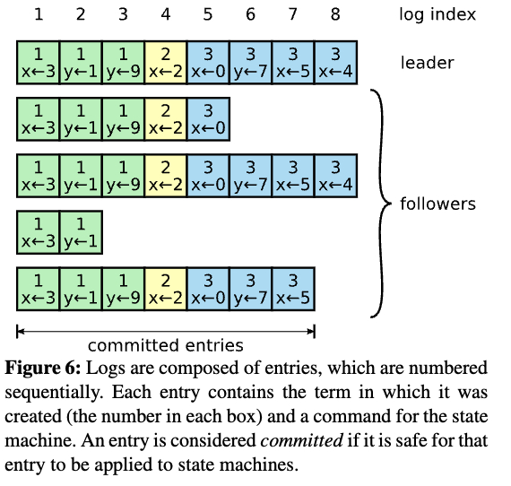
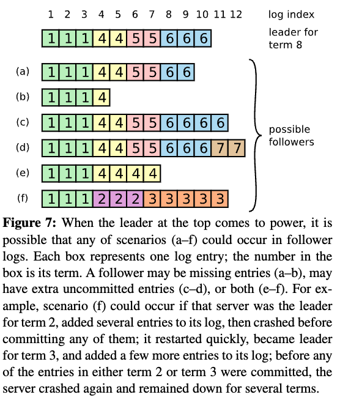

[论文原文](https://pdos.csail.mit.edu/6.824/papers/raft-extended.pdf){target=\_blank}

## 1 Introduction

共识算法允许机器集合作为一个连贯的群体工作，即使其中一些成员出现故障也能继续工作。因为这一点，它们在构建可靠的大规模软件系统中扮演者关键角色。Paxos 在过去的十年中主导了共识算法的讨论，不幸的是，Paxos 相当难以理解，尽管有很多使其更易接受的尝试。另外，其架构需要复杂的修改以支持实用的系统。其结果是，系统构建者和学生都很受 Paxos 困扰。

因此，我们以可理解性为主要目标，设计了一套新的共识算法，即：**Raft**。Raft 与现有的共识算法在很多方面都很相似，但 Raft 有很多新特性：

-   强 leader： 与其它共识算法相比，Raft 使用了更强的领导权形式。例如，日志条目(log entry)仅从 leader 流向其它服务器。这简化了对多副本日志的管理，并使 Raft 更容易理解。

-   领导选举： Raft 使用随机计时器来选举 leader。这仅在任何共识算法都需要的心跳机制上增加了很小的机制，但能够简单又快速地解决冲突。

-   成员变更： Raft 用来变更集群中服务器集合的机制使用了一个新的*联合共识（joint consensus）*方法，其两个不同配置中的大多数服务器会在切换间有重叠。这让集群能够在配置变更时正常地继续操作。

我们认为，无论为了教育目的还是作为实现的基础，Raft 都比 Paxos 和其它共识算法更优秀；Raft 的描述足够完整，能够满足使用系统的需求；Raft 有很多开源实现并已经被一些公司使用；Raft 的安全性性质已经被形式化定义并证明；Raft 的效率与其它算法相似。

## 2 Replicated state machines

## 3 What’s wrong with Paxos?

## 4 Designing for understandability

## 5 The Raft consensus algorithm

<figure markdown="span">
    { width="450" }
</figure>

### 5.1 Raft basics

一个 Raft 集群由多个 Server 组成，通常是 5 个，这样的系统可以容忍两个 Server 崩溃。在任何时间，每个 Server 只能是以下三种状态之一：leader, follower, or candidate。正常运行时，一个集群只有一个 leader，其他 Server 都是 follower。 follower 不会主动提出任何请求，只是被动响应 leader。leader 会处理所有客户端请求（如果 follower 收到客户端请求会将其重定向到 leader）。candidate 状态是为了选举一个新的 leader，会在 5.2 节介绍。状态间的转换如下图：

<figure markdown="span">
    { width="450" }
</figure>

Raft 将时间划分长度不定的任期，如下图：任期使用连续的整数来编号。

<figure markdown="span">
    { width="450" }
</figure>

每个任期由选举开始，其中一个或更多的 candidate 试图成为 leader，5.2 节介绍。在某些情况下，选举会出现票数相等的情况，这种情况任期会直接结束，新的任期很快会重新开始（通过一次新的选举）。Raft 保证一个任期内最多有一个 leader。

不同的服务器可能会在不同的时间观察到任期的转换，在一些情况下一个节点甚至可能错过整个任期，任期作为 Raft 的逻辑时钟，可以帮助 Server 检测旧信息以及过时的 leader。**每个 Server 内都会维护一个单调递增的 current term 字段，在 Server 间的所有通信都会带有该字段。**

Raft 节点间使用 RPC 进行通信，最基本的 Raft 共识算法只需要两种 RPC：

-   RequestVote：该调用会在选举期间被 candidates 调用，用途是拉票；

-   AppendEntries：该调用会在正常运行期间被 leader 调用，用途是复制 log 以及实现心跳机制。

在第 7 节中引入了第三种 RPC 调用，用于在 Server 间传递快照。当请求失败时 Server 会及时重试，并且为了性能，请求都是并行进行的。

### 5.2 Leader election

Raft 通过心跳机制来触发选举。当集群启动时，所有 Server 都是 follower，Server 会维持 follower 状态，如果一段时间（**election timeout**）内没收到来自 leader 的心跳，它就假设 leader 已经不可达来，然后开启一个新的选举去选择一个新的 leader。leader 会周期的向每个 follower 发送心跳（空 log entries 的 AppendEntries 调用），来维护自身的权威。

开始选举时，follower 会自增其 current term 字段，然后将其状态改变为 candidate。然后并行的向集群中的其他节点发起 RequestVote 调用，candidate 会一直持续到出现下面三种情况之一：

1. 它赢得了选举：如果候选者在同一任期内获得整个集群中大多数服务器的投票，则该候选者将赢得选举。每个服务器在给定任期内最多为一名候选人投票，先到先得（第 5.4 节增加了对投票的额外限制）。多数票规则确保在某一任期内最多只有一名候选人能够赢得选举。一旦某个候选者赢得选举，它就会成为领导者。然后，它就会向所有其他服务器发送心跳信息，以确立自己的权威，防止出现新的选举。

2. 其他节点成为了 leader：在等待选票时，candidate 可能会收到来自 leader 的 AppendEntries 调用，如果该 leader 的任期号大于等于的 candidate 的任期，candidate 就会意识到已经有人是 leader 了，他会变回 follower 状态；否则它会拒绝该请求，然后继续保持 candidate 状态。

3. 一段时间过去但没有 leader 出现：当同时有多个 follower 变为 candidate，就会导致选票分散，最终谁都不能得到大多数都选票，当这种情况发生时，每个候选人都会超时，并通过增加任期和启动新一轮请求投票 RPC 开始新的选举。但仅仅重试，可能会一直重复上述情况。

**Raft 采用随机选举超时机制来解决。**为了从一开始就防止分裂投票，election timeout 就是从一个固定间隔（例如 150-300ms）中随机选择的。这样可以分散服务器，在大多数情况下只有一台服务器会超时；它会赢得选举，并在其他服务器超时前发送心跳。同样的机制也用于处理分票。每个候选人在选举开始时重新启动其随机选举超时，等待超时结束后再开始下一次选举；这就降低了在新一轮选举中再次出现分裂投票的可能性。第 9.3 节表明，这种方法能迅速选出领导者。

### 5.3 Log replication

一旦 leader 被选举出来，它就开始处理客户端的请求。每个客户请求都包含复制状态机要执行的命令，领导者将命令作为新条目添加到日志中，然后并行向其他每台服务器发送 AppendEntries RPC，以复制该条目。当条目被安全复制后（如下所述），领导者会将条目应用到其状态机中，并将执行结果返回给客户端。果 follower 崩溃或运行缓慢，或者如果网络包丢失，leader 会无限重试 AppendEntries RPC（即使它已经响应了客户端），直到所有的 follower 最终存储了所有的日志条目。

log 的组织形式如下图所示，每个 log entry 都存储着状态及命令已经被 leader 接收时的任期编号，每个日志条目还有一个标识它在日志中的位置的整数 index（索引）：

<figure markdown="span">
    { width="450" }
</figure>

leader 会决定什么时候能够安全地将日志条目应用到状态机，这种条目被称为 committed（已提交）的。Raft 保证 committed 的条目时持久性的，且最终将会被所有可用的状态机执行。一旦撞见了日志条目的 leader 将其如知道了大多数服务器上，那么该条目会变成 committed 的（e.g. entry 7 in Figure 6）。这也会提交领导者日志中之前的所有条目，包括前任领导者创建的条目。第 5.4 节会讨论这块的细节，同时也说明了这一承诺定义是安全的。

领导者会维护它所知道的已提交的最高索引，并在未来的 AppendEntries RPC（包括心跳）中包含该索引，以便其他服务器最终发现，如果追随者得知日志条目已提交，它就会将该条目应用到其本地状态机（按日志顺序排列）。

我们设计了 Raft 日志机制，以保持不同服务器上的日志之间的高度一致性。Raft 维护以下适当关系，这些关系共同构成日志匹配属性：

-   **如果不同日志中的两个条目具有相同的索引和任期，则它们存储的是相同的命令。**该属性表明：对于给定的日志索引和给定的任期 leader 只会创建一个 log entry，并且 log entry 不会改变其位置。

-   **如果不同日志中的两个条目具有相同的索引和任期，则日志中所有前面的条目都是相同的。**该属性通过 AppendEntries 调用执行的一致性检查保证，当 leader 发送一个 AppendEntries RPC 调用时，会带着新 entry 当前一个 log entry 的索引和任期。如果 follower 没有对应的 log entry 或者前一个 log entry 的任期或索引不正确，就会拒绝追加日志的请求。

正常的操作，leader 和 follower 将会一直保持一致，leader 的崩溃可能会导致日志的不一致（旧的 leader 可能没有完全复制其日志中的所有条目），这些不一致可能会在很多 leader 和 follower 的崩溃后加剧，Figure 7 中展示了可能出现的情况，follower 可能缺少 leader 中的 log entry，也可能有 leader 中没有的 log entry，也可能两种都有：

<figure markdown="span">
    { width="350" }
</figure>

在 Raft 中，leader 会覆盖 follower 中的一些 log entry，来强制复制。第 5.4 节将详细说明，如果再加上一个限制条件，这种方法是安全的。

为了使 follower 与 leader 一致，leader 需要找到二者日志中最后一个相同的 log entry，从该日志之后开始，将 leader 中的日志依次发给 follower。以上过程都是在 AppendEntries 一致性检查时进行的。leader 会为每个 follower 维护一个 nextIndex ，表示下一个要发给该 follower 的 log entry 索引。当 leader 刚任职时，所有的 nextIndex 会被初始化为它当前的日志索引的下一个索引（在 Figure 7 是 11），当 AppendEntries 调用失败时，leader 会递减对应的 nextIndex，然后重试 AppendEntries，最终 nextIndex 的值将会正确指向 follower 下一个需要的日志索引。

??? tip "optimization"

    论文中提出的一种优化是：当 AppendEntries 失败时，follower 返回冲突的日志所在的任期号，以及该 follower 存储的对应任期的第一个 log entry 索引，这样 leader 可以直接跳过这些 log entry，来减少 AppendEntries 的失败调用次数。

    但是论文中认为该优化可能不太必要，因为实际生产环境中崩溃没那么频繁，而且不一致的 log entry 也没那么多。

leader 永远不会删除或覆盖它自己的 log entry（对应 Figure 3 的 Leader Append-Only Property）。

这种日志复制机制体现了 Section 2 描述的理想的共识性质：只要大多数服务器在线，Raft 就可以接受、复制、并应用新日志条目；在正常情况下新日志条目只需要一轮 RPC 就可以被复制到集群中大多数节点上；单个缓慢的 follower 不会影响性能。

### 5.4 Safety

先前章节描述了 Raft 的选举和日志复制机制，然而这些机制还不能确保每个状态机都以相同的顺序执行命令。例如，follower 可能在 leader 提交一些日志条目时不可用，然后它可能被选举为 leader 并讲这些条目覆盖为新的条目；这样，不同的状态机可能执行不同的指令序列。

本章通过添加可以被选举为 leader 的 Server 的限制来完善了 Raft 算法，这一约束确保了任何被选举成为 leader 的 Server 包含当前任期之前所有已经被提交 log entry（Figure 3 的 Leader Completeness Property）。通过选举约束，我们可以让提交的规则更加精确。最后，我们给出了 Leader Completeness Property 的简要证明，并展示了它如何让多副本状态机的行为正确。

#### 5.4.1 Election restriction

在任何基于 leader 的共识算法中，leader 最终都要包含所有已经提交的 log entry，在一些共识算法中，如：Viewstamped replication revisited，即使一个服务器最初没有还包含所有已提交的日志条目，它也可以被选举为 leader。这些算法有额外的机制来识别确实的日志条目，并在选举时或选举完成后的很短的时间里，将它们传输给新的 leader。不幸的是，这需要引入相当多的额外的机制，大大增加了复杂性。

Raft 使用了一种更简单的方法，只有拥有最新 log entry 的 candidate 才能被选举为 leader，拥有更新的任期号的 log entry 更新，如果任期号相同，那么索引越大的越新，因为只有获得大多数投票才能当选，且一个被认定为被提交的 log entry 是已经被赋值到大多数节点上了，所以可以当选的 candidate 一定是拥有最新已经被提交的 log entry 的节点。这也意味着 log entry 仅单向流动：从 leader 到 follower，且 leader 永远不会覆写它的日志中已存在的条目。

#### 5.4.2 Committing entries from previous terms

如第 5.3 节所述，leader 知道，一旦当前任期内的一个 log entry 存储在大多数服务器上，该 entry 就是已提交的。如果领导者在提交条目前崩溃，未来的领导者将尝试完成条目的复制。然而新的 leader 不能通过副本数来提交上一个任期中的 log entry，Figure 8 说明了这样一种情况：

<figure markdown="span">
    { width="450" }
</figure>

情况 C 中当重新当选的 S1 将任期 2 的日志复制到大多数的节点中，如果此时 S1 将它提交，但是在通知其他 follower 前崩溃了，那么 S5 就有机会当选，当 S5 当选后，就会把 任期 3 的日志重新赋值并提交，导致 S1 中已经提交的任期 2 中的日志被覆盖。所以一个新的 leader 是不能通过日志的副本数来提交上一个任期内的日志。

为了解决这个问题，Raft 只运行 leader 提交当前任期内已经复制到大多数机器上的日志，因为有 Log Matching Property，所以上一个任期中的日志会顺带被提交，之前任期中的日志新 leader 只能拷贝，不能提交。

#### 5.4.3 Safety argument

这部分是 Raft 的安全性证明，可以参考原文。

### 5.5 Follower and candidate crashes

目前我们都专注于 leader 故障的情况。处理 follwer 和 candidate 崩溃比处理 leader 崩溃简单得多，且这二者的故障可以用相同的方式处理。如果一个 follower 或 candidate 故障，那么之后发送到它的 RequestVote 和 AppendEntries RPC 会失败。Raft通过无限重试来处理这些故障；如果崩溃的服务器重启，那么RPC将会成功完成。如果服务器在完成RPC后但在响应前故障，那么在它重启后会收到相同的 RPC。Raft 的 RPC 是幂等的，所以这不会造成影响。例如，如果一个 follower 收到了一个包含了已经在它日志中的条目的 AppendEntries，它会忽略新请求中的那些条目。

### 5.6 Timing and availability

我们对 Raft 的要求之一是安全性决不能依赖定时：系统绝不能因某个时间发生的比预期的更快或更慢而产生错误的结果。但可用性（系统能够及时响应客户端的能力）不得不依赖与时间，例如，如果崩溃服务器间的消息交换消耗了比通常更长的时间，candidate将不会保持足够的时间以赢得选举。没有稳定的 leader，Raft 就不能处理任何请求。

所以尽管 Raft 对于事件发生的先后没有要求，但是对于一些事件的事件消耗有一定的限制：

$$
broadcastTime \ll electionTimeout \ll MTBF 
$$

$broadcatTime$ 是广播时间，即服务器将RPC并行地发送给集群中的每个服务器并收到它们的响应的平均时间，$electionTimeout$ 是 5.2 节中描述的选举超时时间，$MTBF$ 是故障发生的平均时间。

$broadcastTime$ 应该比 $electionTimeout$ 小一个数量级，这样leader可以可靠的发送心跳消息以阻止选举发生；因为 $exectionTimeout$ 采用了随机方法，这一不等性也让投票决裂不太可能发生。$electionTimeout$ 应该比 $MTBF$ 小几个数量级，这样系统能够取得稳定的进展。当leader崩溃时，系统将会在大概 $electionTime$ 的时间内不可用，我们想让这一时间仅占总时间的很小的比例。

## 6 Cluster membership changes

