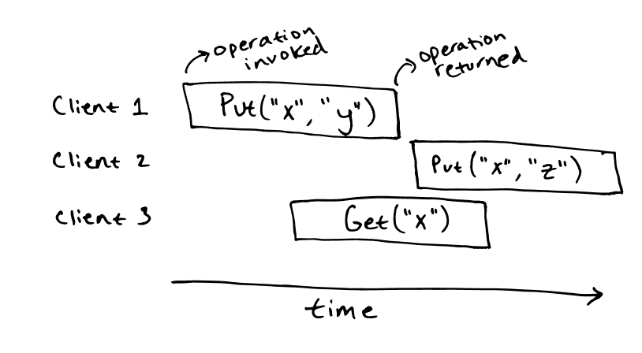
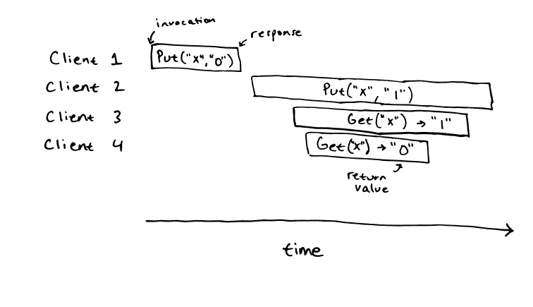
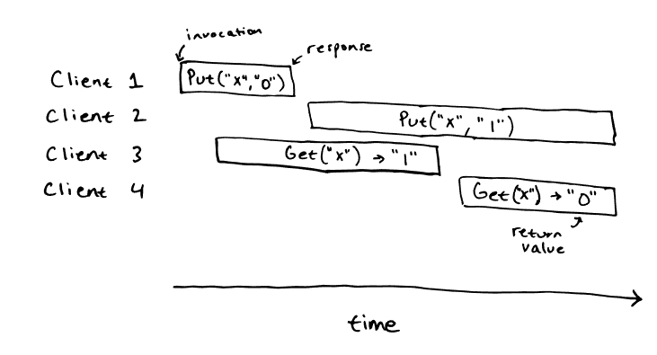
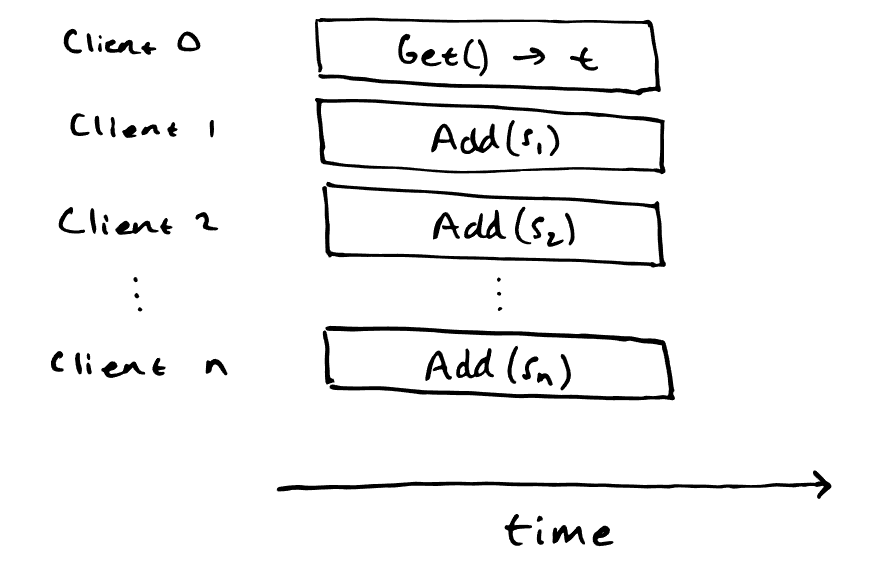

# Testing Distributed Systems for Linearizability

[原文地址](https://anishathalye.com/testing-distributed-systems-for-linearizability){target=_blank}

正确实现分布式系统具有挑战性，因为要处理并发和失败，网络可能延迟、拷贝、重排、丢包而且机器可能在任何时候崩溃。即使设计在论文上被证明是正确的，在实现过程中也很难避免细微的错误。

除非我们想使用形式化方法[$^1$](/Distributed/tdsl/#effectiveness) ，否则，如果我们想保证系统的实现是正确的，就必须对系统进行测试。测试分布式系统也是一项挑战。并发性和不确定性使得在测试中很难捕捉到错误，尤其是当最微妙的错误只在常规运行中不常见的情况下才会出现时，例如同时出现机器故障或极端的网络延迟。


## Correctness

在讨论测试分布式系统的正确性之前，我们需要定义 “正确 ”的含义。即使是看似简单的系统，准确地说明系统应该如何运行也是一个复杂的过程[$^2$](/Distributed/tdsl/#effectiveness)。

考虑一个类似于 etcd 的简单键值存储，它将字符串映射为字符串并支持两种操作： `Put(key，value)`和 `Get(key)`。首先，我们考虑它在顺序情况下的行为。

### Sequential Specifications

我们大概对键值存储在串行操作下的行为有了直观的了解： 获取操作必须反映应用之前所有 Put 操作的结果。例如，我们可以运行 `Put(“x”, “y”)`，随后的 `Get(“x”)` 应该返回 `“y”`。如果操作返回的是 `“z”`，那就不正确了。

比语言描述更正式的是，我们可以将键值存储的规范写成可执行代码：

```python
class KVStore:
    def __init__(self):
        self._data = {}

    def put(self, key, value):
        self._data[key] = value

    def get(self, key):
        return self._data.get(key, "")
```

代码虽然很短，但却详细描述了所有重要细节：起始状态、操作后如何修改内部状态，以及调用键值存储后会返回哪些值。该规范明确了一些细节，比如在一个不存在的键上调用 `Get()` 时会发生什么，但总的来说，它符合我们对键值存储的直观定义。

### Linearizability

接下来，我们将考虑我们的键值存储如何在并发操作下运行。请注意，串行规范并没有告诉我们在并发操作下会发生什么情况。例如，串行规范并没有定义我们的键值存储在这种情况下的行为：

<figure markdown="span">
{ width="550" }
</figure>

`Get(“x”)` 操作应该允许返回什么值并不是一目了然的。直观地说，由于 `Get(“x”)` 与 `Put(“x”, “y”)` 和 `Put(“x”, “z”)` 是并发的，因此它可以返回任何一个值，甚至可以返回`“”`。如果另一个客户端在更晚的时间执行了 `Get(“x”)`，我们可以说该操作必须返回 `“z”`，因为这是最后一次写入所写入的值，而最后一次写入操作与其他写入操作并不同时进行。

我们使用一种称为 [linearizability](https://cs.brown.edu/~mph/HerlihyW90/p463-herlihy.pdf){target=_blank} 的一致性模型，在串行规范的基础上正式规定并发操作的正确性。**在 linearizable 系统中，每个操作似乎都是在调用和响应之间的某个时刻以原子方式瞬时执行的。**除了 linearizability，还有其他一致性模型，但许多分布式系统都提供 linearizability 行为：linearizability 是一种强一致性模型，因此在可线性化系统之上构建其他系统相对容易。

> In a linearizable system, every operation appears to execute atomically and instantaneously at some point between the invocation and response. 

举例说明键值存储操作的调用：

<figure markdown="span">
{ width="550" }
</figure>

这段历史是可线性化的。我们可以通过明确找到所有操作的线性化点来证明这一点（下图中橙色部分为线性化点）。可以得出顺序历史记录： `Put(“x”, “0”)`, `Get(“x”) -> “0”`，`Put(“x”, “1”)`,`Get(“x”) -> “1”`，就顺序规范而言是正确的历史记录。

相比之下，这段历史是不可线性化的：

<figure markdown="span">
{ width="550" }
</figure>


就顺序规范而言，这段历史没有线性化：没有办法为这段历史中的操作指定线性化点。我们可以开始为客户机 1、2 和 3 的操作指定线性化点，但这样就无法为客户机 4 指定线性化点：因为它将观察到一个陈旧的值。同样，我们可以开始为客户机 1、2 和 4 的操作分配线性化点，但客户机 2 操作的线性化点会在客户机 4 操作开始之后，这样我们就无法为客户机 3 分配线性化点：它只能合法读取“”或 “0 ”的值。

## Testing

有了正确性的可靠定义，我们就可以考虑如何测试分布式系统了。一般方法是在测试正确运行的同时，随机注入故障，如机器故障和网络分区。我们甚至可以模拟整个网络，这样就有可能造成超长的网络延迟。由于测试是随机的，因此我们需要多次运行测试，以确保系统实现的正确性。

### Ad-hoc testing

我们究竟如何测试操作是否正确？对于最简单的软件，我们可以使用输入-输出案例进行测试，如 `assert(expected_output == f(input))`，对于分布式系统，我们可以使用类似的方法。例如，对于键值存储，我们可以进行以下测试，让多个客户端并行执行对键值存储的操作：

```cpp
for client_id = 0..10 {
    spawn thread {
        for i = 0..1000 {
            value = rand()
            kvstore.put(client_id, value)
            assert(kvstore.get(client_id) == value)
        }
    }
}
wait for threads
```

当然，如果上述测试失败，那么键值存储就不可线性化。不过，这个测试并不彻底：有一些不可线性化的键值存储也能通过这个测试。

### Linearizability

更好的测试方法是让并行客户端运行完全随机的操作：例如，重复调用 `kvstore.put(rand(), rand())` 和 `kvstore.get(rand())`，也可以限制 key 的范围来增加竞争。但在这种情况下，我们如何确定什么是 “正确 ”操作呢？在比较简单的测试中，我们让每个客户端在一个单独的密 key 上操作，这样可以准确预测输出结果。

当客户同时操作同一组密钥时，情况就会变得更加复杂：我们无法预测每个操作的输出结果，因为正确答案并非只有一个。因此，我们必须采取另一种方法：我们可以通过记录系统的整个操作历史来测试正确性，然后检查该操作历史相对于顺序规范是否可线性化。

#### Linearizability Checking

可线性化检查程序的输入是一个顺序规范和一个并发历史记录，它运行一个决策过程来检查历史记录相对于规范是否可线性化。

#### NP-Completeness

不幸的是，线性化检查是 NP-完备的。证明方法其实很简单：我们可以证明线性化检查在 NP 中，也可以证明一个 NP 难问题可以简化为线性化检查。显然，线性化检查在 NP 中：给定一个线性化，即所有操作的线性化点，我们可以在多项式时间内检查它是否是一个关于顺序规范的有效线性化。

为了证明线性化检查是 NP 难的，我们可以把子集和问题简化为线性化检查。子集和问题：给定一个非负整数集合 $S=\{s_1,s_2\dots ,s_n\}$ 和一个目标和 $t$，我们需要确定是否存在一个 $S$ 的子集其元素和为 $t$，我们可以把这个问题简化为线性化检查，具体如下。考虑顺序规范：

```python
class Adder:
    def __init__(self):
        self._total = 0

    def add(self, value):
        self._total += value

    def get(self):
        return self._total
```

再看看这段历史：

<figure markdown="span">
{ width="550" }
</figure>

当且仅当子集求和问题的答案是 “yes” 时，这个历史记录才是可线性化的。如果这段历史是 linearizable，我们可以将子集和为 $t$ 的所有 $s_i$ 对应的 `Add(s_i)` 的线性化点放在 `Get()` 操作的线性化点的前面。如果不存在和为 $t$ 的子集，那么我们就可以得出该历史是不可线性化的。

#### Implementation

尽管可线性化检查是 NP-完全的，但在实践中，它在小范围的历史上也能发挥相当大的作用。线性化检查程序的实现需要一个可执行的规范和一个历史记录，然后运行一个搜索程序来尝试构建线性化，并使用一些技巧来限制搜索空间的大小。

现有的可线性化检查器包括 [Knossos](https://github.com/jepsen-io/knossos){target=_blank}，它被用于 [Jepsen](https://jepsen.io/){target=_blank} 测试系统。不幸的是，在测试我（原文作者）编写的分布式键值存储实现时，我无法让 Knossos 检查我的历史记录。在几个并发客户端的历史记录中，它似乎还能正常工作，历史记录事件总数约为 100 个，但在我的测试中，有数十个客户端生成了数千个事件的历史记录。

为了测试我的键值存储，我编写了 [Porcupine](https://github.com/anishathalye/porcupine){target=_blank}，这是一个用 Go 实现的快速线性化检查器。Porcupine 可检查历史是否可线性化，以 Go 语言编写的可执行规范为例。根据经验，Porcupine 比 Knossos 快数千倍。我之所以能用它来测试我的键值存储，是因为它能在几秒钟内检查数千个事件的历史记录。

## Effectiveness

使用故障注入和线性化检查对可线性化分布式系统进行测试是一种有效的方法。

为了比较临时测试和使用 Porcupine 的线性化检查，我尝试用这两种方法测试我的分布式键值存储。我试着在键值存储的实现中引入不同类型的设计错误，比如修改会导致过时读取，然后检查哪些测试失败了。临时测试捕捉到了一些最严重的错误，但测试无法捕捉到更微妙的错误。与此相反，我构造不出一个线性化测试捕捉不到的正确性错误。

----

[1] 形式化方法（Formal methods）可以为分布式系统的正确性提供强有力的保证。例如，[Planning for change in a formal verification of the raft consensus protocol](https://dl.acm.org/doi/pdf/10.1145/2854065.2854081){target=_blank}验证了 Raft 共识协议的实现。遗憾的是，verification  需要专业知识，而且 verifying realistic systems 需要耗费大量精力。也许有一天，现实世界中使用的系统会被证明是正确的，但现在，生产系统只能测试而不能验证。


[2] 理想情况下，所有生产系统都会有正式规范。现实世界中正在使用的一些系统确实有正式规范：例如，Raft 就有一个用 TLA+ 编写的正式规范。但遗憾的是，现实世界中的大多数系统都没有正式规范。