## Hadoop


-   Hadoop 是一个开源分布式计算平台，为用户提供了系统底层细节透明的分布式基础架构

-   Hadoop 的核心是 HDFS 和 MapReduce

Hadoop 的项目结构不断丰富发展，已经形成一个丰富的 Hadoop 生态系统

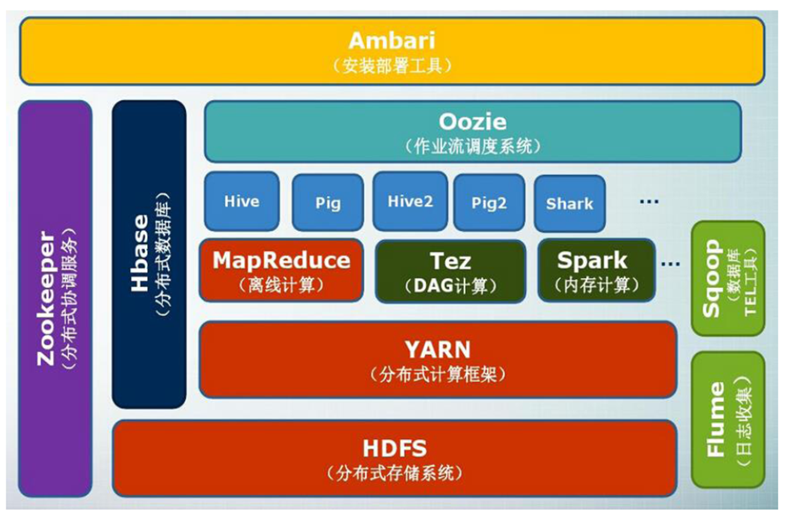

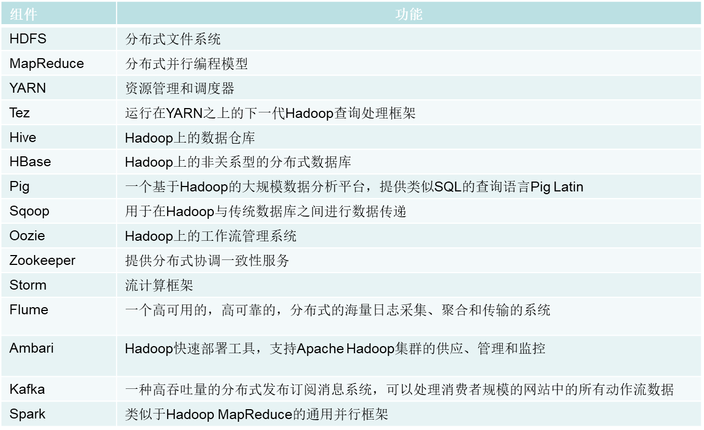

## HDFS

hdfs 的实现目的是：1. 兼容廉价硬件设备、2. 实现流数据读写、3. 支持大数据集、4. 支持简单的文件模型、5. 跨平台兼容性。

局限性：不适合低延迟数据访问，无法高效存储大量小数据，不支持多用户写入随意修改文件

分布式文件系统在物理结构上是由计算机集群中的多个节点构成的，这些节点分为两类，一类叫“主节点”(Master Node)或者也被称为“名称结点”(NameNode)，另一类叫“从节点”（Slave Node）或者也被称为“数据节点”(DataNode)

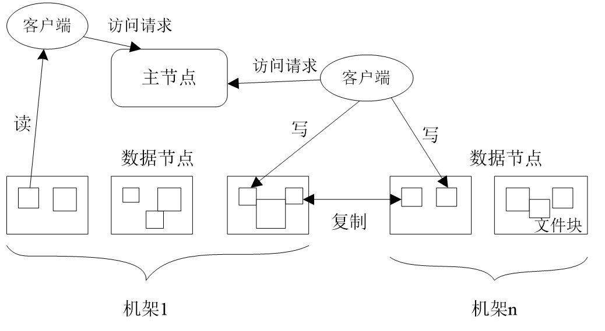

在 HDFS 中，名称节点（NameNode）负责管理分布式文件系统的命名空间（Namespace），保存了两个核心的数据结构，即 FsImage 和 EditLog

-   FsImage 会存储文件复制等级、访问和修改时间、访问权限、块大小以及组成文件到块。

-   EditLog 中记录了所有针对文件的创建、删除、重命名等操作。（磁盘的随机写 -> 为内存写+磁盘顺序写）

这两个结构会被持久化到磁盘上，NameNode 在启动是会加载 FsImage 并将 EditLog 中的修改日志应用到读取到的数据上。关于每个文件中各个块所在的数据节点的位置信息，并不会持久化，每当一个数据节点加入到集群中会向 NameNode 报告它拥有哪些数据块。

随着修改不断进行，EditLog 会不断增大，为了解决该问题，HDFS 使用一个额外的节点 SecondaryNameNode 来做日志的 checkpoint。流程如下：

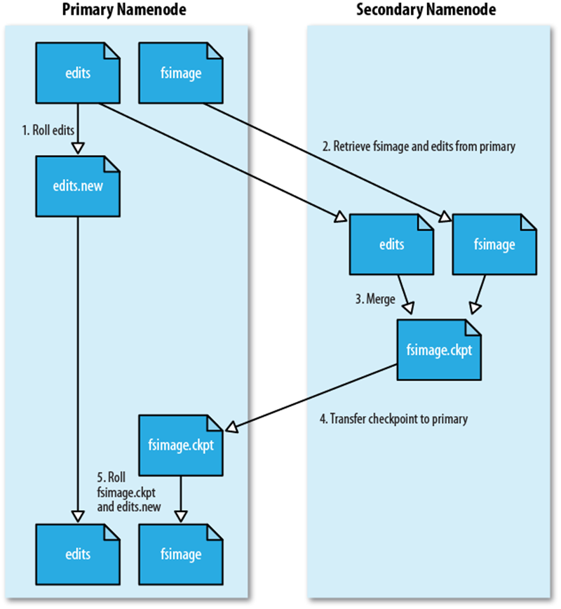

### 错误处理

节点错误，数据错误

### \*读数据

```java
import java.io.BufferedReader;
import java.io.InputStreamReader;
import org.apache.hadoop.conf.Configuration;
import org.apache.hadoop.fs.FileSystem;
import org.apache.hadoop.fs.Path;
import org.apache.hadoop.fs.FSDataInputStream;
public class Chapter3 {
public static void main(String[] args) {
        try {
            Configuration conf = new Configuration();
            conf.set("fs.defaultFS","hdfs://localhost:9000");
            conf.set("fs.hdfs.impl","org.apache.hadoop.hdfs.DistributedFileSystem");
            FileSystem fs = FileSystem.get(conf);
            Path file = new Path("test");
            FSDataInputStream getIt = fs.open(file);
            BufferedReader d = new BufferedReader(new InputStreamReader(getIt));
            String content = d.readLine(); //读取文件一行
            System.out.println(content);
            d.close(); //关闭文件
            fs.close(); //关闭 hdfs
        } catch (Exception e) {
            e.printStackTrace();
        }
    }
}

```

流程如下：

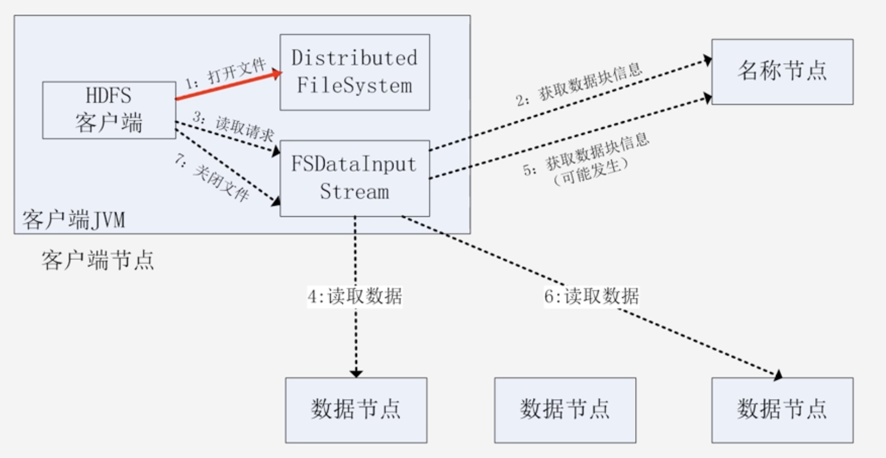

### \*写数据

```java
import org.apache.hadoop.conf.Configuration;
import org.apache.hadoop.fs.FileSystem;
import org.apache.hadoop.fs.FSDataOutputStream;
import org.apache.hadoop.fs.Path;
public class Chapter3 {
        public static void main(String[] args) {
                try {
                        Configuration conf = new Configuration();
                        conf.set("fs.defaultFS","hdfs://localhost:9000");
                        conf.set("fs.hdfs.impl","org.apache.hadoop.hdfs.DistributedFileSystem");
                        FileSystem fs = FileSystem.get(conf);
                        byte[] buff = "Hello world".getBytes(); // 要写入的内容
                        String filename = "test"; //要写入的文件名
                        FSDataOutputStream os = fs.create(new Path(filename));
                        os.write(buff,0,buff.length);
                        System.out.println("Create:"+ filename);
                        os.close();
                        fs.close();
                } catch (Exception e) {
                        e.printStackTrace();
                }
        }
}
```

## HBase

HBase 是一个列式存储的分布式数据库，是谷歌 BigTable 的开源实现，主要用来存储非结构化和半结构化的松散数据。

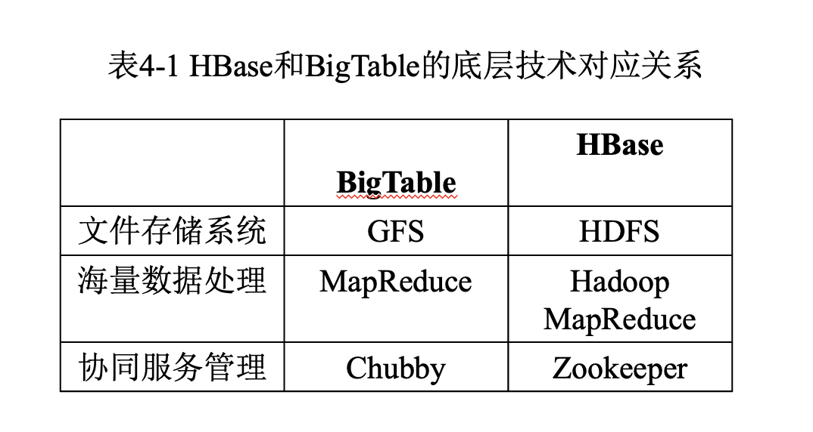

??? question "为什么需要 HBase?"

    Hadoop 可以很好地解决大规模数据的离线批量处理问题，但是，受限于 Hadoop MapReduce 编程框架的高延迟数据处理机制，使得 Hadoop 无法满足大规模数据实时处理应用的需求

我们可以通过以下方式访问 HBase 中的数据：

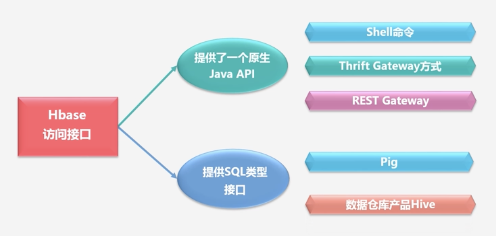

HBase 是一个稀疏、多维度、排序的映射表，这张表的索引是行键、列族、列限定符和时间戳

### 数据模型

HBase 中的数据模型如下：


-   表：HBase 采用表来组织数据，表由行和列组成，列划分为若干个列族；

-   行：每个 HBase 表都由若干行组成，每个行由行键（row key）来标识；

-   列族：一个 HBase 表被分组成许多“列族”（Column Family）的集合，它是基本的访问控制单元；

-   列限定符：列族里的数据通过列限定符（或列）来定位；

-   单元格：在 HBase 表中，通过行、列族和列限定符确定一个“单元格”（cell），单元格中存储的数据没有数据类型，总被视为字节数组 byte[]；

-   时间戳：每个单元格都保存着同一份数据的多个版本，这些版本采用时间戳进行索引。

### 实现原理

HBase 的功能组件如下：

（1）库函数：链接到每个客户端

（2）一个 Master 主服务器：主服务器 Master 负责管理和维护 HBase 表的分区信息，维护 Region 服务器列表，分配 Region，负载均衡；

（3）许多个 Region 服务器：负责存储和维护分配给自己的 Region，处理来自客户端的读写请求

客户端并不是直接从 Master 主服务器上读取数据，而是在获得 Region 的存储位置信息后，直接从 Region 服务器上读取数据，客户端并不依赖 Master，而是通过 Zookeeper 来获得 Region 位置信息，大多数客户端甚至从来不和 Master 通信，这种设计方式使得 Master 负载很小。

同一个 Region 不会被分拆到多个 Region 服务器，每个 Region 服务器存储 10-1000 个 Region。

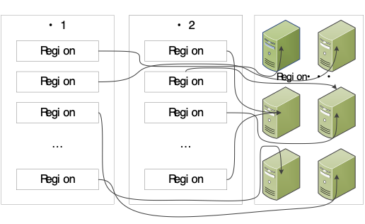

未来找到每个 Region 的具体位置，HBase 要向客户端提供 Region 和 Region 服务器 的映射关系表，也就是 .META. 表，为了防止 META 表过大，导致一个 Region 都存不下其本身，所以 HBase 构建了三层结构：

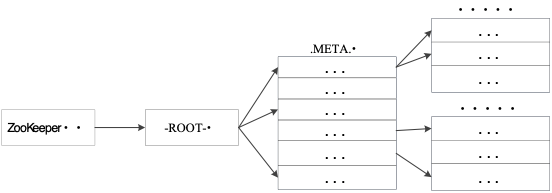
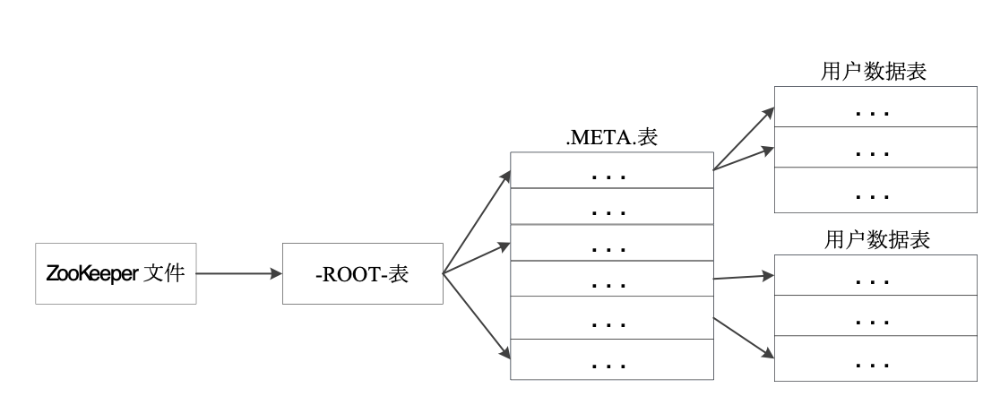

下面是 HBase 的系统架构：

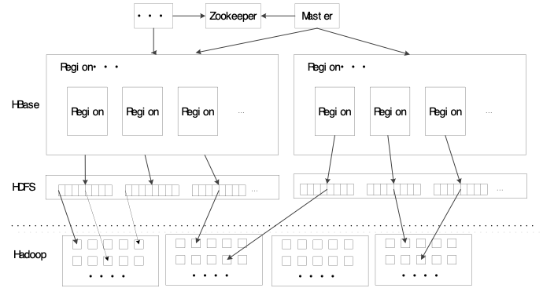

-   客户端：客户端包含访问 HBase 的接口，同时在缓存中维护着已经访问过的 Region 位置信息，用来加快后续数据访问过程

-   Zookeeper 服务器：Zookeeper 可以帮助选举出一个 Master 作为集群的总管，并保证在任何时刻总有唯一一个 Master 在运行，这就避免了 Master 的“单点失效”问题，Zookeeper 是一个很好的集群管理工具，被大量用于分布式计算，提供配置维护、域名服务、分布式同步、组服务等。

-   Master：主服务器 Master 主要负责表和 Region 的管理工作：

    -   管理用户对表的增加、删除、修改、查询等操作

    -   实现不同 Region 服务器之间的负载均衡

    -   在 Region 分裂或合并后，负责重新调整 Region 的分布

    -   对发生故障失效的 Region 服务器上的 Region 进行迁移

-   Region 服务器：Region 服务器是 HBase 中最核心的模块，负责维护分配给自己的 Region，并响应用户的读写请求

### Region 服务器

Region 服务器的工作原理如下：

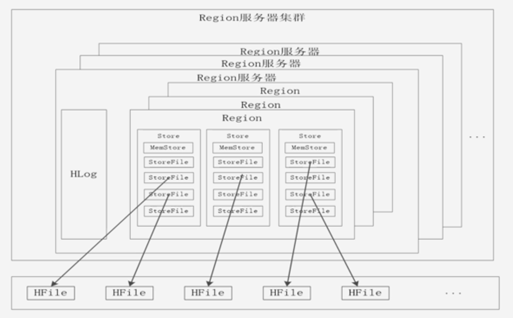

每个列族都对应一个 Store，当 Store 中的数据不断增加，导致 Region 过大，HBase 就会将 Region 分裂，将列族数据分区。

用户读写数据过程：

-   用户写入数据时，被分配到相应 Region 服务器去执行

-   用户数据首先被写入到 MemStore 和 Hlog 中

-   只有当操作写入 Hlog 之后，commit() 调用才会将其返回给客户端

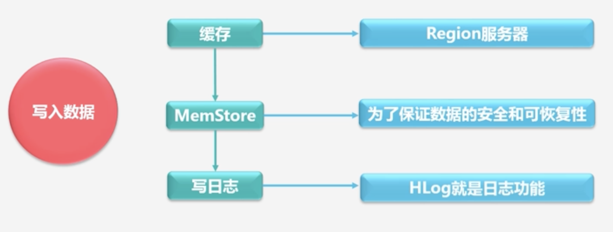

-   当用户读取数据时，Region 服务器会首先访问 MemStore 缓存，如果找不到，再去磁盘上面的 StoreFile 中寻找

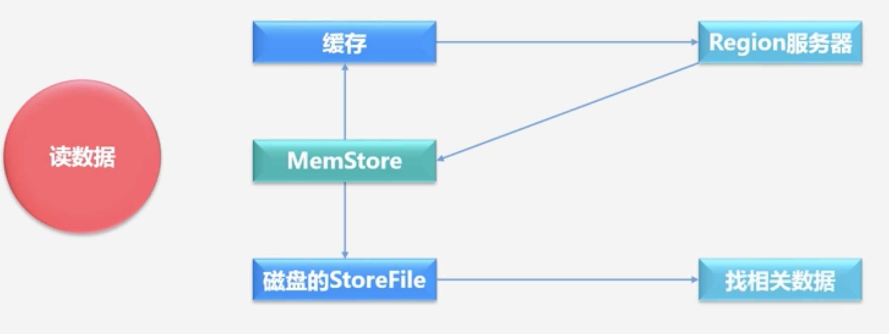

缓存的刷新过程：

-   系统会周期性地把 MemStore 缓存里的内容刷写到磁盘的 StoreFile 文件中，清空缓存，并在 Hlog 里面写入一个标记

-   每次刷写都生成一个新的 StoreFile 文件，因此，每个 Store 包含多个 StoreFile 文件

-   每个 Region 服务器都有一个自己的 HLog 文件，每次启动都检查该文件，确认最近一次执行缓存刷新操作之后是否发生新的写入操作；如果发现更新，则先写入 MemStore，再刷写到 StoreFile，最后删除旧的 Hlog 文件，开始为用户提供服务；

StoreFile 的合并：

-   每次刷写都生成一个新的 StoreFile，数量太多，影响查找速度

-   调用 Store.compact()把多个合并成一个

-   合并操作比较耗费资源，只有数量达到一个阈值才启动合并

### Java API

我们要通过 Java API 创建如下的表：

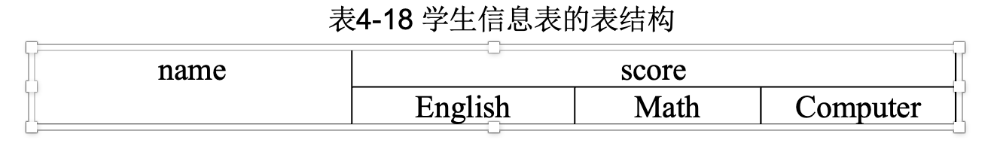

再插入如下数据：
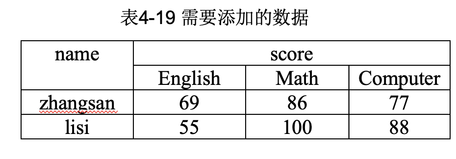

```java
import org.apache.hadoop.conf.Configuration;
import org.apache.hadoop.hbase.*;
import org.apache.hadoop.hbase.client.*;
import org.apache.hadoop.hbase.util.Bytes;
import java.io.IOException;

public class Chapter4{
    public static Configuration configuration;
    public static Connection connection;
    public static Admin admin;
    public static void main(String[] args)throws IOException {
        createTable(“student”,new String[]{“score”});
        insertData(“student”,“zhangsan”,“score”,“English”,“69”);
        insertData(“student”,“zhangsan”,“score”,“Math”,“86”);
        insertData(“student”,“zhangsan”,“score”,“Computer”,“77”);
        getData(“student”, “zhangsan”, “score”, “English”);
    }

    //建立连接
    public static void init(){
        configuration  = HBaseConfiguration.create();
        configuration.set("hbase.rootdir","hdfs://localhost:9000/hbase");
        try{
            connection = ConnectionFactory.createConnection(configuration);
            admin = connection.getAdmin();
        }catch (IOException e){
            e.printStackTrace();
        }
    }

    //关闭连接
    public static void close() {
        try {
            if(admin != null){
                admin.close();
            }
            if(null != connection){
                connection.close();
            }
        } catch (IOException e){
            e.printStackTrace();
        }
    }

    /*创建表*/
    /**
     * @param myTableName 表名
     * @param colFamily列族数组
     * @throws Exception
     */
    public static void createTable(String myTableName,String[] colFamily) throws IOException {
        TableName tableName = TableName.valueOf(myTableName);
        if(admin.tableExists(tableName)){
            System.out.println("table exists!");
        }else {
            HTableDescriptor hTableDescriptor = new HTableDescriptor(tableName);
            for(String str: colFamily){
                HColumnDescriptor hColumnDescriptor = new HColumnDescriptor(str);
                hTableDescriptor.addFamily(hColumnDescriptor);
            }
            admin.createTable(hTableDescriptor);
        }
    }

    /*添加数据*/
    /**
     * @param tableName 表名
     * @param rowKey 行键
     * @param colFamily 列族
     * @param col 列限定符
     * @param val 数据
     * @throws Exception
     */
    public static void insertData(String tableName, String rowKey, String colFamily, String col, String val) throws IOException {
        init();
        Table table = connection.getTable(TableName.valueOf(tableName));
        Put put = new Put(Bytes.toBytes(rowkey));
        put.addColumn(Bytes.toBytes(colFamily), Bytes.toBytes(col), Bytes.toBytes(val));
        table.put(put);
        table.close();
        close();
    }

    /*获取某单元格数据*/
    /**
    * @param tableName 表名
    * @param rowKey 行键
    * @param colFamily 列族
    * @param col 列限定符
    * @throws IOException
    */
    public static void getData(String tableName,String rowKey,String colFamily,String col)throws  IOException{
        init();
        Table table = connection.getTable(TableName.valueOf(tableName));
        Get get = new Get(Bytes.toBytes(rowkey));
        get.addColumn(Bytes.toBytes(colFamily),Bytes.toBytes(col));
        //获取的result数据是结果集，还需要格式化输出想要的数据才行
        Result result = table.get(get);
        System.out.println(
            new String(
                result.getValue(colFamily.getBytes(), col == null ? null : col.getBytes())
            )
        );
        table.close();
        close();
    }
}
```

## NoSQL

传统关系型数据库的缺陷：

-   无法满足海量数据的管理需求

-   无法满足数据高并发的需求

-   无法满足高可扩展性和高可用性的需求

### CAP 理论

-   C（Consistency）：一致性，是指任何一个读操作总是能够读到之前完成的写操作的结果；

-   A:（Availability）：可用性，是指快速获取数据，可以在确定的时间内返回操作结果，保证每个请求不管成功或者失败都有响应；

-   P（Tolerance of Network Partition）：分区容忍性，是指当出现网络分区的情况时，分离的系统也能够正常运行，也就是说，系统中任意信息的丢失或失败不会影响系统的继续运作。

CAP 理论告诉我们，一个分布式系统不可能同时满足一致性、可用性和分区容忍性这三个需求，最多只能同时满足其中两个，正所谓“鱼和熊掌不可兼得”。

### BASE 理论

BASE 即：基本可用（Basically Availble）、软状态（Soft-state）、最终一致性（Eventual consistency）；

-   基本可用：基本可用，是指一个分布式系统的一部分发生问题变得不可用时，其他部分仍然可以正常使用，也就是允许分区失败的情形出现

-   软状态：“软状态（soft-state）”是与“硬状态（hard-state）”相对应的一种提法。数据库保存的数据是“硬状态”时，可以保证数据一致性，即保证数据一直是正确的。“软状态”是指状态可以有一段时间不同步，具有一定的滞后性

-   最终一致性：允许后续的访问操作可以暂时读不到更新后的数据，但是经过一段时间之后，必须最终读到更新后的数据。

### NewSQL

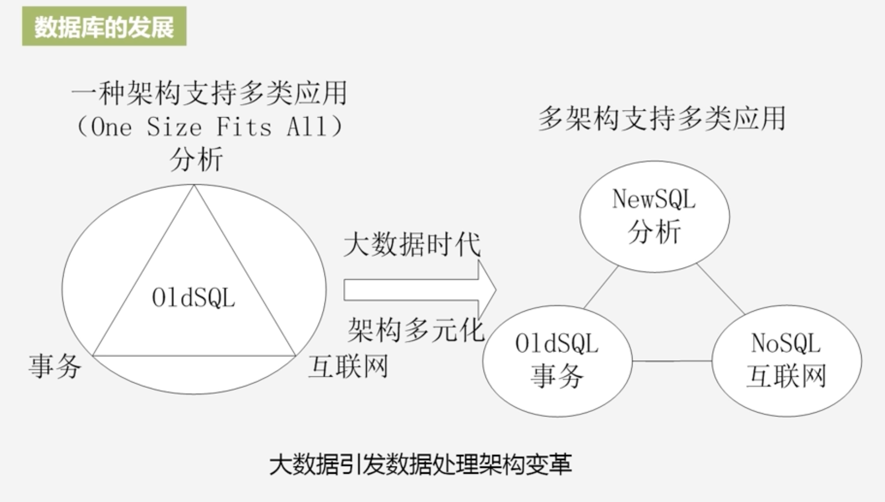

NewSQL 有如下优点：

-   良好的水平拓展性；

-   强一致性；

-   事物；

-   SQL 查询；

-   海量数据存储。

### MongoDB

MongoDB 是一个基于分布式文件存储的开源数据库系统。MongoDB 文档类似于 JSON 对象。字段值可以包含其他文档，数组及文档数组。

在 mongodb 中基本的概念是文档、集合、数据库：

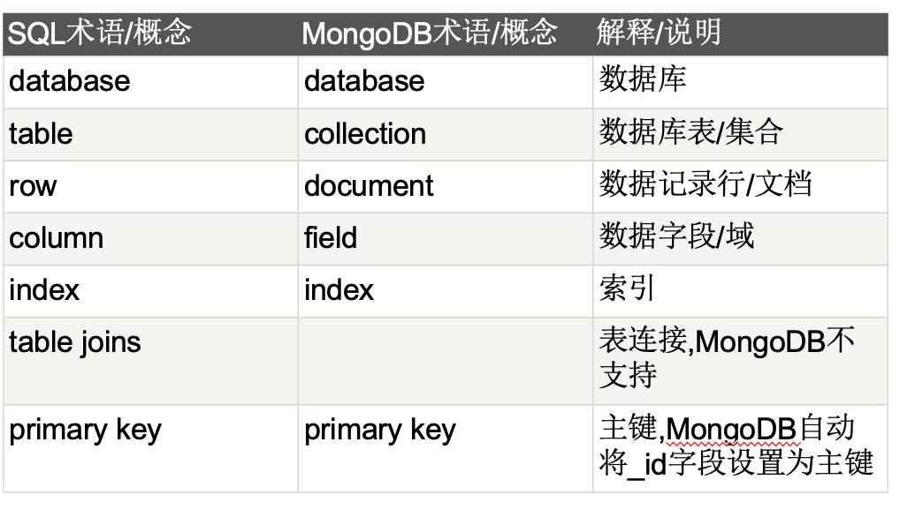

以下是传统关系型数据库与 MongoDB 的数据模型的不同：

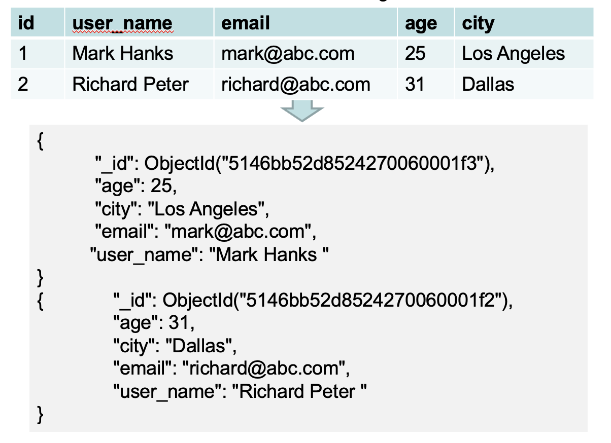

MongoDB 数据类型：

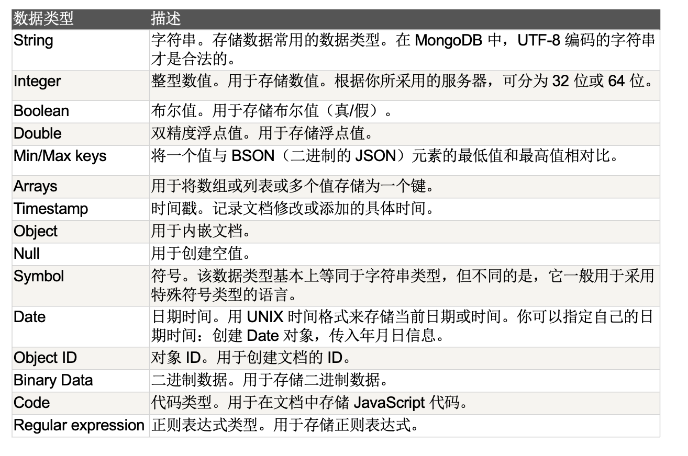

使用 JAVA API 访问 MongoDB 的代码如下：

??? note "连接数据库"

    ```java
    public class MongoDBJDBC{
    public static void main( String args[] ){
        try{
            // 连接到 mongodb 服务
            MongoClient mongoClient = new MongoClient( "localhost" , 27017 );
            // 连接到数据库
            DB db = mongoClient.getDB( "test" );
            System.out.println("Connect to database successfully");
            boolean auth = db.authenticate(myUserName, myPassword);
            System.out.println("Authentication: "+auth);
        }catch(Exception e){
            System.err.println( e.getClass().getName() + ": " + e.getMessage() );
        }
    }
    }
    ```

??? note "创建集合"

    ```java
    public class MongoDBJDBC{
        public static void main( String args[] ){
            try{
                // 连接到 mongodb 服务
                MongoClient mongoClient = new MongoClient( "localhost" , 27017 );
                // 连接到数据库
                DB db = mongoClient.getDB( "test" );
                System.out.println("Connect to database successfully");
                boolean auth = db.authenticate(myUserName, myPassword);
                System.out.println("Authentication: "+auth);
                DBCollection coll = db.createCollection("mycol");
                System.out.println("Collection created successfully");
            }catch(Exception e){
                System.err.println( e.getClass().getName() + ": " + e.getMessage() );
            }
        }
    }
    ```

??? note "插入文档"

    ```java
    public class MongoDBJDBC{
        public static void main( String args[] ){
            try{
            // 连接到 mongodb 服务
                MongoClient mongoClient = new MongoClient( "localhost" , 27017 );
                // 连接到数据库
                DB db = mongoClient.getDB( "test" );
                System.out.println("Connect to database successfully");
                boolean auth = db.authenticate(myUserName, myPassword);
                System.out.println("Authentication: "+auth);
                DBCollection coll = db.getCollection("mycol");
                System.out.println("Collection mycol selected successfully");
                BasicDBObject doc = new BasicDBObject("title", "MongoDB").
                    append("description", "database").
                    append("likes", 100).
                    append("url", "http://www.w3cschool.cc/mongodb/").
                    append("by", "w3cschool.cc");
                coll.insert(doc);
                System.out.println("Document inserted successfully");
            }catch(Exception e){
                System.err.println( e.getClass().getName() + ": " + e.getMessage() );
            }
        }
    }
    ```

## MapReduce
