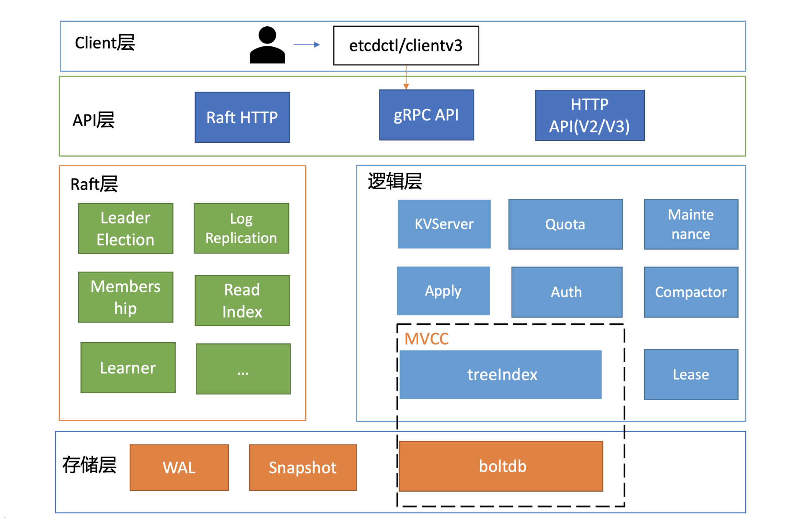
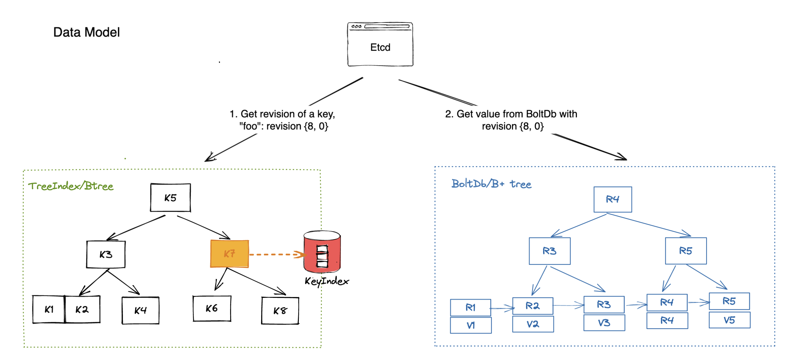
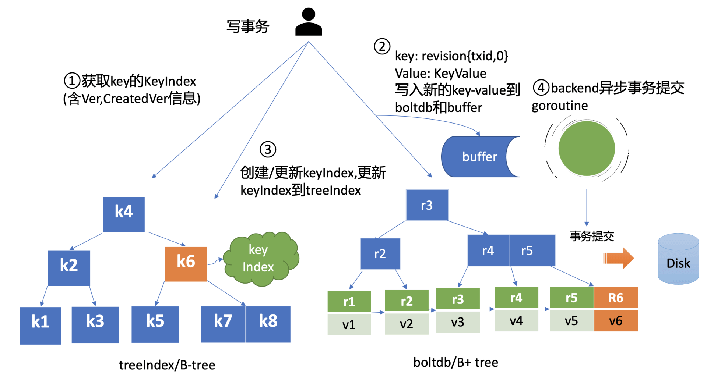
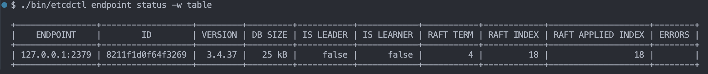

下面是 etcd 的整体架构：



## Raft

etcd 的 Raft 层依靠的是 etcd/raft/v3 实现的，这是 etcd 官方实现的 raft 库，关于该库的细节在之后文章中详细介绍。

## MVCC

etcd v3 加入了 MVCC，每个 kv 对都有多个版本，他们靠如下类来维护：

```go
type keyIndex struct {
	key         []byte  // 用户提供的 key
	modified    Revision // 最新一次修改后的版本
	generations []generation // 该 key 产生的所有代
}

type Revision struct {
	Main int64 // 主版本号
	Sub int64 // 一个事务内修改版本号，初始为 0，随修改次数递增
}

type generation struct {
	ver     int64 // 对于这代的修改次数
	created Revision // 产生这代的版本
	revs    []Revision // 这代 key 的所有的版本
}
```

在事务启动时会获取当前 store 的 `currentRev` 作为 `Main` 的值，`currentRev` 是一个全局的时间戳，每次执行修改事务后都会 +1。这里解释一下“代”的概念，可以理解为 kv 的一次生命周期，从第一次创建到删除就会产生一个“代”。

kv 对及其版本信息分别被存储在 treeIndex 和 backend/bbolt 中。其中 treeIndex 是基于 Google 的内存 BTree 实现的，而 bbolt 一个面向磁盘的嵌入式 BTree。

- treeIndex 中存储用户的 key 到对应 value 版本信息的映射：

- bbolt 中存储版本信息到对应 value 到映射。

## etcd 读写流程

etcd 读分为两种：

- 串行读：不考虑一致性，直接从 follower 中读；

- 线性读：每次读都从 leader 获取 ReadIndex。

etcd 默认提供的是线性读，我们主要介绍线性读流程：

- 客户端向 etcd 集群发送读请求，client 库采用 Round-robin 轮询算法，来做到负载均衡；

- API 层解析请求后交给 KVServer，对于读请求，这里是使用 `Range()` 区间读统一处理；

- KVServer 会向 Leader 请求最新 CommitedIndex，如果 LeaderCommitedIndex < AppliedIndex，就直接到 tree index 读取最新信息，否则阻塞，直至满足上述情况；

- 在 tree index 中读到 key 对应的版本信息后，到 boltdb 中读取对应版本的 value。




写流程和上述流程类似：

- 客户端向 etcd 集群发送 gRPC 调用；

- 然后 etcd 节点收到请求后经过 gRPC 拦截器、Quota 模块后，进入 KVServer 模块；

- API 层解析请求后交给 KVServer，Leader 向 Raft 模块发起决议，之后提案通过 RaftHTTP 发送到其他节点，当大多数节点复制后，标记对应 log 为 commited；

- Server 层通过 applyc 获取已提交的日志，并执行相应的 put 操作；

- 首先会从 treeIndex 模块中查询 key 的 keyIndex 索引信息，然后通过 keyIndex 版本信息构造出 mvccpb.KeyValue 结构体，它的组成如下，构造完成后，将其写入 boltdb，然后更新 treeIndex。

```go
message KeyValue {
  bytes key = 1;  // 用户的 key
  int64 create_revision = 2; // 表示此 key 创建时的版本号
  int64 mod_revision = 3; // 表示 key 最后一次修改时的版本号
  int64 version = 4;  // 表示此 key 的修改次数
  bytes value = 5; // 用户提供的 value
}
```

写事务提交时才真正执行，而且成本很高，为了提高写效率，backend 会批量执行写操作，减少写事务的提交次数。但最近几条修改在磁盘上可能就不可见了，为了读到最新的数据，这些修改会先应用到 buffer 中，然后再交给 batchTx 等待提交，这样最新的修改就可以从 buffer 中读到了。整体的修改逻辑如下：



## SnapShot

生产快照流程如下：

- 在 applyAll 应用日志时会判断，是否达到生产快照的阈值（每 10000 条写一次磁盘，每 1000 条在内存生成一次日志），若到达阈值，则开始进行 snapshot；

- 先调用 s.KV().Commit() 将出入 pending 的写入任务提交，保证快照时 backend 的 consistent_index 已经更新；

- 然后创建集群信息的快照，如果需要写磁盘，就将快照写入磁盘；

- 最后要压缩 wal 文件，丢弃快照 index 之前的日志。

这里与常规 snapshot 不同的是 etcd 增加了一种内存快照，他的作用是提高集群成员间的同步速度，leader 可以给落后的 follower 最新的数据，内存快照还不需要频繁的写磁盘，生产内存快照后，就可以截断内存中的 log entries 数组了，可以减少内存中需要保留的日志条数，降低内存占用；内存快照并不影响持久化和恢复，当崩溃后，可以从磁盘中读到上次磁盘快照的写入的数据。

崩溃恢复的逻辑如下：

- 检查 WAL、db、snap 文件是否存在可用；

- etcd 会查找最新的快照文件（snap.db），并加载快照元数据（如 raftpb.Snapshot）；

- 用快照和 WAL 日志恢复 raft 状态机（MemoryStorage），包括：应用快照到 MemoryStorage，追加未提交的 Entries、设置 HardState；

- 然后会根据 bbolt 重建 treeIndex 等内存数据结构；

- 根据 MemoryStorage 初始化 etcdProgress，随后 etcd 成功启动。

<!-- ## 鉴权 -->


<!-- ## Watch


## etcd Learner

## 2AZ 容灾

## Task

- 三节点 etcd 集群，加 learner 节点，




- 设计方案，裁剪 etcd 代码，修改重放日志逻辑 
-->
