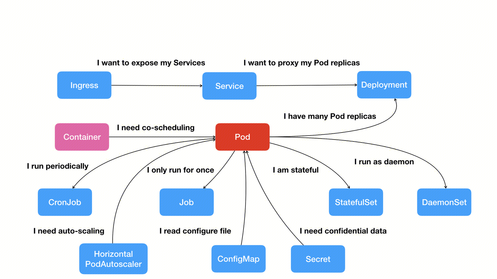

容器技术的核心功能，就是通过约束和修改进程的状态及数据，从而为其创造出一个“边界”，通常通过两个技术来实现这个“边界”：

- Namespace：用来修改进程视图的主要方法；

- Cgroups：用来制造约束的主要手段；

- Unionfs：用了实现容器镜像，为应用程序提供运文件系统以及运行环境。

下面我们一一介绍这些内容。

## 隔离-Namespace

被 Namespace 隔离开的进程只能看到其 Namespace 内部的资源情况，我们以 PID Namespace 为例：当我们创建一个新的进程时，可以传入参数 `CLONE_NEWPID`：

```c
int pid = clone(main_function, stack_size, SIGCHLD, NULL);
```

来将新创建的进程置于一个信的 PID Namespace 中，此时的 pid 就会为 1，因为在该 Namespace 只有一个进程，它看不到系统中其他 Namespace 中的进程，所以它会认为他是当前系统中的 1 号进程。

除了 PID Namespace，Linux 还提供了：

| Namespace | Flag              | Page                 | Isolates                                               |
|-----------|--------------------|-----------------------|--------------------------------------------------------|
| Cgroup    | `CLONE_NEWCGROUP`  | cgroup_namespaces     | 用于隔离进程的资源限制（如 CPU、内存等）。每个容器可以有自己的 cgroup 设置，确保容器不会影响到其他容器或主机上的资源使用。|
| IPC       | `CLONE_NEWIPC`     | ipc_namespaces        | System V IPC, POSIX message queues 隔离进程间通信     |
| Network   | `CLONE_NEWNET`     | network_namespaces    | Network devices, IPv4 和 IPv6 协议栈, ports, IP 路由表、端口等等网络资源     |
| Mount     | `CLONE_NEWNS`      | mount_namespaces      | Mount points 隔离文件系统挂载点                        |
| PID       | `CLONE_NEWPID`     | pid_namespaces        | Process IDs 隔离进程的 ID                              |
| Time      | `CLONE_NEWTIME`    | time_namespaces       | Boot and monotonic clocks                              |
| User      | `CLONE_NEWUSER`    | user_namespaces       | User and group IDs 隔离用户和用户组的 ID               |
| UTS       | `CLONE_NEWUTS`     | uts_namespaces        | Hostname and NIS domain name 隔离主机名和域名信息     |


到这里就可以明白一个容器其实就是一个特殊的被限制了的进程。

## 限制-Cgroup

Linux Cgroups 的全称是 Linux Control Group。它最主要的作用，就是限制一个进程组能够使用的资源上限，包括 CPU、内存、磁盘、网络带宽等等。

下面是一个使用 Cgroup 进行 cpu 资源限制的例子：

首先创建一个资源限制组：

```shell
$ sudo cgcreate -g cpu:my_group
```

> `cgcreate` 工具需要手动安装 `sudo apt install cgroup-tools -y`

它会在 `/sys/fs/cgroup/` 下生成一个 `my_group` 目录：

```shell
$ ls /sys/fs/cgroup/my_group 
cgroup.controllers      cgroup.threads  cpu.weight                       dmem.low                  hugetlb.2MB.current       io.stat              memory.oom.group     memory.zswap.current    pids.events.local
cgroup.events           cgroup.type     cpu.weight.nice                  dmem.max                  hugetlb.2MB.events        io.weight            memory.peak          memory.zswap.max        pids.max
cgroup.freeze           cpu.idle        cpuset.cpus                      dmem.min                  hugetlb.2MB.events.local  memory.current       memory.pressure      memory.zswap.writeback  pids.peak
cgroup.kill             cpu.max         cpuset.cpus.effective            hugetlb.1GB.current       hugetlb.2MB.max           memory.events        memory.reclaim       misc.current            rdma.current
cgroup.max.depth        cpu.max.burst   cpuset.cpus.exclusive            hugetlb.1GB.events        hugetlb.2MB.numa_stat     memory.events.local  memory.stat          misc.events             rdma.max
cgroup.max.descendants  cpu.pressure    cpuset.cpus.exclusive.effective  hugetlb.1GB.events.local  hugetlb.2MB.rsvd.current  memory.high          memory.swap.current  misc.events.local
cgroup.pressure         cpu.stat        cpuset.cpus.partition            hugetlb.1GB.max           hugetlb.2MB.rsvd.max      memory.low           memory.swap.events   misc.max
cgroup.procs            cpu.stat.local  cpuset.mems                      hugetlb.1GB.numa_stat     io.max                    memory.max           memory.swap.high     misc.peak
cgroup.stat             cpu.uclamp.max  cpuset.mems.effective            hugetlb.1GB.rsvd.current  io.pressure               memory.min           memory.swap.max      pids.current
cgroup.subtree_control  cpu.uclamp.min  dmem.current                     hugetlb.1GB.rsvd.max      io.prio.class             memory.numa_stat     memory.swap.peak     pids.events
```

这里就是该控制组的资源限制文件，限制 CPU 使用量需要用到：

- `cpu.max`：限制 cpu 使用量

- `cgroup.procs`：属于该限制组的进程 pids。

```shell
$ echo "50000 100000" | sudo tee /sys/fs/cgroup/my_group/cpu.max
```

这里，50000 是每个调度周期允许的最大 CPU 时间（单位为微秒），100000 是周期长度（单位为微秒）。这意味着每个进程最多可以使用 50% 的 CPU 时间。

```shell
# 启动 stress 进程
$ stress --cpu 2 &
$ PID=$!

$ top
%Cpu(s): 97.3 us,  2.7 sy,  0.0 ni,  0.0 id,  0.0 wa,  0.0 hi,  0.0 si,  0.0 st
# 将其加入 cgroup
$ echo $PID | sudo tee /sys/fs/cgroup/my_group/cgroup.procs
$ top
%Cpu(s): 50.5 us,  0.3 sy,  0.0 ni, 49.2 id,  0.0 wa,  0.0 hi,  0.0 si,  0.0 st 
```

## 镜像-UnionFS

首先我们介绍一下 Mount Namespace，它会修改容器进程对文件系统的视图。我们可以将一个 linux 文件系统（即 rootfs），挂载到一个容器的 `/` 目录下，这样对于该进程来说，它就像运行在一个独立的操作系统中。

需要明确的是，rootfs 只是一个操作系统所包含的文件、配置和目录，并不包括操作系统内核。这个挂载在容器根目录上、用来为容器进程提供隔离后执行环境的文件系统（rootfs），就是所谓的“容器镜像”。

对于容器镜像，除了最基础的操 OS 文件系统，我们还可以再增加些我们开发的应用程序所需的其他依赖（如：语言环境、依赖库等）。Docker 镜像通过 AuFS 以一种增量的方式实现了这个想法，AuFS 即 Advance UnionFS，是 Linux 原生 UnionFS 的改进，UnionFS 顾名思义，它可以将两个目录联合挂载到同一个路径下，然后合并其中的内容：

```shell
# before
├── A
│  ├── a
│  └── x
└── B
  ├── b
  └── x
# after union A B
├── a
├── b
└── x
```

在 Docker 镜像中将镜像划分为很多层（layer），每一层都是最终文件系统的一部分，在启动时会将所有的层挂载在根目录下，可以看下面的例子：

```shell
$ sudo docker image inspect golang
     "RootFS": {
            "Type": "layers",
            "Layers": [
                "sha256:385eb556134e17ef23...",
                "sha256:c878d283e64a0ef7dd...",
                "sha256:8bc405ffff1cd23ede...",
                "sha256:09a1e942fa6b9044f7...",
                "sha256:97ce74d86964d59658...",
                "sha256:4c8de3eebfc4db542d...",
                "sha256:5f70bf18a086007016..."
            ]
        },
```

我们可以随便看几层的内容：

```shell
ubuntu@VM-0-159-ubuntu:~$ sudo ls -l /var/lib/docker/overlay2/.../diff
total 4
drwxr-xr-x 3 root root 4096 Jul  3 05:47 usr
ubuntu@VM-0-159-ubuntu:~$ sudo ls -l /var/lib/docker/overlay2/.../diff
total 16
drwxr-xr-x 12 root root 4096 Jul  1 11:19 etc
drwxr-xr-x  2 root root 4096 Jul  1 11:19 run
drwxr-xr-x  7 root root 4096 Jun 30 08:00 usr
drwxr-xr-x  5 root root 4096 Jun 30 08:00 var
ubuntu@VM-0-159-ubuntu:~$ sudo ls -l /var/lib/docker/overlay2/.../diff
total 4
drwxrwxrwt 4 root root 4096 Jul  9 02:04 go
```

这些层合并后，就会得到一个包含 go 语言环境的容器镜像。

至此你已经知道容器是怎么实现的了，你会发现容器相较于虚拟机技术而言更加的细粒度，每个组件都可以划分到一个容器中，它们之间互不干涉，拥有各自的资源配额，可以被调度在整个集群里的任何一台机器上。如何实现大量容器的编排和管理呢？由此我们可以引出 Kubernetes。

## Kubernetes

单单是容器技术只能是开发者手里的小工具，容器编排技术的出现才让其一跃成为了云计算领域的绝对主角。

而 Kubernetes （k8s）提供容器编排conntrack、路由网关、监控、灾难恢复、水平扩展等功能。容器或作业间的关系是容器编排和管理的最大难题，在 k8s 中采用声明式 API 来定义调度对象间以及调度对象间的各种关系。

在 k8s 中调度的对象可以是：

- Pod：一个或多个容器的集合。Pod 里的容器共享同一个 Network Namespace、同一组数据卷；

- Job：表示一次性运行的 Pod（如：大数据任务）；

- CronJob：定时任务。

- .....

这些对象的关系可以是最简单的 web server 和 db 的关系，service 它可以作为 Pod 的代理入口，将网络地址和 Pod 分离，即使 db 的 Pod 出现变化，web server 也不需要做出任何修改。

除此之外还有 Deployment 定义 Pod 实例个数；Secret 来定义两个 Pod 间通信时的鉴权信息等等；围绕 Pod 展开的各种关系构成了 k8s 的核心功能全景图：



k8s 并没有像其他项目那样，为每一个管理功能创建一个指令，然后在项目中实现其中的逻辑，而是：
- 首先，通过一个“编排对象”，比如 Pod、Job、CronJob 等，来描述你试图管理的应用；
- 然后，再为它定义一些“服务对象”，比如 Service、Secret、Horizontal Pod Autoscaler（自动水平扩展器）等。这些对象，会负责具体的编排功能。

下面可以通过一个例子感受一下 k8s 的声明式 API：

定义一个 `nginx-deployment.yaml` 文件：

```yaml
apiVersion: apps/v1
kind: Deployment
metadata:
  name: nginx-deployment
spec:
  replicas: 2  # 设置副本数为 2
  selector:
    matchLabels:
      app: nginx
  template:
    metadata:
      labels:
        app: nginx
    spec:
      containers:
      - name: nginx
        image: nginx:latest  # 使用最新版本的 nginx 镜像
        ports:
        - containerPort: 80  # 暴露 80 端口
```

然后执行：

```
kubectl apply -f nginx-deployment.yaml
```
在创建 `nginx-service.yaml` 来向外暴露我们的服务：

```yaml
apiVersion: v1
kind: Service
metadata:
  name: nginx-service
spec:
  selector:
    app: nginx  # 与 Deployment 的标签匹配
  ports:
    - protocol: TCP
      port: 80  # 外部访问的端口
      targetPort: 80  # 实际容器的端口
  type: LoadBalancer  # 如果你在云环境中，可以使用 LoadBalancer 类型暴露服务，或者使用 NodePort
```
执行：

```
kubectl apply -f nginx-service.yaml
```

这样，两个完全相同的 Nginx 容器副本就被启动了。


---
参考：
- 深入剖析Kubernetes | 极客时间技术好课
- https://kubernetes.io/zh-cn/docs/concepts/architecture/

