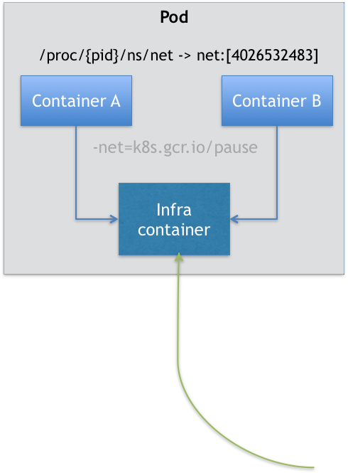

## Architecture

k8s 由控制平面以及一系列被称作计算节点的工作机组成。它们的架构如下：


控制平面组件会为集群做出全局决策，比如资源的调度。控制平面组件可以在集群中的任何节点上运行：

- kube-apiserver：负责 API 服务；整个集群的持久化数据会由 apiserver 处理后存储在 etcd 中；

- kube-scheduler：负责监视新创建的、未指定运行节点的 Pods， 并选择节点来让 Pod 在上面运行；

- kube-controller-manager：负责运行控制器进程（在 k8s 中，控制器通过监控集群的公共状态，并致力于将当前状态转变为期望的状态）；控制器有许多不同类型，如：Node 控制器、Job 控制器等；

节点组件会在每个节点上运行，负责维护运行的 Pod 并提供 Kubernetes 运行时环境：

- kubelet：主要负责同容器运行时（比如 Docker 项目）打交道。而这个交互所依赖的，是一个称作 CRI（Container Runtime Interface）的远程调用接口，这个接口定义了容器运行时的各项核心操作，比如：启动一个容器需要的所有参数。

- 容器运行时：kubelet 通过与支持 CRI（Container Runtime Interface）容器运行时交互，来管理容器的执行和生命周期。

## Concept

### Pod

Pod 是可以在 Kubernetes 中创建和管理的、最小的可部署的计算单元。它类似于 Linux 中用户组的概念，一个 Pod 中可能有一个或多个容器组成，这些容器共享存储、网络、以及怎样运行这些容器的规约。关于 Pod 最重要的一个事实是：它只是一个逻辑概念，Kubernetes 真正处理的，还是宿主机操作系统上 Linux 容器的 Namespace 和 Cgroups，而并不存在一个所谓的 Pod 的边界或者隔离环境。

在启动 Pod 时 k8s 会先启动一个 Infra 容器，而其他用户定义的容器，则通过 Join Network Namespace 的方式，与 Infra 容器关联在一起



这也就意味着，对于 Pod 里的容器 A 和容器 B 来说：

- 它们可以直接使用 localhost 进行通信；

- 一个 Pod 只有一个 IP 地址，也就是这个 Pod 的 Network Namespace 对应的 IP 地址；

- Pod 的生命周期只跟 Infra 容器一致，而与容器 A 和 B 无关；

下面介绍两种 Pod 中特殊的容器：Init 容器 和 Sidecar 容器

### Init 容器

在 Pod 中，所有 Init Container 定义的容器，都会比用户容器先启动，并且 Init Container 容器会按顺序逐一启动，而直到它们都启动并且退出了，用户容器才会启动。考虑下面的例子。

下面的例子定义了一个具有 2 个 Init 容器的简单 Pod。 第一个等待 myservice 启动， 第二个等待 mydb 启动。 一旦这两个 Init 容器都启动完成，Pod 将启动 spec 节中的应用容器：

```yaml
apiVersion: v1
kind: Pod
metadata:
  name: myapp-pod
  labels:
    app.kubernetes.io/name: MyApp
spec:
  containers:
  - name: myapp-container
    image: busybox:1.28
    command: ['sh', '-c', 'echo The app is running! && sleep 3600']
  initContainers:
  - name: init-myservice
    image: busybox:1.28
    command: ['sh', '-c', "until nslookup myservice.$(cat /var/run/secrets/kubernetes.io/serviceaccount/namespace).svc.cluster.local; do echo waiting for myservice; sleep 2; done"]
  - name: init-mydb
    image: busybox:1.28
    command: ['sh', '-c', "until nslookup mydb.$(cat /var/run/secrets/kubernetes.io/serviceaccount/namespace).svc.cluster.local; do echo waiting for mydb; sleep 2; done"]
```

## Design 

