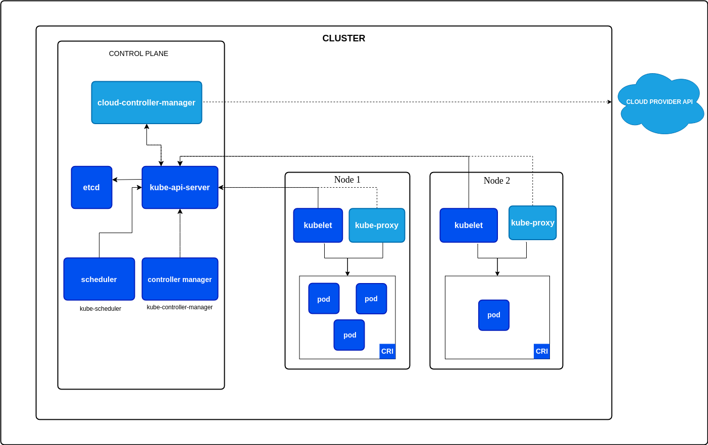

## 概念
k8s 集群由两个部分组成：Master 和 Node 两种节点组成：



Master 中有：

- **kube-apiserver** 负责 API 服务；
- **kube-scheduler **负责调度；
- **kube-controller-manager **负责容器编排。
- 整个集群的持久化数据，则由 kube-apiserver 处理后保存在 **etcd** 中。

计算节点上最核心的部分是 **kubelet**，主要负责同容器运行时（比如 Docker ）交互，它通过 CRI（Container Runtime Interface）远程调用接口，这个接口定义了容器运行时的各项核心操作，比如：启动一个容器需要的所有参数。只要你的这个容器运行时能够运行标准的容器镜像，它就可以通过实现 CRI 接入到 Kubernetes 项目当中。

而具体的容器运行时，比如 Docker 项目，则一般通过 OCI 这个容器运行时规范同底层的 Linux 操作系统进行交互，即：把 CRI 请求翻译成对 Linux 操作系统的调用（操作 Linux Namespace 和 Cgroups 等）。

此外 kubelet 还通过 gRPC 同 **Device Plugin** 进行交互，管理宿主机的 GPU 等物理设备，是基于 Kubernetes 项目进行机器学习训练、高性能作业支持等工作必须关注的功能。

kubelet 还需要通过 **CNI**（Container Networking Interface）和 **CSI**（Container Storage Interface）为容器提网络配置和持久化存储。

## kubeadm

kubeadm 是 k8s 官方提供的部署工具，它可以为我们检测 k8s 启动时所需的环境，并创建 k8s 各个组件启动的配置文件以及 ca 证书等。

通过 `kubeadm init` 我们可以初始化一个 Master 节点，他会检测机器配置（CPU、内存等）、机器是否有容器运行时环境、Linux Cgroups 模块是否可用等等，通过检查后会生成一系列等配置文件，如下：

在 `/etc/kubernetes` 会生成根 ca 证书及密钥

```
$ ls ca.*
ca.crt  ca.key
```
此证书用于给 api-server、kubelet 等组件签发证书，来实现组件间等安全连接。

```
$ ls /etc/kubernetes/manifests/
cloud-controller-manager.yaml  etcd.yaml  kube-apiserver.yaml  kube-controller-manager.yaml  kube-scheduler.yaml
```

此文件夹下等 yaml 文件是一种特殊的容器启动方式叫“Static Pod”，在这台机器启动 kebelet 时，它会自动检测这个目录，加载所有的 Pod YAML 文件，然后在这台机器上启动它们。

> kebelet 是不能通过容器启动的，通常会使用 systemd 来维护其运行状态。

启动结束后，kebeadm 会输出一个 token，用于 Node 加入到该 k8s 集群中，通过如下命令：

```
$ sudo kubeadm join --token <token> <control-plane-host>:<control-plane-port> --discovery-token-ca-cert-hash sha256:<hash>
```

通过 join，Node 会从  api-server 获得 ca.ert 等 Master 等信息，此次连接是不安全的，获取到证书信息后，才能进行安全连接。

## 容器化应用

现在我们再回过头看一下上一篇文章中的 Nginx 例子，解释一下各个字段的含义，它给出了两个配置文件：

```yaml
apiVersion: apps/v1
kind: Deployment
metadata:
  name: nginx-deployment
spec:
  replicas: 2  # 设置副本数为 2
  selector:
    matchLabels:
      app: nginx
  template:
    metadata:
      labels:
        app: nginx
    spec:
      containers:
      - name: nginx
        image: nginx:latest  # 使用最新版本的 nginx 镜像
        ports:
        - containerPort: 80  # 暴露 80 端口
```

在 k8s 中每一个对象都一个 Metadata 字段，这是 k8s 中对象的唯一标识，这其中最主要使用到的字段是 Labels，它是一组 kv 格式的标签，像 Deployment 这样的控制器对象，就可以通过这个 Labels 字段从 k8 中过滤出它所关心的被控制对象。

在上面这个 YAML 文件中，Deployment 会把所有正在运行的、携带“app: nginx”标签的 Pod 识别为被管理的对象，并确保这些 Pod 的总数严格等于两个，这个过滤规则的定义，是在 Deployment 的“spec.selector.matchLabels”字段。我们一般称之为：Label Selector。

处理 Metadata， k8s 的对象定义还有 Spec，它用来描述它所要表达的功能，不同对象的 Spec 也不尽相同，但是不同对象的 Metadata 通常定义的都是相似的字段。

相比于编写一个单独的 Pod 的 YAML 文件，更推荐的做法是使用一个 replicas=1 的 Deployment。

Deployment 是一种高级资源对象，它不仅定义了应用的容器，还自动管理应用的副本、升级、回滚等功能。
- 自动管理副本：你可以指定副本数（replicas），Deployment 会确保你指定数量的 Pod 始终存在。若 Pod 宕机或出现故障，Deployment 会自动重新创建新的 Pod。

- 滚动更新：通过 Deployment 进行更新时，Kubernetes 会自动逐步替换旧 Pod，确保服务不中断，支持平滑过渡。


??? tip "tip"

    相比于编写一个单独的 Pod 的 YAML 文件，更推荐的做法是使用一个 replicas=1 的 Deployment。

    Deployment 是一种高级资源对象，它不仅定义了应用的容器，还自动管理应用的副本、升级、回滚等功能。
    - 自动管理副本：你可以指定副本数（replicas），Deployment 会确保你指定数量的 Pod 始终存在。若 Pod 宕机或出现故障，Deployment 会自动重新创建新的 Pod。

    - 滚动更新：通过 Deployment 进行更新时，Kubernetes 会自动逐步替换旧 Pod，确保服务不中断，支持平滑过渡。


