## **Decision Support Systems**

对于只读 OLAP 数据库，通常具有分叉环境，其中有多个 OLTP 数据库实例，这些实例从外部世界引入信息，然后将其馈送到后端 OLAP 数据库（有时称为数据仓库）。有一个称为 ETL 或提取（Extract）、转换（Transform）和加载（Load）的中间步骤，它将 OLTP 数据库组合成数据仓库的通用架构。

现在的现代趋势（而不是 ETL）是 ELT，即提取（Extract）、加载（Load）和转换（Transform）。加载原始数据后，将在 OLAP 数据库本身上完成转换。

<figure markdown="span">
    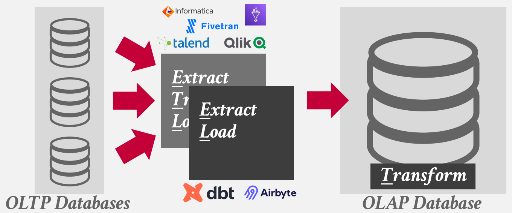{ width="550" }
</figure>

决策支持系统 （Decision support systems，DSS） 是服务于组织的管理、运营和规划级别的应用程序，通过分析存储在数据仓库中的历史数据，帮助人们就未来问题做出决策。

eg：沃尔玛在 2000 年时，通过 DSS 来分析在飓风来临前和飓风袭击后，人们会购买什么东西，这样在飓风即将来临前，他们就会在附近的商店提前准备所需的物资，在飓风过境后，就马上派满载货物的卡车前往支援，因为他们已经提前指定民众需要购买什么。


ETL 的过程并不只是简单地移动，通常还会涉及表结构的重新整理，以提高后续查询分析的效率。对分析数据库进行建模的最常见的两种方法是：星型架构（Star Schema）和雪花型架构（Snowflake Schema）。

- Star Schema：处在最中间的是 Fact Table，通常记录着业务流程中的核心事件、指标，如成单记录；处在四周的是 Dimension Tables，记录一些补充信息。Fact Table 通过外键与 Dimension Tables 关联，用户可以通过简单的 Join 来分析数据。在 Star Schema 中，只能允许有一层的引用关系。

<figure markdown="span">
    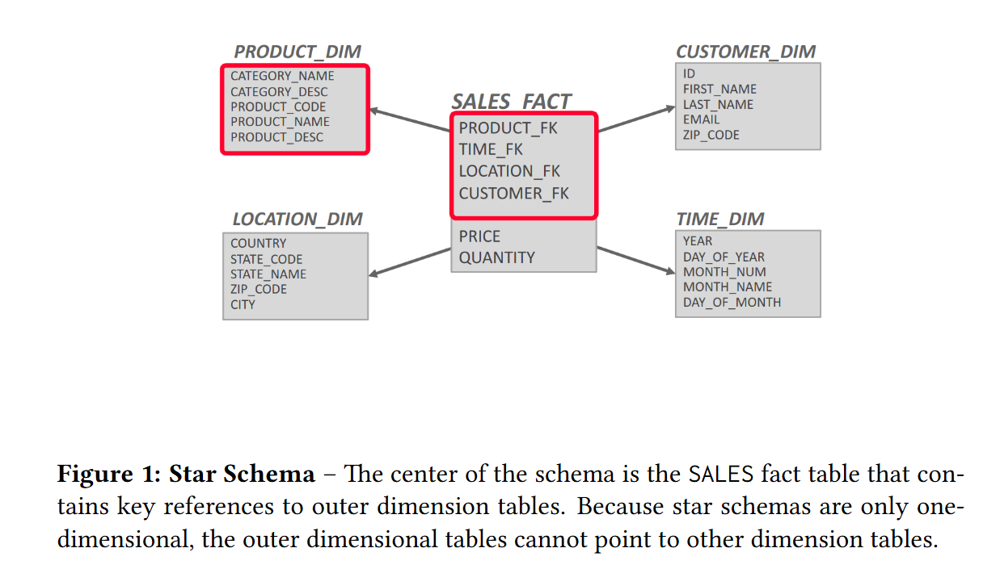{ width="550" }
</figure>

- Snowflake Schema：在 Star Schema 中，只能允许有一层的引用关系，在 Snowflake Schema 中，则允许有两层关系，

<figure markdown="span">
    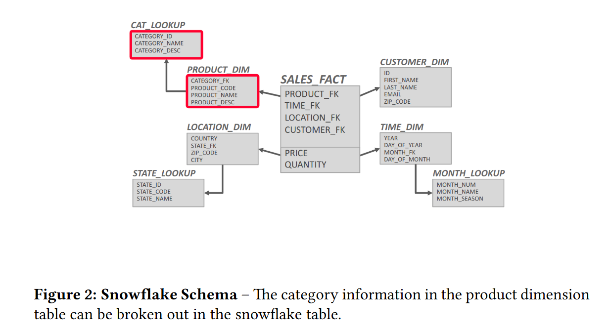{ width="550" }
</figure>

二者的区别、权衡主要在于以下两个方面：

- Normalization：Snowflake Schema 的规范化 (Normalization) 级别更高，冗余信息更少，占用空间更少，但会遇到数据完整性和一致性问题。

- Query Complexity：Snowflake Schema 在查询时需要更多的 join 操作才能获取到查询所需的所有数据，速度更慢。

### **Problem Setup**

想象下面这个最简单的分析场景：

<figure markdown="span">
    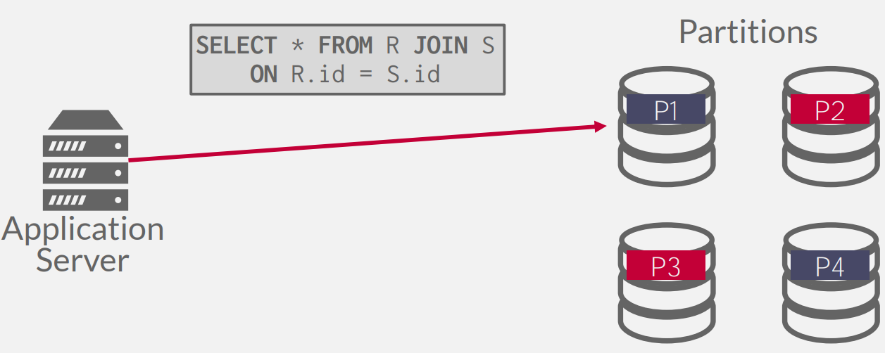{ width="550" }
</figure>


一个 join 语句需要访问所有数据库分片。要满足这样的需求，最简单的做法就是，将所有相关的数据读取到某一个分片上，然后统一计算：

<figure markdown="span">
    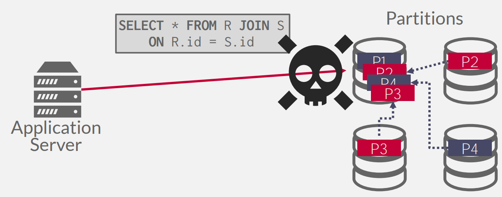{ width="550" }
</figure>

但这在 OLAP 场景下是不可行的。通常 OLAP 就需要访问全量数据，遇到全量数据无法装进一个分片中的情况，就无计可施了。这就要涉及我们今天要讨论的内容：

- Execution Models

- Query Planning

- Distributed Join Algorithms

- Cloud Systems

<hr>

## **Execution Models**

大体上，查询的执行模式分为两种：

- Push Query to Data：将查询、或查询的一部分发送到拥有该数据的节点上，在相应的节点上执行尽可能多的过滤、预处理操作，将尽量少的数据通过网络传输返回

<figure markdown="span">
    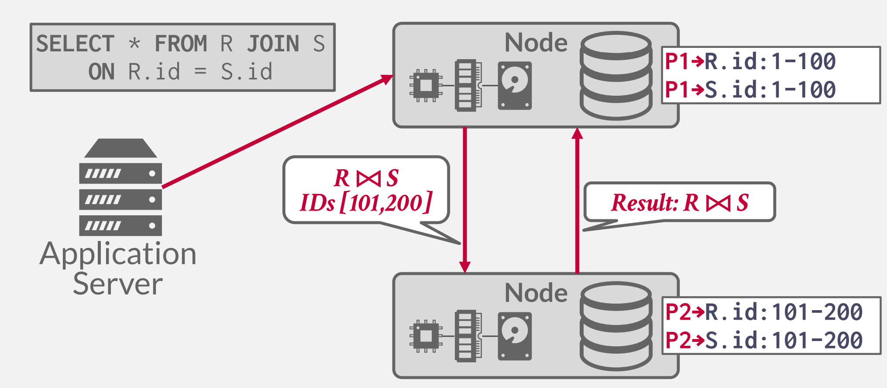{ width="550" }
</figure>

如上图所示：应用程序将查询请求发到上方的节点，称为节点 A。节点 A 发现 ID 在 1-100 之间的数据就在本地存储；而 ID 在 101-200 之间的数据位于下方的节点，称为节点 B。因此节点 A 将查询发给节点 B，由节点 B 负责将 101-200 之间的数据 join，然后将 join 的结果返回给节点 A，而节点 A 则自行将 1-100 之间的数据 join，最终节点 A 将所有数据整理好返回给应用程序。整个过程对应用程序透明。

- Pull Data to Query：将数据移动到执行查询的节点上，然后再执行查询获取结果。

<figure markdown="span">
    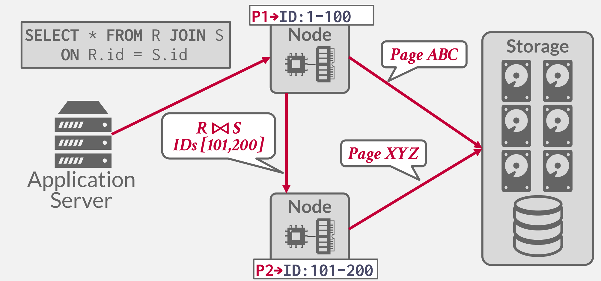{ width="550" }
</figure>

如上图所示：在 shared-disk 架构下，节点 A 可以将计算分散到不同的节点上，如 1-100 的在 A 节点上计算；101-200 的在 B 节点上计算。A，B 拿到计算任务后，就将各自所需的数据 (page ABC、XYZ) 从共享的存储服务中取出放到本地。这个取数据的过程就是 Pull Data to Query。当 B 节点中的计算任务执行完后，B 节点将结果返回给 A 节点，A 节点再将自己的结果与 B 节点的结果结合，得到最终的结果返回给应用程序：

<figure markdown="span">
    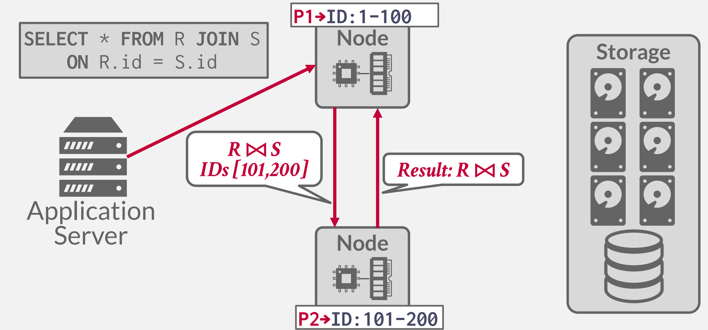{ width="550" }
</figure>

对于数据库来说，Push Query to Data 和 Pull Data to Query 并不是非此即彼的选择，在不同类型的分布式数据库、不同的查询执行阶段上，也有可能使用不同的执行模式。

### **Query Fault Tolerance**

节点从远程源接收的数据缓存在缓冲池中。这允许 DBMS 支持大于可用内存量的中间结果。但是，临时页面在重新启动后不会保留。因此，分布式 DBMS 必须考虑如果节点在执行期间崩溃，长时间运行的 OLAP 查询会发生什么情况。

大多数 shared-nothing 分布式 OLAP DBMS 都设计为假定节点在查询执行期间不会失败。如果一个节点在查询执行期间失败，则整个查询都会失败，这需要从头开始执行整个查询。这可能很昂贵，因为某些 OLAP 查询可能需要几天时间才能执行。

DBMS 可以在执行期间拍摄查询的中间结果的快照，以允许它在节点发生故障时进行恢复。但是，此操作成本很高，因为将数据写入磁盘的速度很慢。

<figure markdown="span">
    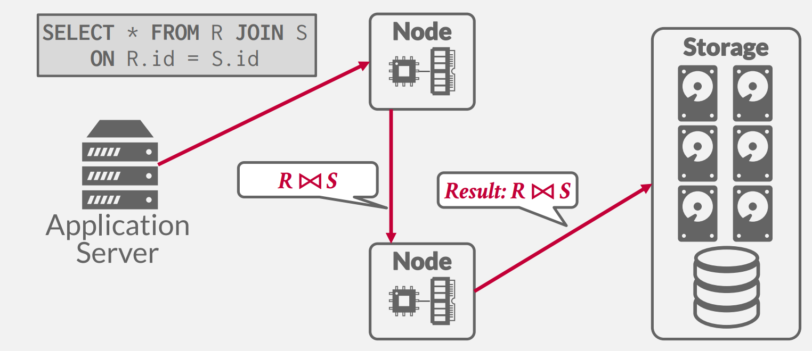{ width="550" }
</figure>

<figure markdown="span">
    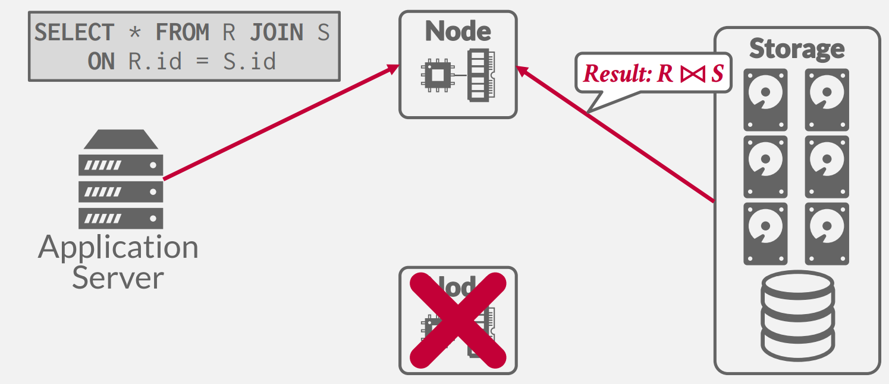{ width="550" }
</figure>

<hr>

## **Query Planning**

我们之前讨论的所有优化仍然适用于分布式环境，包括 predicate pushdown、early projections 和 optimal join orderings。分布式查询优化会更难，因为它必须考虑数据在集群中的物理位置和数据移动成本。

### **Query Plan Fragments**

- Physical Operators：先生成一个查询计划，再将它按数据分片信息 (partition-specific) 分解成多个部分，分发给不同的节点。大部分数据库采用的就是这种做法。

- SQL：将原始的 SQL 语句按分片信息重写成多条 SQL 语句，每个节点自己在本地作查询优化。。SingleStore 和 Vitess 是使用此方法的系统示例。

<figure markdown="span">
    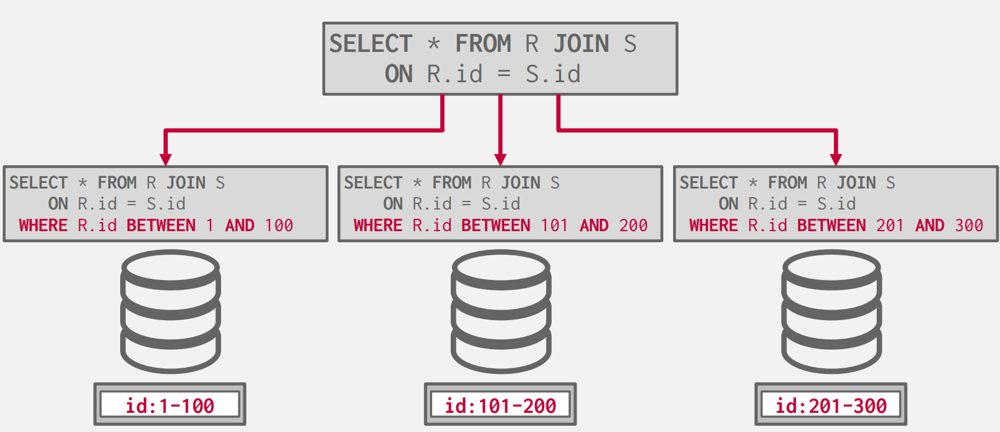{ width="550" }
</figure>


<hr>

## **Distributed Join Algorithms**

对于分析工作负载，大部分时间都花在执行联接和从磁盘读取上，这表明了此主题的重要性。分布式连接的效率取决于目标表的分区方案。

一种方法是先将整个表读取到单个节点上，然后执行 Join 操作。但是 DBMS 失去了分布式的并行性，这违背了拥有分布式 DBMS 的目的。此选项还需要通过网络进行昂贵的数据传输。

要 Join 表 R 和 S，DBMS 需要在同一节点上获取正确的元组。到达那里后，它会执行本学期早些时候讨论的相同连接算法。应始终发送计算联接所需的最小数量，有时需要整个 Tuples。我们假设 SQL 如下：

```sql
SELECT 
    *
FROM R
    JOIN S
    ON R.id = S.id
```


分布式联接算法有四种场景。

### **Scenario 1**

参与 Join 的两张表中，其中一张表 (假设为 S 表) 复制到了所有节点上，那么每个节点按 R 表的分片信息执行 join，最后聚合到 coordinating node 上即可：

<figure markdown="span">
    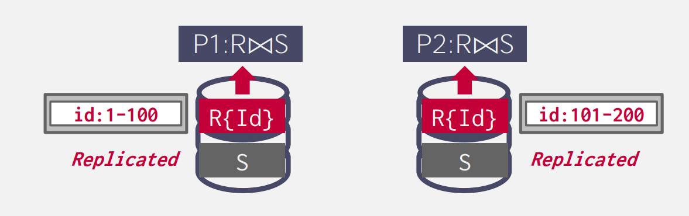{ width="550" }
</figure>
<figure markdown="span">
    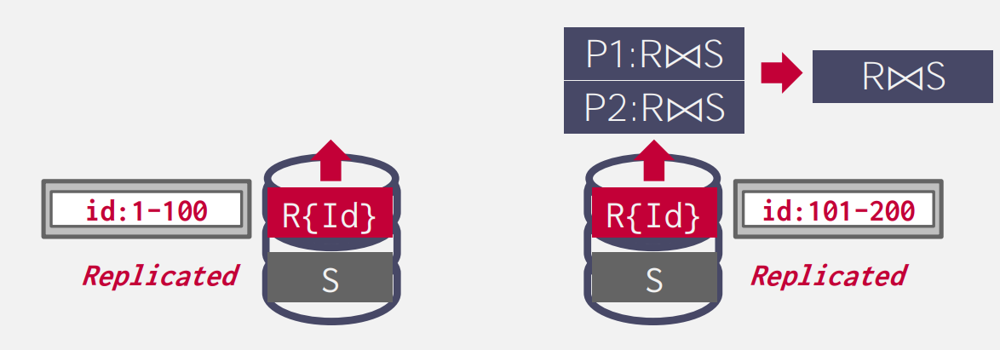{ width="550" }
</figure>

### **Scenario 2**

这个场景下表 S 并没有复制到所有节点上，但恰好 R 和 S join 的字段就是 partition 的字段，那么每个节点本地 join，最后聚合到 coordinating node 上即可，与我们之前的假设一致：

<figure markdown="span">
    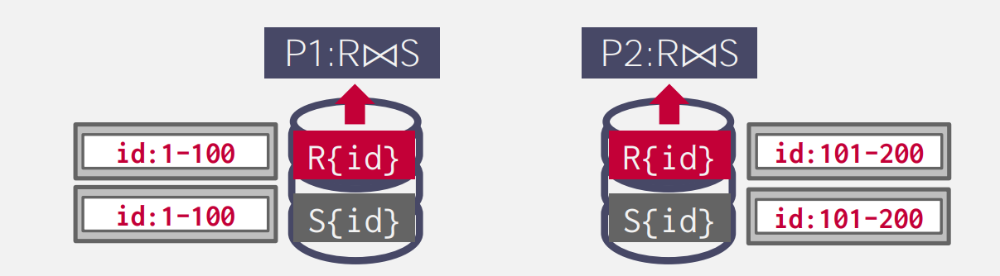{ width="550" }
</figure>
<figure markdown="span">
    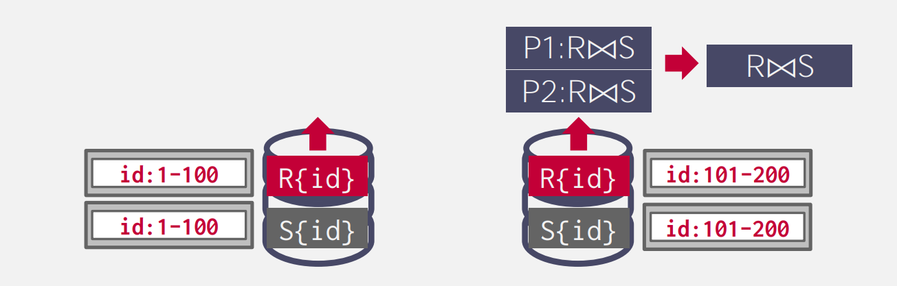{ width="550" }
</figure>

### **Scenario 3**

如果 R 和 S 是根据不同 key 来分片，其中一张表 (S) 的 key 不是 join key 且数据量很小，那么 DBMS 可以将这张小表广播到所有需要执行计算的节点上，这样执行时就可以按 R 的分片信息来执行，最后汇总结果：

<figure markdown="span">
    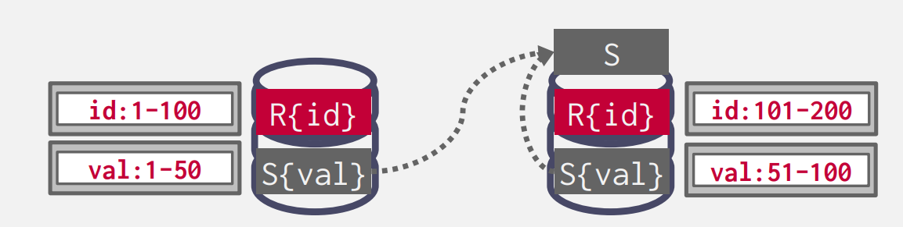{ width="550" }
    R 按照 Id 分片，S 按照 Val 分片
</figure>
<figure markdown="span">
    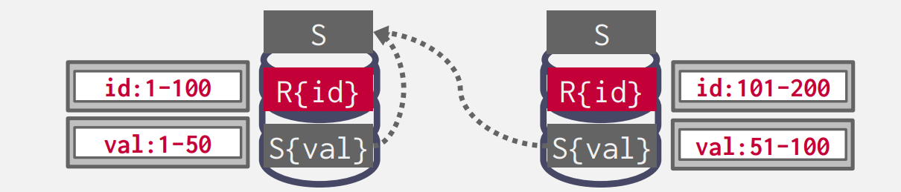{ width="550" }
</figure>
<figure markdown="span">
    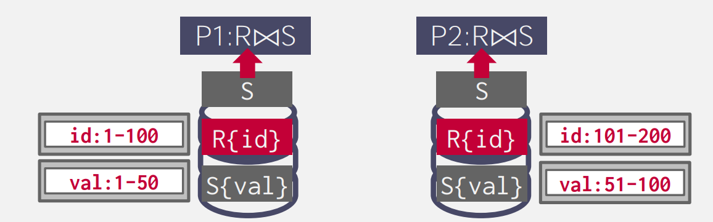{ width="550" }
</figure>
<figure markdown="span">
    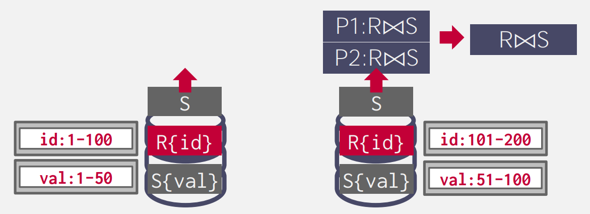{ width="550" }
</figure>


### **Scenario 4**

这是最坏的情况。这两个表都未根据联接键进行分区。DBMS 通过在节点之间重新排列表来复制表。计算本地联接，然后将结果发送到最终联接的公共节点。如果磁盘空间不足，则故障是不可避免的。这称为 shuffle join。

<figure markdown="span">
    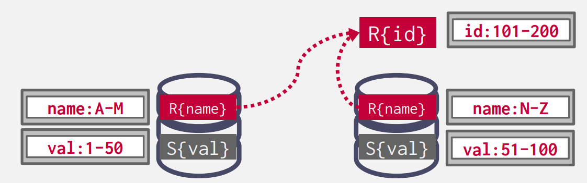{ width="550" }
    将 R 表中 id 为 101-200 的数据移动到右边节点
</figure>
<figure markdown="span">
    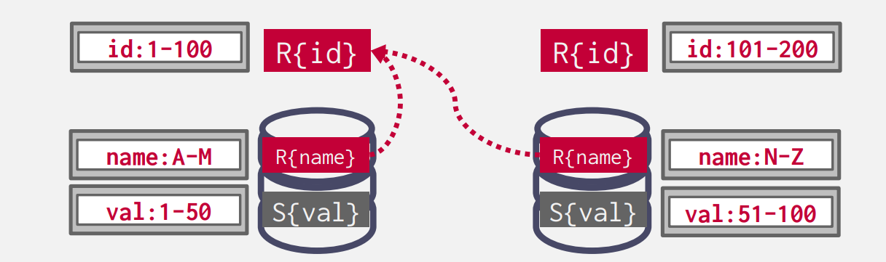{ width="550" }
</figure>
<figure markdown="span">
    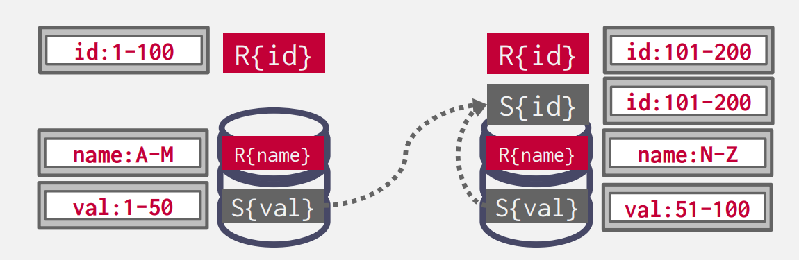{ width="550" }
    将 R 表中 id 为 1-100 的数据移动到左边节点
</figure>
<figure markdown="span">
    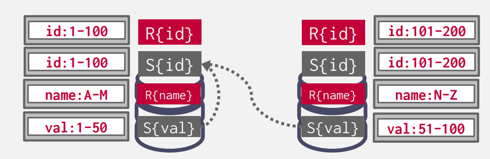{ width="550" }
    将 S 表中 id 为 101-200 的数据移动到右边节点
</figure>
<figure markdown="span">
    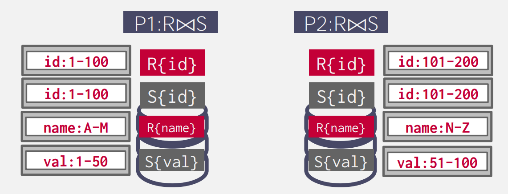{ width="550" }
    将 S 表中 id 为 1-100 的数据移动到左边节点
</figure>
<figure markdown="span">
    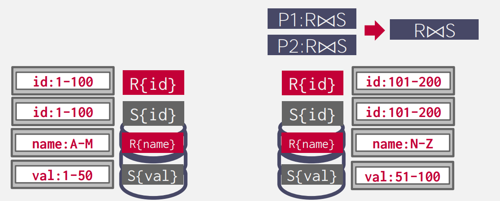{ width="550" }
    在两个节点上执行 Join
    合并结果返回
</figure>

### **Semi-Join**

semi-join 指的是当 join 的结果只需要左边数据表的字段，右边数据表的字段仅仅是用来做筛选的情况。在分布式数据库中，可以对这种特殊情况优化数据移动量，从而减少 join 成本。一些数据库支持 semi-join 的 SQL 语法，如果不支持则可以使用 EXISTS 语法来模拟：

<hr>

## **Cloud Systems**

供应商提供数据库即服务 （DBaaS） 产品，这些产品是托管的 DBMS 环境。

较新的系统开始模糊无共享和共享磁盘之间的界限。例如，Amazon S3 允许在将数据复制到计算节点之前进行简单的筛选。云系统有两种类型：托管 DBMS 或云原生 DBMS。

- managed：将开源单机数据库挪到云上，增加一些小的修改，大多数供应商采用这种做法

- cloud-native：为云原生环境而设计，通常基于 shared-disk 架构。一些例子包括：Snowflake，Google BigQuery，Amazon Redshift 以及 Microsoft SQL Azure

### **Serverless Databases**


无服务器 DBMS 不是始终为每个客户维护计算资源，而是在租户空闲时驱逐租户，将系统中的当前进度检查点发送到磁盘。用户在不主动查询时只支付存储的费用。

右侧都是采用 Serverless 的系统。

<br>
<br>

<figure markdown="span">
    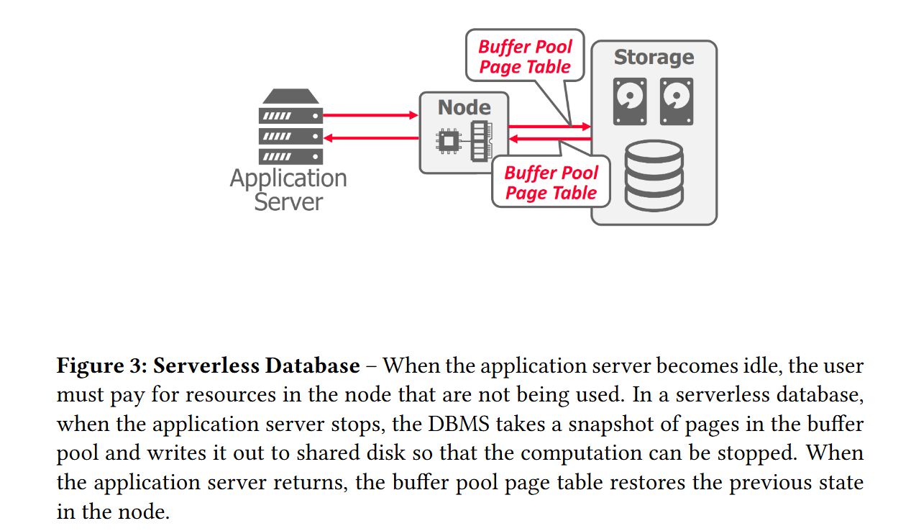{ width="600" }
</figure>


### **Data Lakes**


数据湖是一个集中式存储库，用于存储大量结构化、半结构化和非结构化数据，而无需定义架构或将数据摄取为专有的内部格式。数据湖通常可以更快地摄取数据，因为它们不需要立即转换。但它们要求用户编写自己的转换管道。

在传统架构中，我们要插入数据前必须使用 `CREATE TABLE` 语句，然后是用 `INSERT INTO` **通过计算节点**将数据存入数据库中：

<figure markdown="span">
    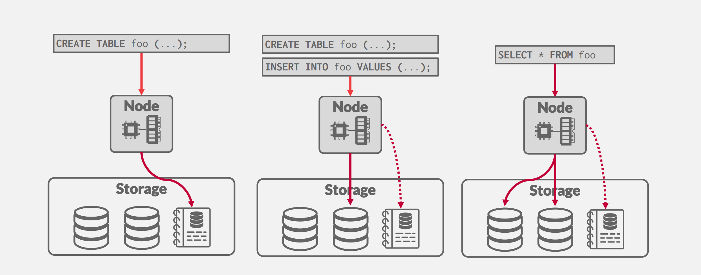{ width="650" }
</figure>


但在数据湖架构中，DBMS 不再是数据插入的守门人，相反，我们有一个对象存储，任何应用程序可以直接将数据写入那里，它可以写入 CSV、JSON、Parquet 或 ORC 格式的文件，然后更新目录来记录这些数据的位置。

当运行查询时，会通过目录找到所需的数据，然后转换他们，让它们变得有意义，这里可以看出上文提到的 ETL 和 TLT 的区别。

<figure markdown="span">
    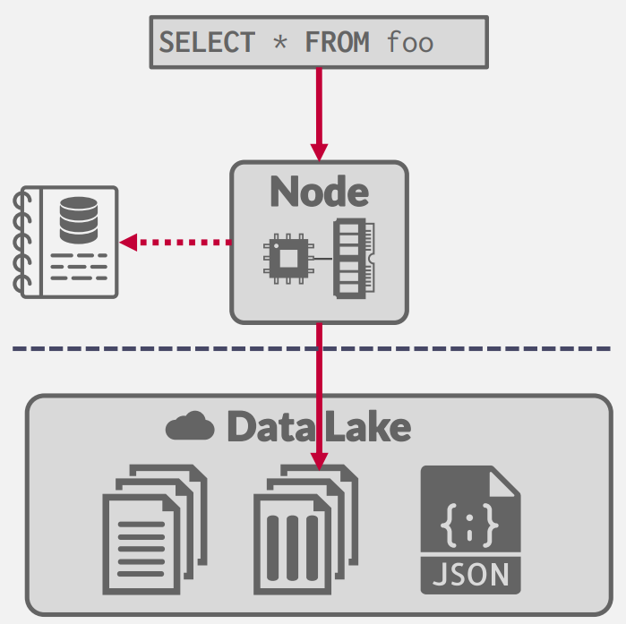{ width="300" }
</figure>

如下是使用数据湖架构的系统：

<figure markdown="span">
    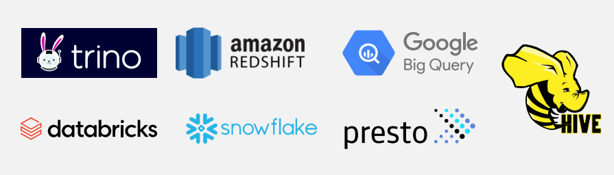{ width="400" }
</figure>

<hr>

## **OLAP Commoditization**

过去十年的一个最新趋势是将 OLAP 引擎子系统突破为独立的开源组件。这通常由不从事 DBMS 软件销售业务的组织完成。这些组件通常是系统目录、查询优化器、文件格式/访问库和执行引擎。

### **System Catalogs**

DBMS 跟踪数据库的架构（表、列）和其目录中的数据文件。如果 DBMS 位于数据摄取路径上，则它可以增量维护目录。如果外部进程添加了数据文件，则它还需要更新目录，以便 DBMS 能够识别它们。值得注意的示例包括 HCatalog、Google Data Catalog 和 Amazon Glue Data Catalog。


### **Query Optimizers**


可扩展的搜索引擎框架，用于基于启发式和基于成本的查询优化。DBMS 提供转换规则和成本估算。框架返回逻辑或物理查询计划。这是在任何 DBMS 中构建最难的部分。著名的例子包括 Greenplum、Orca 和 Apache。

### **Data File Formats**

大多数 DBMS 对其数据库使用专有的磁盘二进制文件格式。在系统之间共享数据的唯一方法是将数据转换为基于文本的常见格式，包括 CSV、JSON 和 XML。云供应商和分布式数据库系统支持新的开源二进制文件格式，可以更轻松地跨系统访问数据。编写自定义文件格式将让位于更好的压缩和性能，但这会让位于更好的互操作性。

- Apache Parquet：来自 Cloudera/Twitter 的压缩列式存储。

- Apache ORC：来自 Apache Hive 的压缩列式存储。

- Apache CarbonData：带有来自华为的索引的压缩列式存储。

- Apache Iceberg：灵活的数据格式，支持 Netflix 的架构演变。

- HDF5：用于科学工作负载的多维数组。

- Apache Arrow：来自 Pandas/Dremio 的内存中压缩列式存储。

### **Execution Engines**

用于对列式数据执行矢量化查询运算符的独立库。输入是物理运算符的有向无环图。它们需要外部调度和编排。著名的例子包括 Velox、DataFusion 和 Intel OAP。
