## **Distributed DBMSs**

分布式 DBMS 将单个逻辑数据库划分为多个物理资源。应用程序（通常）不知道数据分布在不同的硬件上。该系统依赖于单节点DBMS的技术和算法来支持分布式环境中的事务处理和查询执行。设计分布式 DBMS 的一个重要目标是容错（即避免单个节点故障导致整个系统瘫痪）。

当我们在谈论分布式数据库时，首先要明确什么是分布式系统：如果通信成本和通信的可靠性问题不可忽略，就是分布式系统。这也是区分 Parallel DBMS 和 Distributed DBMS 的依据所在：

|Parallel DBMSs|Distributed DBMSs|
|:-:|:-:|
|不同节点在物理上隔得很近|不同节点在物理上可能隔得很远
|不同节点通过高速局域网连接|不同节点通过普通公共网络相连接
|通信成本很小，基本不会产生问题|通信成本和通信问题不可忽略

## **System Architectures**

DBMS 的系统架构指定了 CPU 可以直接访问哪些共享资源。它影响 CPU 之间的协调方式以及它们在数据库中检索和存储对象的位置。

单节点 DBMS 使用所谓的 shared everything 架构。该单个节点使用其自己的本地内存地址空间和磁盘在本地 CPU 上执行工作程序。还有其他三种分布式架构：Shared Memory、Shared Disk、Shared Nothing：

<figure markdown="span">
    { width="750" }
</figure>

### **Shared Nothing**

在 *shared nothing* 环境中，每个节点都有自己的 CPU、内存和磁盘。节点之间仅通过网络进行通信。在云存储平台兴起之前，无共享架构曾经被认为是构建分布式DBMS的正确方法。

这种架构有更好的性能，并且比其他类型的分布式 DBMS 架构更高效。但是也有缺点：

- 很难扩容。在扩容时，DBMS 需要在不同节点间迁移、均衡数据，同时要保证服务在线，且数据一致，可以想象其复杂性。

- 确保系统一致性也很难，因为节点必须在事务状态上相互协调

使用 Shared Nothing 架构的数据库有很多，罗列如下：

<figure markdown="span">
    { width="750" }
</figure>

### **Shared Disk**

在共享磁盘架构中，所有CPU都可以通过互连直接读取和写入单个逻辑磁盘，但每个CPU都有自己的私有内存。每个计算节点上的本地存储可以充当缓存。这种方法在基于云的 DBMS 中更为常见。

DBMS 的执行层可以独立于存储层进行扩展。添加新的存储节点或执行节点不会影响另一层数据的布局或位置。

节点必须在它们之间发送消息以了解其他节点的当前状态。也就是说，由于存储器是本地的，如果数据被修改，则在该数据块位于其他CPU的主存储器中的情况下，必须将变化传送到其他CPU。

节点有自己的缓冲池，被认为是无状态的。节点崩溃不会影响数据库的状态，因为数据库单独存储在共享磁盘上。存储层在发生崩溃时保留状态。

<figure markdown="span">
    { width="750" }
</figure>

### **Shared Memory**

在 Shared Memory 架构下，不同的 CPU 通过网络访问同一块内存空间，每个 CPU 中都能看到所有内存数据结构，每个 DBMS 实例都知道其它实例的所有情况。这种架构实际上只出现在一些大型机上，在云原生环境下几乎见不到。

## **Design Issues**

分布式 DBMS 旨在保持数据透明度，这意味着用户不需要知道数据的物理位置，或者表如何分区或复制。数据存储方式的详细信息对应用程序是隐藏的。换句话说，在单节点 DBMS 上运行的 SQL 查询在分布式 DBMS 上应该同样运行。

分布式数据库系统必须解决的关键设计问题如下：

- 应用程序如何查找数据？

- 如何对分布式数据执行查询？是否应该将查询推送到数据所在的位置？或者应该将数据集中到一个公共位置来执行查询？

- DBMS 如何保证正确性？

另一个需要做出的设计决策涉及决定节点如何在集群中交互。有两种选择：同构节点和异构节点，它们都在现代系统中使用。

- **同质节点(Homogeneous Nodes)**:集群中的每个节点都可以执行相同的任务集（尽管可能在不同的数据分区上），这非常适合无共享架构。这使得配置和故障转移变得“更容易”。失败的任务将分配给可用节点。

- **异构节点(Heterogeneous Nodes)**:节点被分配了特定的任务，因此节点之间必须进行通信才能执行给定的任务。这允许单个物理节点托管多个“虚拟”节点类型来执行专用任务，这些任务可以独立地从一个节点扩展到另一个节点。 MongoDB 就是一个例子，它具有将查询路由到分片的路由器节点和存储从键到分片的映射的配置服务器节点。

<figure markdown="span">
    { width="750" }
</figure>

在 MongoDB 集群中有 3 种角色，Router、Config Server 以及 Shard。所有请求都打到 Router 上，Router 从 Config Server 中获取路由信息，即哪些数据存放在哪些分片上，然后根据这些路由信息将请求发送到对应的分片上执行。

## **Partitioning Schemes**

既然要做 Distributed DBMS，势必要将数据库的资源分布到多个节点上，如磁盘、内存、CPU，这就是广义的分片，Partitioning 或 Sharding。DBMS 需要在各个分片上执行查询的一部分，然后将结果整合后得到最终答案。这部分我们来关注数据如何在磁盘上分片。

分区方案的目标是最大化单节点事务，或者尽可能让事务仅访问一个分区上包含的数据。这使得 DBMS 不需要协调其他节点上运行的并发事务的行为。另一方面，分布式事务访问一个或多个分区上的数据，这需要昂贵且困难的协调，这将在下一节中讨论。

对于逻辑分区的节点，特定节点负责从共享磁盘访问特定元组。对于物理分区的节点，每个 shared nothing 的节点只需要读取修改它自己本地的磁盘。

### **Naive Table Partitioning**

假设单个节点有足够的容量存储单张表，我们可以简单地让每个节点只存储一张表：

<figure markdown="span">
    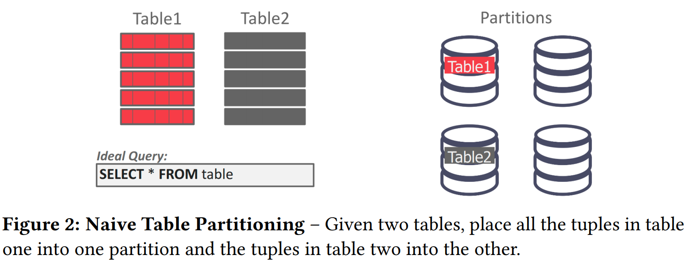{ width="750" }
</figure>

如果只存在单表查询，这种方案是最理想的。但这种方法很差，因为它不可扩展。如果经常查询一张表而不使用所有可用节点，则一个分区的资源可能会耗尽。

### **Vertical Partitioning**

垂直分区，它将表的属性拆分到不同分区中，每个分区还必须存储用于重建原始记录的元组信息。

<figure markdown="span">
    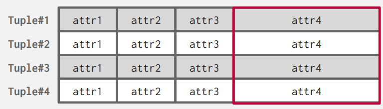{ width="750" }
</figure>

<figure markdown="span">
    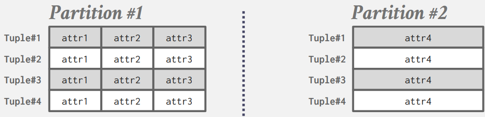{ width="750" }
</figure>

### **Horizontal Partitioning**

更常见的是，使用水平分区将表的元组拆分为不相交的子集。这种分片方式要求 DBMS 要找到在大小、负载上能均匀分配的键，作为分区键。

<figure markdown="span">
    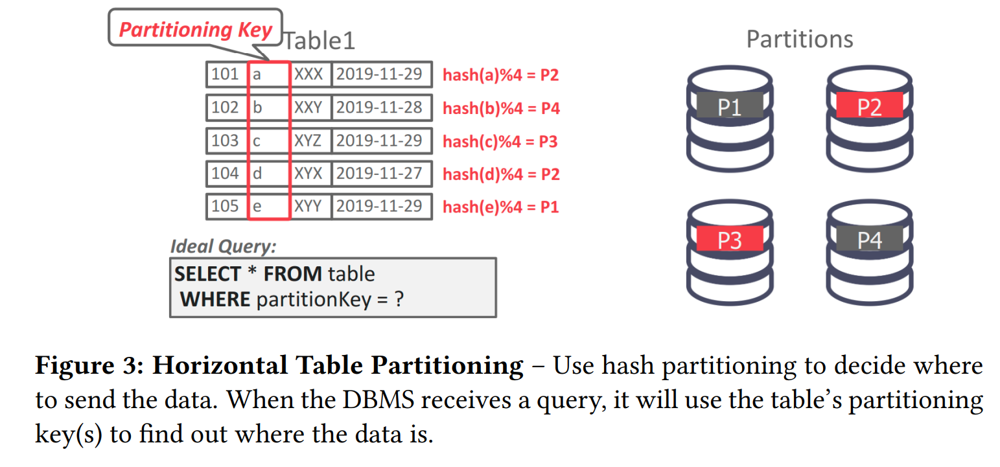{ width="750" }
</figure>

DBMS 可以基于Hash、数据范围或谓词对数据库进行物理分区（不共享任何内容）或逻辑分区（共享磁盘）。

- 逻辑分区（Logical Partitioning）：一个节点负责一组键，但它实际上并不存储这些键。这通常用于共享磁盘架构。

<figure markdown="span">
    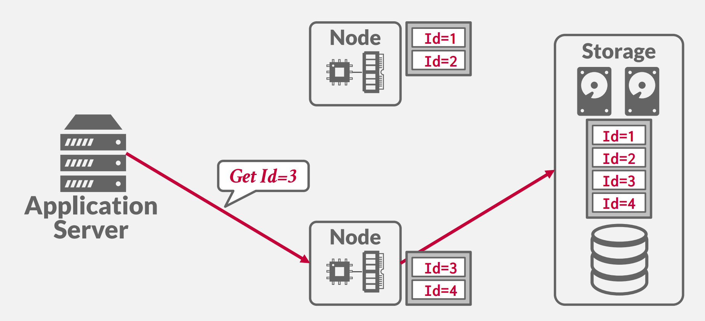{ width="550" }
</figure>

如果我要获取多个数据，计算节点会从其他的计算节点获取相应的数据：

<figure markdown="span">
    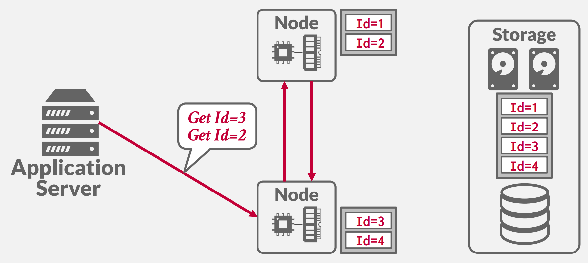{ width="550" }
</figure>

- 物理分区（Physical Partitioning）：节点负责一组键值，并物理存储这些键值。这通常用于无共享架构。

<figure markdown="span">
    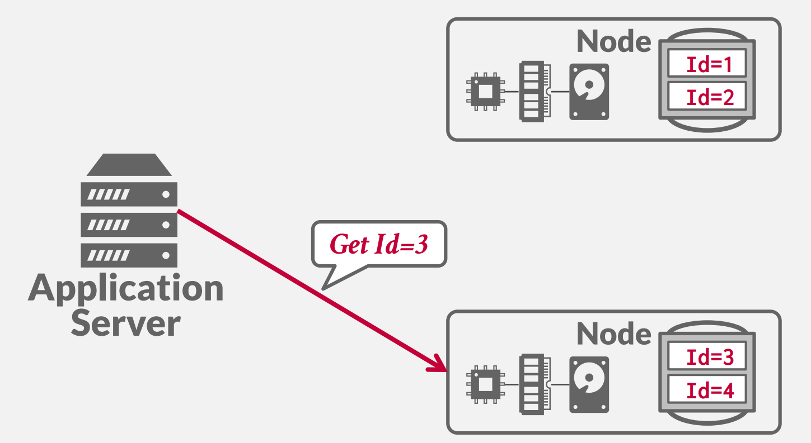{ width="550" }
</figure>

哈希分区的问题在于，当添加或删除节点时，必须对大量数据进行洗牌，例子如下：当添加新节点后，模数从 4 变为 5，全部数据的位置都需要调整。

<figure markdown="span">
    { width="550" }
</figure>

解决方案是**一致性哈希**。

一致性哈希将每个节点分配到某个逻辑环上的一个位置。然后每个分区键的哈希映射到环上的一个位置。顺时针方向最靠近该键的节点负责该键。例子如下：

<figure markdown="span">
    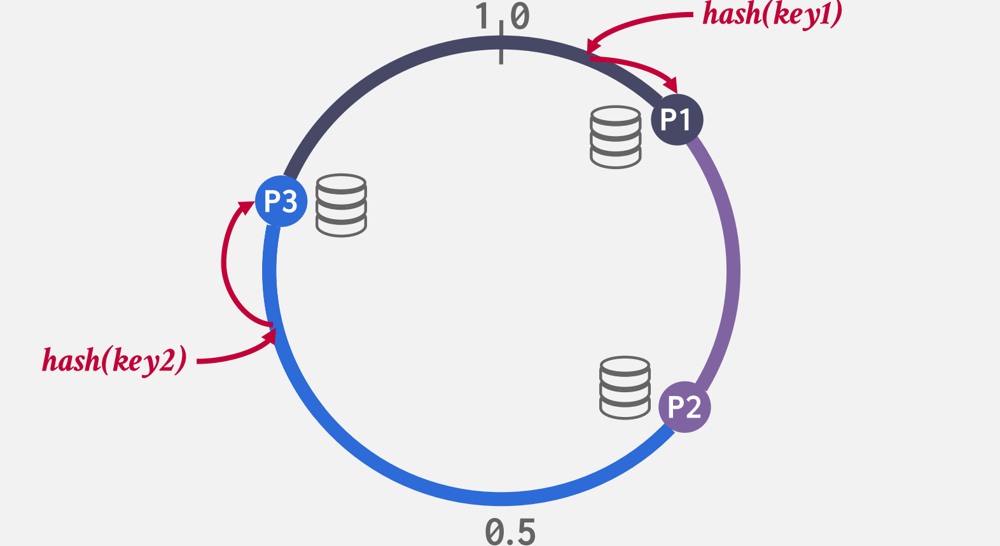{ width="550" }
</figure>

添加或删除节点时，键仅在与添加/删除的节点相邻的节点之间移动，因此仅移动 1/n 部分的键：

<figure markdown="span">
    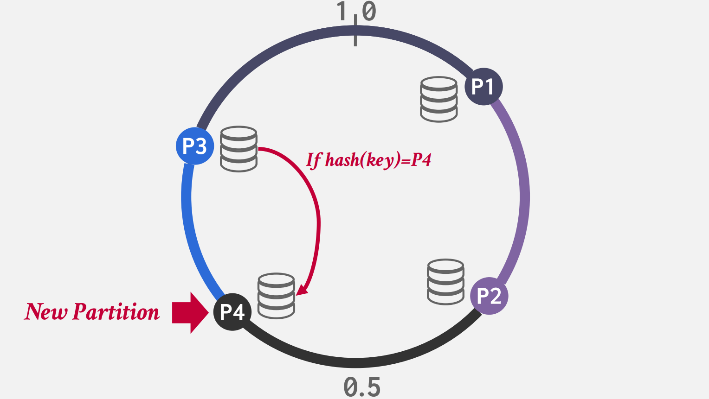{ width="550" }
</figure>

我们可以设置复制因子为 k ，它意味着每个键都在顺时针方向最近的 k 个节点处复制。

<figure markdown="span">
    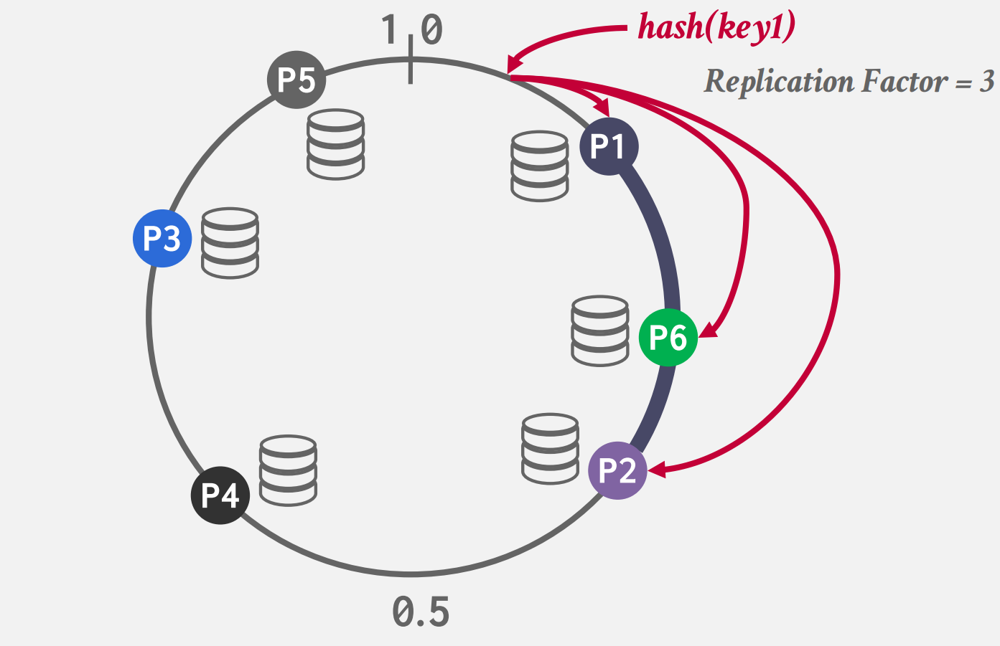{ width="550" }
</figure>

## **Transaction Coordination**

分布式事务访问一个或多个分区的数据，这就需要高昂的协调花费，通常有两种实现方式:中心化 (Centralized) 和去中心化 (Decentralized)。

### **Centralized coordinator**

实现 Centralized Coordinator 的其中一种思路就是构建一个独立的组件负责管理事务，叫 Transaction Processing Monitor，即 TP Monitor。TP Monitor 与其之下运行的单节点 DBMS 无关，DBMS 无需感知 TP Monitor 的存在。每次应用在发送事务请求时，需要先通过 TP Monitor 确认事务是否可以执行。

<figure markdown="span">
    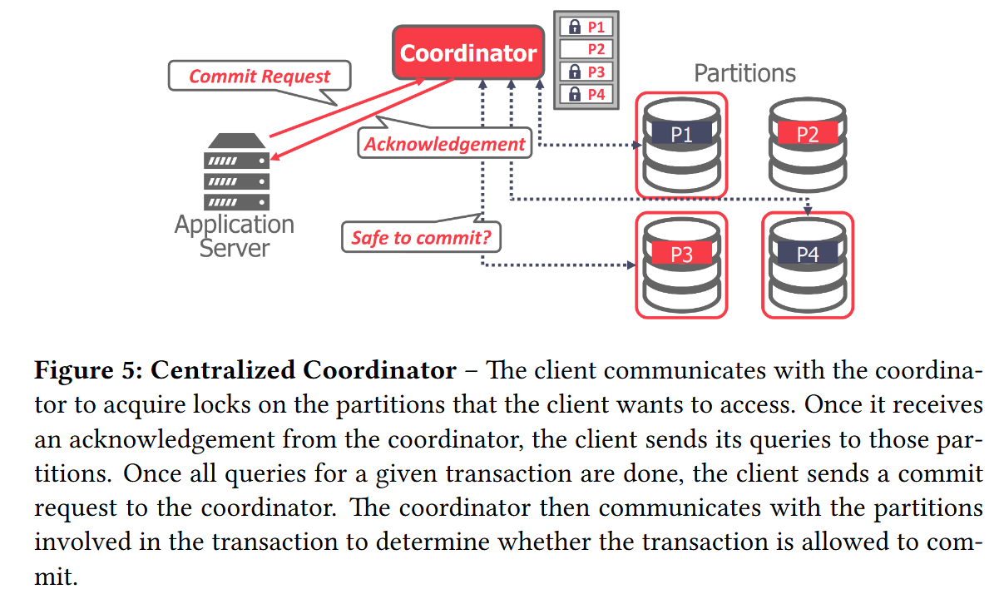{ width="650" }
</figure>

现在还有好多老的系统在使用这项技术：Oracle bea、Apache Omid、IBM Transac。

<figure markdown="span">
    { width="650" }
</figure>

### **Middleware**

更为常见的是中间件方法，它接受查询请求并将查询路由到正确的分区或数据库中。Facebook 运行着世界上最大的 MySQL 集群，采用的就是这种方案。它们的 Middleware 负责处理分布式事务、路由、分片等所有逻辑。

<figure markdown="span">
    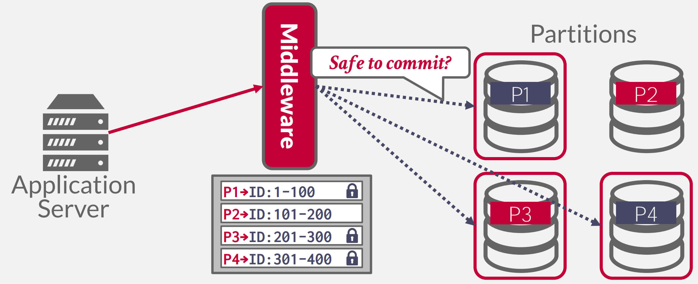{ width="650" }
</figure>

使用这种方式还可以实现联邦数据库系统：

<figure markdown="span">
    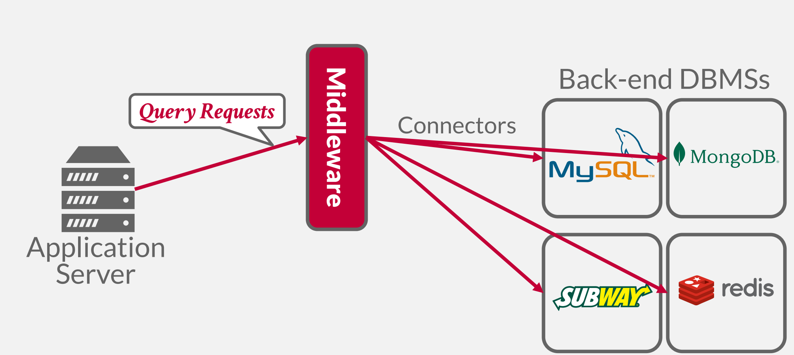{ width="650" }
</figure>

联邦数据库系统目的是将多个不同的单机数据库系统组合成一个集群，理想情况下是：将这些数据孤岛组合成一个涵盖所有数据的全局视图。这是一个比较老的方法始于 1990s，且尚无人可以很好的实现，原因是：

- 不同的数据模型，查询语言

- 没有简单的方式进行查询优化

- 大量的数据拷贝，需要将大量数据读到 Middleware 中。

### **Decentralized Coordinator**

Decentralized Coordinator 的基本思路就是，执行某个事务时，会选择一个分片充当 Master，后者负责询问涉及事务的其它分片是否可以执行事务，完成事务的提交或中止：

<figure markdown="span">
    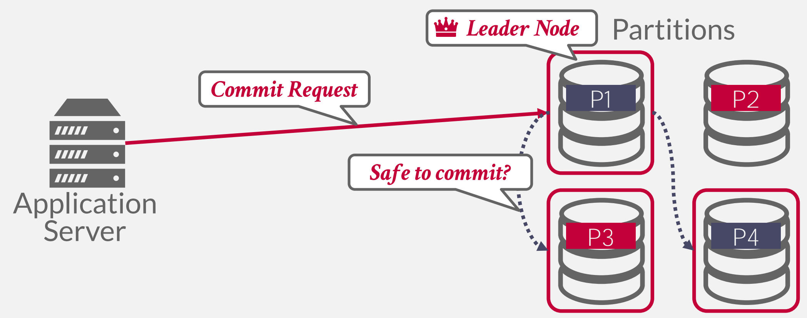{ width="650" }
</figure>

集群中没有一个固定的 Leader Node，而是每过一段时间，通过选举，选取出一个临时的 Leader Node 来负责事务的运行与提交，这一般靠 Raft 或 Paxos 算法来实现选举。

### **Summary**

在多个客户端尝试获取同一分区上的锁的情况下，Centralized coordinator 会导致瓶颈，然而，它对于分布式 2PL 来说可能更好，因为它具有锁的中心视图并且可以更快地处理死锁。对于 Decentralized Coordinator 来说，这并非易事。

## **Distributed Concurrency Control**

分布式并发控制的难度在于：

- Replication

- Network Communication Overhead

- Node Failures

- Clock Skew

举个例子，假如我们要实现分布式的 2PL：

<figure markdown="span">
    { width="650" }
</figure>

A 数据在 Node 1 上，B 数据在 Node 2 上，因为没有中心化的角色存在，一旦发现如上图所示的死锁，双方都不知道是应该中止还是继续等待。从这个例子我们可以看出将并发控制升级到分布式并发控制，有许多问题要解决。