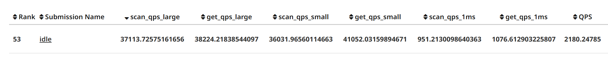
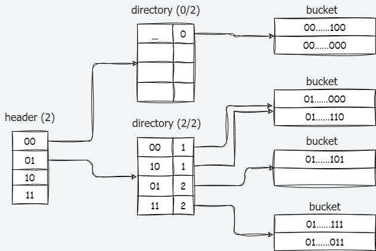
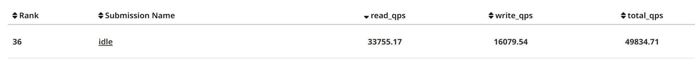

本章节博客是 CMU 15-445 2023 Fall 的课程笔记，一些学习资源：

- [课程主页](https://15445.courses.cs.cmu.edu/fall2023/){targt=_blank}

- [【数据库系统导论 15-445 2023Fall】CMU—中英字幕](https://www.bilibili.com/video/BV1Ex4y1p7bi?p=1&vd_source=0de771c86d90f02a6cab8152f6aa173f){targt=_blank}

- [open-courses](https://zhenghe.gitbook.io/open-courses/cmu-15-445-645-database-systems/relational-data-model){targt=_blank} 

也有关于课程项目 BUSTUB 的一些编写思路。一些参考：  

- [BusTub 养成记：从课程项目到 SQL 数据库](https://zhuanlan.zhihu.com/p/570917775){targt=_blank}


- [CMU15-445 2023 Fall Project0~4 通关总结](https://zhuanlan.zhihu.com/p/679980578){targt=_blank}

- [xxl CMU15445(2023-fall)](https://4ever-xxxl.github.io/categories/cmu154452023-fall/){targt=_blank}

## **关于 BUSTUB**

这个课程实验用的是 C++17，需要一些 C++ 基础才能做。我写的是 2023 Fall 这一期的。

下面是整个项目的整体结构：

<figure markdown="span">
  { width="600" }
</figure>

因为 Andy 强调过不要放出源码，所以这里只介绍一下实现思路。

###  **Project 0 -- C++Primer**

它是检验我们 C++17 语法水平的，要写一个 Copy-Write 的 KV 存储字典树。

### **Project 1 -- Buffer Pool**

一个 Buffer Pool Manager，管理整个 DB 的页面，对于并发控制，优化了锁的粒度，使用 2PL 协议，并且以相同顺序申请锁避免死锁。

对应 LRU-k 的实现，我维护了两个链表 `young_list_` 和 `old_list_`，在 `young_list_` 中的页面都是访问次数不够 k 次的，替换时直接采用 FIFO 的方式替换即可。当 `young_list_` 中没有可淘汰的页面时，再从 `old_list_` 中选取最近第 k 次最早的页面淘汰调（第 k 次最早，说明最近访问的次数相对较少），注意被 Ping 住的页面不能替换。

对于 Disk Scheduler，原先只有一个线程来处理读写请求，可能会导瓶颈，但是也不能加太多线程来处理，会导致频繁的线程切换，效果反而更差，我综合测下来 3 个线程效果相对比较好。

我整理笔记时 Leaderboard 排名是 53（之前 48 的掉了几名，后面想办法再优化一下吧 QAQ）。



### **Project 2 -- Extensible Hash Index**

这一部分要实现一个可扩展哈希索引。

首先实现 可扩展哈希的 四种 Page 类型：Header、Directory、Bucket。结构如下：

<figure markdown="span">
  { width="500" }
</figure>

一个 Key 经过项目中提供的哈希函数后，会得到一个 32 位的二进制数。

在查找时，通过 hash 值的高几位确定 header 中对应 Directory 的索引，从 hash 值的低几位确定 Bucket 的索引，在从对应 Bucket 中遍历找到数据。高位用的位数用 max_depth_ 确定，低位的位数用 Directory 中的 global_depth_ 确定。

插入的逻辑是：先按上述过程找到对应的 Bucket，判断是否满了，如果没满就直接插入并返回 true，否则就进行扩容，扩容逻辑如下：

  1. 判断 directory 是否还能扩容，如果能就扩容，否则直接返回 false；

  2. 创建 new_bucket，增加对应 Bucket 的 local_depths_；

  3. 分裂 bucket 中的元素到 new_bucket；

  4. 更新 directory 信息；如：global_depth_，对应 Bucket 的 local_depths_，以及 hash 值到 Bucket 的映射。

  5. 重复上述步骤，知道能将元素插入为止；因为原来的 Bucket 中第 local_depths_ 位全部相同，分裂后原先的数据还是都在一个 Bucket 中。

删除逻辑是：先进行删除，如果删除后 bucket 为空了，就要进行合并，合并逻辑如下：

  1. 找到 img bucket 的相关信息

  2. 判断是否可以合并：1> merge bucket 和 bucket 二者 local depth 是否相等，2> merge bucket 或 bucket 有一个为空

  3. 修改 directory 信息

  4. 检查是否可以收缩 global_depth

  5. 如果合并后 merge bucket 还是空的，重复上述过程

整理笔记时 Leaderboard 排名是 36。




### **Project 3 -- Query Execution**

基于 Iterator Model 实现查询层的算子，包括SeqScan、IndexScan、Insert、Update、Delete、HashJoin，Aggregation和Windowfunction。以及一些 Heuristics 的优化，包括：SeqScan to IndexScan、NestedLoopJoin to HashJoin、Top-N Optimization。

这一部分代码量很大，但是大部分逻辑不是很难，这里挑几个比较复杂的说一下。

- Hash Join：这里我直接用了 unordered_map，先把左表中的 tuple 按 join key 扔到哈希表中，每调用一次 `Next` 就从右表取一个 tuple 上来，跟坐表 join 然后输出。

- Window Function：先读取所有的 tuple，我们创建一个 `std::unordered_map<RID, std::vector<Value>> tmp_result` ，方便后续不同列的窗口函数的　`ORDER BY`　排序。

```cpp
  std::vector<std::pair<OrderByType, AbstractExpressionRef>> order_by;
  while (child_executor_->Next(&tuple, &rid)) {
    // Make a identifier for every tuple.
    rid.Set(cnt++, 0);
    tuple.SetRid(rid);
    tuples.emplace_back(std::move(tuple));
    // Allocate space in advance
    tmp_result[rid].resize(plan_->columns_.size());
  }
```

再遍历每一个列，判断列是否有 window_function，没有的话直接记录所有 tuple 对应列的值，否则进行 window_function 的运算，然后再根据 `(partition_by_, order_exprs)` 排序，这样 partition key 相同的 tuple 就被划分到了一起，整个元组也按照 order key 排序好了，然后在对应相同的 partition，进行聚合操作即可。

```cpp
  auto wf_ptr = plan_->window_functions_.find(i);
  if (wf_ptr == plan_->window_functions_.end()) {
    // No window function, just evaluate the tuple value.
    for (auto &tuple : tuples) {
      tmp_result[tuple.GetRid()][i] = plan_->columns_[i]->Evaluate(&tuple, tuple_schema);
    }
    continue;
  }
  // Have a window function, calculate aggregation result.
  // Sort tuple by keys(partition_by_, order_exprs).
  const auto &wf = wf_ptr->second;
  auto wf_helper = std::make_unique<WindowFunctionHelper>(wf.type_);
  std::vector<std::pair<OrderByType, AbstractExpressionRef>> order_exprs;
  for (auto &expr : wf.partition_by_) {
    order_exprs.emplace_back(OrderByType::ASC, expr);
  }
  for (auto &expr : wf.order_by_) {
    order_exprs.emplace_back(expr);
  }
  SortTupleHelperFunction(tuples, order_exprs, tuple_schema);
```

需要注意的是，当 PARTITION BY 和 ORDER BY 都被定义时，对应每个 partition 内，应该对累计值求聚合函数，但如果没提供 ORDER BY，每个 partition 都是整个部分求聚合函数，可以看看实验指导上的例子。聚合这部分代码有点长就不贴了。

### **Project 4 -- Concurrency Control**

实现 MV + OCC 的并发控制协议，实现了 Snapshot level 的隔离，支持 read-write、write-read、read-read 的并行执行。

这一部分要重写 scan, index scan, update, delete 算子。

对于 scan, index scan，如果tuple 的时间戳比当前事务的小或正在被当前事务修改，直接读取 tuple，否则就使用 `ReconstructTuple` 来获取 tuple 即可。

update 和 delete 的实现类似。这里我主要讲 update 的思路。在 update 之前，我们先要讲所有需要的 tuple 的 `VersionUndoLink` 中的 `in_progress_` 字段修改为 true ，避免多个事务同时修改一个 tuple 的 version link。

还有比较麻烦的就是修改主键的时候，要先将原先的主键都删除，在重新插入新的主键，以此来维护主键的正确性，这在实验指导的 4.3 有细讲。我的做法如下：

在 init 时判断 update 的列是否有主键：

```cpp
  if (primary_key_ != nullptr) {
    auto &key_attrs = primary_key_->index_->GetKeyAttrs();
    for (unsigned int key_attr : key_attrs) {
      if (std::dynamic_pointer_cast<ColumnValueExpression>(plan_->target_expressions_[key_attr]) == nullptr) {
        is_update_primary_key_ = true;
        break;
      }
    }
  }
```

如过有主键的话，就在修改先，先将需要修改的 tuple 都删除：

```cpp
if (is_update_primary_key_) {
  for (auto &[rid, meta, tuple] : old_data) {
    InsertVersionLink(txn_mgr_, txn_, table_info_, rid, GenerateNullTupleForSchema(&table_info_->schema_), tuple,
                      meta);
    table_info_->table_->UpdateTupleMeta(TupleMeta{txn_->GetTransactionTempTs(), true}, rid);
  }
}
```

另外我把 update 和 delete 相似的地方提取出来实现了一个 `InsertVersionLink` 函数，实现向 tuple 的版本链中插入一个新版本的逻辑（deletee 就是插入一个 is_deleted_ 为 ture 的 UndoLog）。


## **论文**

- [Are You Sure You Want to Use MMAP in Your Database Management System?](https://db.cs.cmu.edu/papers/2022/cidr2022-p13-crotty.pdf){target=_blank}：mmap 映射文件引发的一些问题。

- [Exploiting Directly-Attached NVMe Arrays in DBMS](https://www.cidrdb.org/cidr2020/papers/p16-haas-cidr20.pdf){target=_blank}：现代 SSD 替代传统 HDD 的优势。

