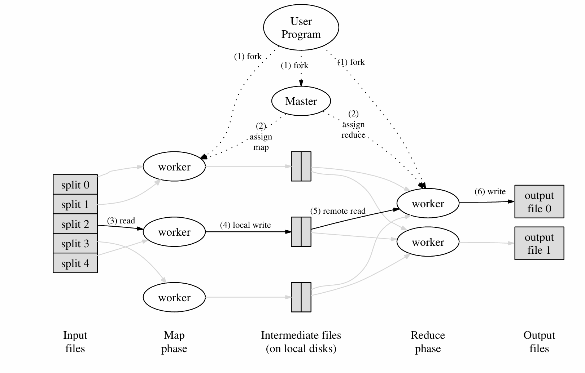
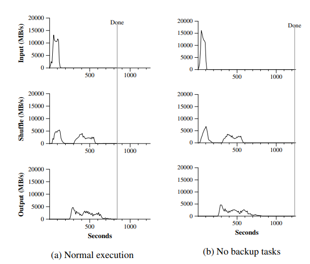

[论文原文](https://pdos.csail.mit.edu/6.824/papers/mapreduce.pdf){target=_blank}

MapReduce 主要贡献是一个简单而强大的接口，它支持大规模计算的自动并行化和分发，并结合该接口的实现，在大型商用 PC 集群上实现高性能。

MapReduce 常见的运用如：计算倒排索引、Word Count 等等聚合操作的场景。

## Programming Model

计算采用一组输入键/值对，并生成一组输出键/值对。 MapReduce 库的用户将计算表示为两个函数：Map 和 Reduce。

Map 由用户编写，它接受一个 input 对并生成一组中间键/值对。MapReduce 库将与同一中间键 I 关联的所有中间值组合在一起，并将它们传递给 Reduce 函数。

Reduce 函数（也由用户编写）接受中间键 I 和该键的一组值。它将这些值合并在一起，以形成一组可能更小的值。通常，每次 Reduce 调用只生成零个或一个输出值。中间值通过迭代器提供给用户的 reduce 函数。这允许我们处理太大而无法放入内存的值列表。

举一个简单的例子，单词计数：

```Python
map(String key, String value):
    # key: document name
    # value: document contents
    for each word w in value:
        EmitIntermediate(w, "1")

reduce(String key, List values):
    # key: a word
    # values: a list of counts
    int result = 0;
    for each v in values:
        result += ParseInt(v);
        Emit(AsString(result));
```


## Implementation

这个部分介绍 Google 实现 MapReduce 的方式，他们部署 MapReduce 集群的计算环境是用交换以太网连接在一起的大型商用计算机集群，在环境中：

（1） 计算机是运行 Linux 的双处理器 x86 处理器，每台计算机具有 2-4 GB 内存。

（2） 使用商用网络硬件 – 通常为 100 MB/秒或 1 GB/秒的计算机级别，但总体等分带宽的平均带宽要低得多。

（3） 集群由数百或数千台机器组成，因此机器故障很常见。

（4） 存储由直接连接到单个计算机的廉价 IDE 磁盘提供。内部开发的分布式文件系统 [8] 用于管理存储在这些磁盘上的数据。文件系统使用复制在不可靠的硬件之上提供可用性和可靠性。

（5） 用户将作业提交到调度系统。每个作业都由一组任务组成，并由调度程序映射到集群中的一组可用计算机。

### Execution Overview

首先将输入文件分成 M 份大小为 16MB~64MB 的可以并行处理的子文件，将 M 份的数据输入 MapReduce 程序，随后程序按照下图所示的执行一下几步：




1. 在用户程序中的 MapReduce 库会启动很多子程序，其中有一个特殊的进程 -- Master，其余的进程都是 Worker。Master 会为每个空闲的 Worker 分配 map 或 reduce 任务。

2. 被分配 map 任务的 Worker 会读取对应输入子文件的内容。从输入数据中解析出 key/value 对，并将其输入用户定义的 Map 函数中。用户 Map 函数产生的 key/value 对会被缓存到内存中。

3. 被缓存的键值对会被周期地写入本地磁盘中，输出的数据通过分区函数被分成 R 个部分。然后这 R 个部分的数据会被返回给 Master，后续会负责将这些位置交给执行 reduce 任务的 Worker。

4. 当 Reduce 通过 Master 获取所有中间数据后，对其进行排序，排序是必需的，因为通常许多不同的 key 映射到同一个 reduce 任务，如果任务中的数据量太大而无法放入内存，还需要使用外部排序。

5. Reduce worker 遍历排序后的中间数据，对于遇到的每个唯一中间 key，它将 key 和所有相应的中间 value 传递给用户定义的 Reduce 函数。Reduce 函数的输出将附加到此 reduce 分区的最终输出文件中。

6. 当 map 任务和 reduce 任务全部完成后，master 唤醒用户程序。此时，用户程序中的 MapReduce 调用返回给用户代码。

最后完成后，MapReduce 执行的结构将输出到 R 个文件中（每个 Reduce 任务对应一个输出文件），通常这些结果不需要合并，而是输出到另一个 MapReduce 程序中，或是输出到一些分布式文件系统（如：GFS、HDFS，这些文件系统本身就是分块存储数据的）。

### Fault Tolerance

由于 MapReduce 库旨在帮助使用数百或数千台计算机处理大量数据，因此该库必须能够正常容忍计算机故障。

**Worker Failure**：Master 会定期 ping 每个 worker。 如果在一段时间内未收到 worker 的响应，则 master 会将该 worker 标记为 failed，并且其对应的执行任务会被分配到新的机器上运行。

当 map 任务首先由 Worker A 执行，然后由 Worker B 执行时（因为 Worker A 失败），所有执行 reduce 任务的 Worker 会收到重新执行的通知。任何尚未从工作程序 A 读取数据的 reduce 任务都将从工作程序 B 读取数据。

**Master Failure**：我们可以定期执行 checkpoints 来持久化 Master 当前的状态。如果 Master 死亡，则可以从最后一个检查点状态启动新副本。但是，鉴于只有一个 Master ，并且它失败的可能性不大；因此，如果 Master 失败，我们当前的实现会中止 MapReduce 计算，客户端可以检查此条件，并根据需要重试 MapReduce 程序。

### Task Granularity

我们将 map 阶段细分为 M 块，将 reduce 阶段细分为 R 块。理想情况下，M 和 R 应远大于 worker 计算机的数量，这样可以让每个 worker 执行许多不同的任务可以改善动态负载均衡，还可以在 worker 发生故障时加快恢复速度。

通常受 R 的大小到用户的约束，因为每个 reduce 任务的输出最终都位于单独的输出文件中。在实践中，Google 倾向于选择 M，以便每个单独的任务大约是 16 MB 到 64 MB 的输入数据（因此上述局部性优化最有效），并且 Google 将 R 设置为我们预期使用的工作机器数量的小倍数。我们经常使用 2,000 台 worker 机器执行 M = 200,000 和 R = 5,000 的 MapReduce 计算。


### Locality

在 Google 的计算环境下，网络带宽是稀缺资源。他们将输入数据存储到本地部署的 GFS 中，GFS 将每个文件划分为 64 MB 大小的块，并在多台机器上存储块的副本，MapReduce 的 Master 会首先考虑输入文件的位置，尽可能将任务分配给距离输入数据较进的 Worker（例如，在与包含数据的计算机位于同一网络交换机上的工作计算机上），依次来减少网络带宽的占用。

### Backup Tasks

延长 MapReduce作所花费总时间的常见原因之一是“落后者”，机器需要非常长的时间才能完成计算中的最后几个 map 或 reduce 任务之一。

落后者可能由于多种原因而出现。例如，磁盘损坏的计算机可能会遇到频繁的可纠正错误，这些错误会将其读取性能从 30 MB/s 降低到 1 MB/s。 

集群调度系统可能已在计算机上调度了其他任务，导致由于争夺 CPU、内存、本地磁盘或网络带宽而导致其执行 MapReduce 代码的速度变慢。

解决办法就是：备份任务。当 MapReduce 作接近完成时，主节点会重新安排 Worker 执行剩余正在进行的任务的备份执行，每当主执行或备份执行完成时，该任务都会标记为已完成。在论文中提到的 Sort 的例子，如果禁用备份任务，最终完成 sort 程序需要多花 44% 的时间才能完成：

{width=500}

## Refinements

尽管仅编写 Map 和 Reduce 函数提供的基本功能就足以满足大多数需求，但我们发现一些扩展很有用。

### Partitioning Function

MapReduce 的用户可以指定 Reduce 任务输出文件的数量（R），MapReduce 会使用一个默认的分区函数：`hash（key） mod R`，通常情况下这个函数能够做到足够的负载均衡。

在某些情况下，可能会需要一些定制化的分区函数，例如：key 是 URL，我们希望相同主机的 value 都输出道同一个文件中，我们就可以使用类似 `hash（Hostname（urlkey）） mod R` 这样的分区函数，最终相同主机的 url 的 value 都会写入到同一文件

### Ordering Guarantees

MapReduce 保证在给定的分区中，intermediate key/value 按 key 的递增顺序处理，这种排序保证使得为每个分区生成排序的输出文件变得容易，当输出文件格式需要支持按键的高效随机访问查找时，或者用户想要一个排序好的输出数据，这非常有用。

### Combiner Function

在某些情况下，每个 map 任务产生的中间键存在大量重复，并且用户指定的 Reduce 函数是可交换顺序的。一个很好的例子是 Section 2.1 中的字数统计示例，每个映射任务将生成数百或数千条形式为 <xxx， 1> 的记录，所有这些计数都将通过网络发送到单个 reduce 任务，然后由 Reduce 函数相加以生成一个数字。

我们允许用户指定一个可选的 Combiner 函数，该函数在通过网络发送之前对这些数据进行部分合并。

Combiner 函数在执行 Map 任务的每台计算机上执行。通常，相同的代码用于实现 combiner 和 reduce 函数。reduce 函数和组合函数之间的唯一区别是 MapReduce 库如何处理函数的输出。reduce 函数的输出将写入最终输出文件。组合函数的输出被写入一个中间文件，该文件将被发送到 reduce 任务。

### Input and Output Types

MapReduce 库支持以多种不同格式读取输入数据。例如，“text” 模式输入将每一行视为一个 key/value 对：key 是文件中的偏移量，value 是行的内容。用户可以通过提供简单 reader 接口的实现来添加对新 input 类型的支持，尽管大多数用户只使用少量预定义 input 类型中的一种。

读取器不一定需要提供从文件中读取的数据。例如，很容易定义一个读取器，该读取器从数据库或内存中存储的数据结构中读取记录。

以类似的方式，我们支持一组输出类型来生成不同格式的数据，并且用户代码很容易添加对新输出类型的支持。

### Skipping Bad Records

有时，用户代码中存在导致 Map 或 Reduce 函数在某些记录上确定性崩溃的错误。此类错误会导致 MapReduce 正常执行。通常的行动方案是修复错误，但有时这是不可行的，比如 bug 位于源代码不可用的第三方库中。此外，有时忽略一些记录也是可以接受的，例如，在对大型数据集进行统计分析时。我们提供了一种可选的执行模式，其中 MapReduce 库会检测哪些记录会导致确定性崩溃，并跳过这些记录以继续前进。

每个工作进程都会安装一个信号处理程序，用于捕获分段违规和总线错误。在调用用户 Map 或 Reduce作之前，MapReduce 库将参数的序列号存储在全局变量中。如果用户代码产生异常信号，信号处理程序向 Master 发送一个包含序列号的“最后一口气”UDP 数据包。当 Master 在特定记录上看到多个失败时，它表示在发出相应的 Map 或 Reduce 任务的下一次重新执行时，应跳过该记录。

### Local Execution

调试 Map 或 Reduce 函数中的问题可能很棘手，因为实际计算发生在分布式系统中，通常在几千台机器上，工作分配决策由主服务器动态做出。为了方便调试、分析和小规模测试，我们开发了 MapReduce 库的替代实现，该实现在本地计算机上执行 MapReduce的所有工作。向用户提供控件，以便将计算限制为特定的 map 任务。用户使用特殊标志调用他们的程序，然后可以轻松使用他们认为有用的任何调试或测试工具（例如：gdb）

### Status Information

主服务器运行内部 HTTP 服务器并导出一组状态页面供人类使用。状态页面显示计算的进度，例如已完成的任务数、正在进行的任务数、输入字节数、中间数据字节数、输出字节数、处理速率等。这些页面还包含指向每个任务生成的标准错误和标准输出文件的链接。用户可以使用此数据来预测计算需要多长时间，以及是否应向计算添加更多资源。这些页面还可用于确定计算何时比预期慢得多。

此外，顶级状态页面显示哪些工作程序失败，以及它们在失败时正在处理哪些 map 和 reduce 任务。在尝试诊断用户代码中的 bug 时，此信息非常有用。

### Counters

MapReduce 库提供了一个计数器工具，用于计算各种事件的发生次数。例如，用户代码可能想要计算处理的单词总数或索引的德语文档数等。

要使用此功能，用户代码创建一个命名的计数器对象，然后在 Map 和/或 Reduce 函数中适当地增加该计数器。例如：

```cpp
Counter* uppercase;
uppercase = GetCounter("uppercase");
map(String name, String contents):
for each word w in contents:
    if (IsCapitalized(w)):
        uppercase->Increment();
        EmitIntermediate(w, "1")
```

来自各个 worker 机器的 counter 值会定期发送到 master（同 Ping 相应一起），主节点聚合成功的 map 和 reduce 任务的 counter 值，并在 MapReduce 完成后将其返回给用户代码。 当前计数器值也显示在主 status 页面上，以便人类可以查看实时计算的进度。在聚合 counter 值时，master 会消除重复执行同一 map 或 reduce 任务的影响，以避免重复计数。（重复执行可能是由于我们使用备份任务和由于失败而重新执行任务引起的。

一些计数器值由 MapReduce 库自动维护，例如：处理的输入键值对的数量、生成的输出键值对的数量。

用户发现计数器工具对于完整性检查 MapReduce 的行为非常有用。例如，在某些 MapReduce 中，用户代码可能希望确保生成的输出 kv 数与处理的输入的 kv 数完全相等。

## **Lab1**

需要有两个部分：coordinator 和 worker

- coordinator 与 worker 间要使用 RPC 进行通信。

- 每个 worker 将在循环中向 coordinator 请求任务，从一个或多个文件读取任务的输入，执行任务，将任务的输出写入一个或更多文件，然后再次向 coordinator 询问新任务。

- （back up）协调员应该注意到一名 worker 是否在合理的时间内没有完成任务（对于这个 lab1，用10秒），并将相同的任务交给另一名 worker。

- 当整个 MapReduce Job 完全完成时，所有的 worker 应该退出。

[我的实现](https://github.com/idle-lab/MIT-6.824/tree/master/src/mr){target=_blank}