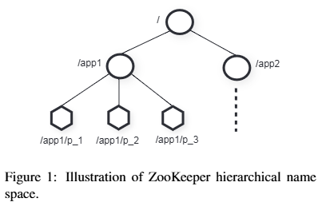
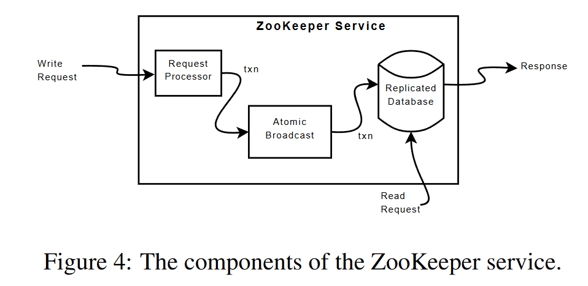

[论文原文](https://www.usenix.org/legacy/event/atc10/tech/full_papers/Hunt.pdf){target=_blank}

## Introduction

ZooKeeper 是无等待的（非阻塞)，且与文件系统非常相似。

它提供顺序保证：

- 提供 linearizable 写操作，sequential consistency 读操作。
  
- 保证所有操作先进先出的客户端顺序

它还提供：

- watch机制（监听）：让客户端可监视到更新（从而简化客户端缓存实现）


本文的主要贡献如下:

- Coordination kernel：提出了一种具有宽松一致性保证的无等待协调服务，用于分布式系统中。特别地，描述了协调内核的设计和实现，已在许多关键应用程序中使用它来实现各种协调技术。

- Coordination recipes：展示了如何使用 ZooKeeper 构建更高级别的协调原语，甚至是阻塞和强一致性原语，这些原语通常用于分布式应用程序中。

- Experience with Coordination：分享了使用 ZooKeeper 的一些方法，并评估了它的性能。


## The ZooKeeper service

### Service overview

ZooKeeper 使用 znode 表示数据，且以树形形式表示（类似文件系统）。


znode 分为2类：

- 普通：客户端需要显式创建/删除这类节点
- 临时：客户端创建这类节点后，当其会话结束后，节点自动删除

<figure markdown="span">
{ width="550" }
</figure>

znode 不存储通用数据，而主要映射客户端应用的抽象（主要是协调用的元数据）。


### Client API

- create(path, data, flags)：创建path的znode节点，保存data，返回新的znode的名字。flag用于指明znode类型，也可指明是否使用顺序标志

- delete(path, version)：删除path的znode节点，并且版本号满足version

- exists(path, watch)：返回path的znode是否存在。watch可允许客户端在该节点上应用watch

- getData(path, watch)：获取path的znode的值，watch和exists()一样，除非znode不存在

- setData(path, data, version)：向path下的znode写入data，节点版本需要匹配version

- getChildren(path, watch)：返回path子节点的所有名字

- sync(path)：操作开始时，等待所有的更新都发送到客户端所连接的服务器，path当前是被忽略的

### ZooKeeper guarantees


ZooKeeper 提供**线性化写**和**FIFO客户端顺序**的保证。但对于读操作 ZooKeeper 为了效率只实现了顺序一致性（可能读到旧数据，但所有进程看到的更新顺序是一致的）。


## Examples of primitives

通过 ZooKeeper 提供的这些 API，可以实现很多复杂原语：

**Configuration Management** 将配置信息保存在znode中。进程读取znode的值，并设置watch为真。当配置变化后，进程会被通知，重新读取后，再设置watch为真。

**Rendezvous** 有时候，分布式系统的最终配置不能提前知道，因此启动时，主进程可创建一个znode，存储动态的配置信息（如动态调度的IP和端口），工作进程读取这个znode，并设置watch为真，若节点没值，则等待。

**Simple Locks** 一个简单的锁可通过创建 znode 节点完成，上锁：创建临时znode尝试获得锁，若创建成功则获取锁，否则监听已有的znode；解锁：删除znode释放锁（此时通知等待的客户端，以获取锁）。上述锁会有个缺点：节点多时，造成羊群效应（过多客户端监听同一个znode，通知时造成流量尖峰，导致网络阻塞）。

**Simple Locks without Herd Effect** 实现无羊群效应的锁的伪码如下：

```cpp
// Lock
n = create(l + “/lock-”, EPHEMERAL|SEQUENTIAL)
C = getChildren(l, false)
if n is lowest znode in C, exit
p = znode in C ordered just before n
if exists(p, true) wait for watch event
goto 2

// Unlock
delete(n)
```

加锁时监视比当前编号小的第一个 znode 是否存在，不存在就成功加锁，否则等待其删除。

**Read/Write Locks** 实现读写锁伪代码如下：

```cpp
// Write Lock
n = create(l + “/write-”, EPHEMERAL|SEQUENTIAL)
C = getChildren(l, false)
if n is lowest znode in C, exit
p = znode in C ordered just before n
if exists(p, true) wait for event
goto 2

// Read Lock
n = create(l + “/read-”, EPHEMERAL|SEQUENTIAL)
C = getChildren(l, false)
if no write znodes lower than n in C, exit
p = write znode in C ordered just before n
if exists(p, true) wait for event
goto 3
```

写锁与一半的互斥锁相同；加读锁时，查看是否有比自己序号小的写 znode，没有加锁成功，否则等待写锁 znode 删除。

## ZooKeeper Implementation

ZooKeeper 通过数据复制提供高可用的服务，下图展示了 Zookeeper 服务的基本组件。Request Processor 将写请求转化为对应的事务 Txn；Atomic Broadcast 通过 ZAB 共识算法，将事务日志复制到多个 follower 机器上；已提交的事务将应用到 Replicated Database 中。

<figure markdown="span">
{ width="550" }
</figure>

### Request Processor

为了让事务幂等，Leader收到写请求，会计算得到写入后的状态，并将请求转化成一个包含这个新状态的事务条目。

如一个写请求setData，那么：

- 成功时，生成setDataTXN，包含新数据，新版本号以及更新时间戳

- 失败时，生成errorTXN

### Atomic Broadcast

所有更新操作都会被转发给 leader，leader 执行后，将请求通过 ZAB 拷贝到其他 follower 上，相较一般的原子广播协议保证的总顺序外， ZAB 还保证了以下两种顺序：

- 一个领导者所广播的所有状态变更都会严格按照它们发送的顺序被集群中的所有服务器接收和应用；

- 如果发生领导者切换，那么新当选的领导者在开始广播新的更新之前，会先接收并应用完所有前一任领导者已经达成共识的变更。

实现上：

- 使用TCP协议，保证了传输可靠（完整性、顺序等）以及高性能。

- 使用 ZAB 选出的Leader作为ZooKeeper的Leader，所以创建事务的进程也会提出对应事务的 proposal。

- 使用 WAL 来记录 ZAB 的广播

- ZAB 广播消息实现exactly-once，由于事务是幂等的，且消息按顺序发送，则 ZAB 重新广播（如恢复时）也是可以接受的。

### Replicated Database

每个 replica 的内存中都有一份 ZooKeeper 状态副本。ZooKeeper 会通过 replay 持久化的日志来恢复状态机，并通过周期的 fuzzy snapshots 来减少恢复的时间。持久化时 ZooKeeper 会 dfs 整棵树，将每个 znode 的数据写入磁盘。


### Client-Server Interactions

对于写请求：

- 将更新相关的通知发出去，并将对应的watch清空

- 写请求不会和任何请求并发进行（包括和读并发进行），严格按照顺序处理，这保证了通知的严格一致

- 通知是在各个副本的本地进行，而并非全在Leader

对于读请求：

- 请求在各个副本的本地执行（无读盘以及协商，性能很高）

- 每个读请求被赋上zxid，它等于最后一个服务端见到的事务。

sync()：普通读请求会读到旧数据，通过sync()以读到最新的数据，[但在极端（脑裂）情况下，也会返回陈旧数据](https://github.com/jepsen-io/jepsen/issues/399){target=\_blank}（没懂）。
