重点：对项目管理的认识、

## 走进项目管理

1.4 不看

###  项目与项目管理的价值

###  项目

**项目的定义：**利用有限资源，在一定时间内，完成满足一系列特定目标的多项相关工作叫做项目。

作业与项目的区别：

-   作业：连续不断、周而复始的活动，如车间加工产品的活动、财务人员的日常记账工作等；

-   项目：临时性的、一次性的活动，如企业新产品开发、企业业务系统开发等。

###  项目管理

项目管理的定义：项⽬管理就是将知识、技能、⼯具与技术应⽤于项⽬活动，以满⾜项⽬的要求。

PMI：Project Management Institute，项目管理协会

PMBOK：Project Management Body Of Knowledge。

**项目管理知识体系包括：**

-   四大核心知识领域：项目范围管理，项目时间管理，项目成本管理，项目质量管理；

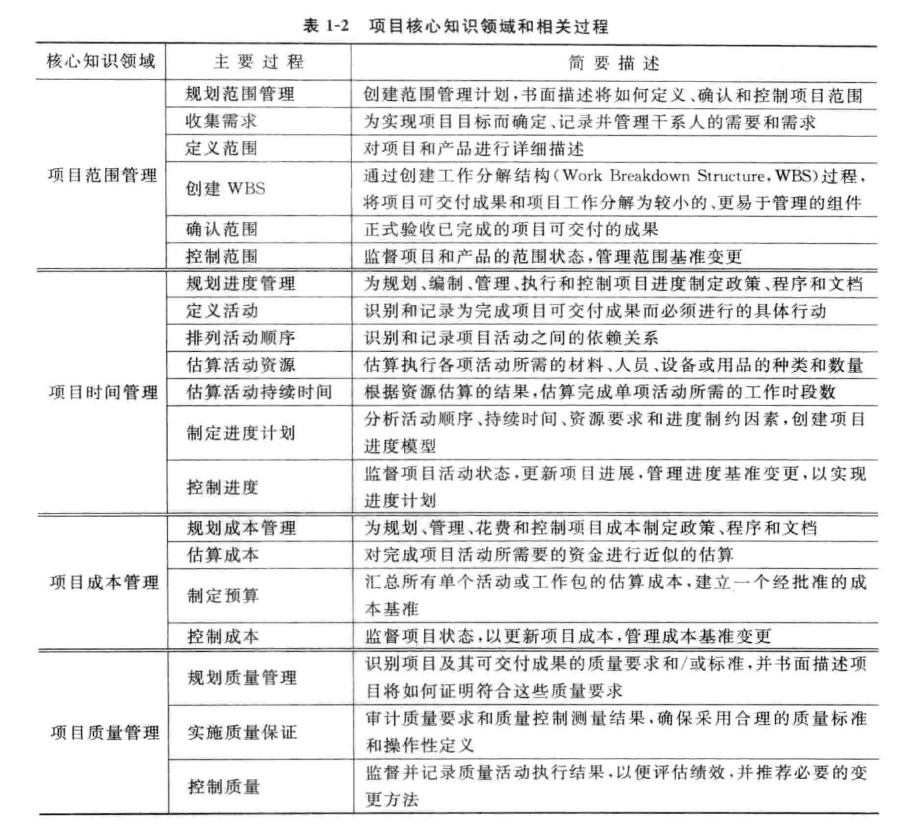

-   五大辅助知识领域：人力资源管理，项目沟通管理，项目风险管理，采购管理，项目干系人管理；

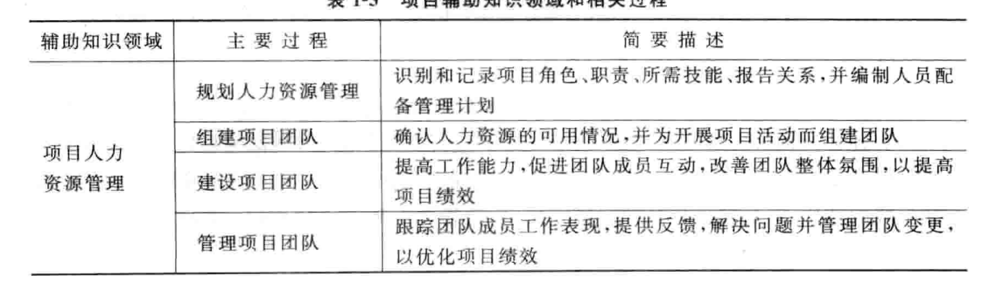
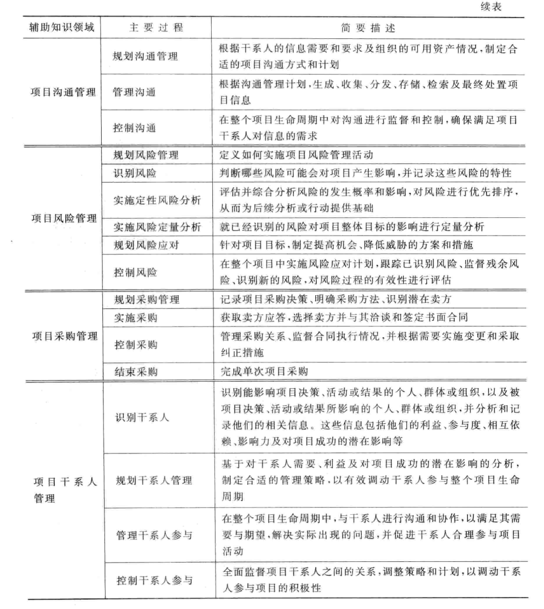

-   项目整合管理：协调其他所有项目管理知识领域所涉及的过程；

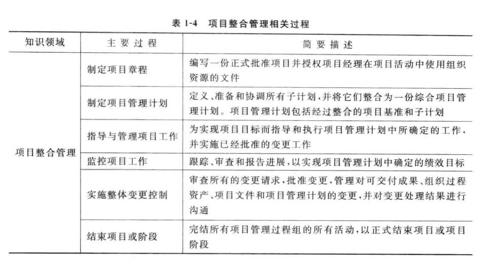

###  IT 项目管理

IT 项目 定义：就是把各种知识、技能、手段和技术应用于 IT 项目活动之中，以达到 IT 项目的要求

**IT 项目的特点**：

-   与战略目标的相关性

-   与业务规则的一致性

-   环境基础的重要性

-   管理的集成性

-   人力资源管理的特殊性

-   项目过程的可控性

-   文档的完整性

###  软件和软件项目

-   一个软件系统通常包括：

    -   在计算机运行中能够提供所希望的功能和性能的**程序**；
    -   使程序能够正确运行的数据结构和**数据**；
    -   描述**系统结构的文档**和如何使用与维护系统的**用户文档**

-   软件是计算机系统中与 硬件互相依存的另一部分，它是**程序、数据和文档**的完整集合

软件项目的最终成果是**软件产品**，软件产品与其他任何产品的最大区别**是无形和没有物理属性**，是一种逻辑产品（而硬件是一种物理部件）

###  软件项目管理

## 2. 把握环境 控制过程

2.1、2.2、2.4 不看

### 2.3 熟悉项目阶段

项目阶段性特征：项目的范围越小、项目组的规模越小、项目的工期越短，项目的风险就越小、项目越容易控制、项目的成功率越高；

项目划分成不同的阶段，以简化项目的复杂度和可控性，更好的处理项目与组织的日常运营之间的关系，提高项目的成功率。

**产品的生命周期：**

-   产品的生命周期从提出产品研发开始，直到最后停止使用该产品为止

-   对于软件企业来说，产品的市场成功才是开发项目结束的真正标志

-   对于软件产品的生命周期，包括了产品项目筛选、概念形成、产品开发、产品上市以及市场增长、成熟、衰退等各个阶段组成的全过程。

**软件生命周期：**

-   软件工程采用的生命周期方法学就是从时间角度把软件开发和维护的复杂问题进行分解
-   软件生命周期划分为软件定义、软件开发、软件运行维护时期，每个时期再进一步划分若干个阶段

    -   软件定义：问题定义、可行性分析和需求分析阶段
    -   软件开发：概要设计、详细设计、编码和测试阶段
    -   运行维护：系统的运行与维护

-   软件产品生命周期包括项目生命周期

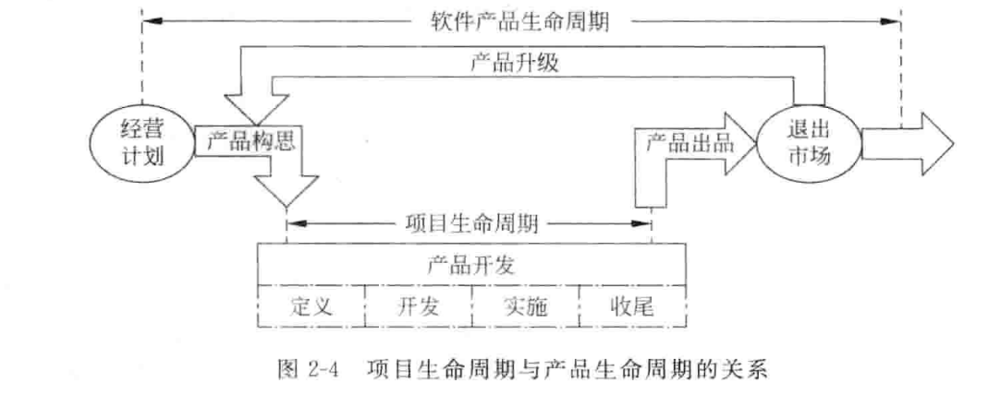

??? question "为什么要划分软件生命周期"

    通过软件生命周期的划分，确定每个阶段的任务，以降低软件产品定义、开发和维护的难度，达到提高软件产品质量、降低软件开发成本的目的。

    一些常用的软件开发模型包括瀑布模型、螺旋模型、第四代技术模型、原型模型、构建组装模型、混合模型、喷泉模型等。

    这些模型都是软件产品生命周期的实例，是软件工程思想的具体化，是人们在软件开发中总结出来的开发方法和步骤。

### 2.5 控制项目过程

**项目管理过程组：**大多数项目都有共同的项目管理过程，这一过程包括**启动、规划、执行、监督和结束**5 个过程组

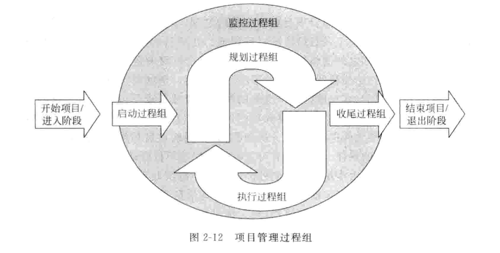

注意：监控过程组一直执行，规划过程组和执行过程组是循环执行的

-   **启动过程组**的主要任务是**确定并核准项目或项目阶段**，在项目开始阶段启动过程的主要成果就是**形成一个项目章程和选择一位项目经理**；

-   **规划过程组**的主要任务是**确定和细化目标**，并规划为实现项目目标和项目范围的行动方针和路线，确保实现项目目标，规划过程的主要成果包括完成工作任务分解结构、项目进度计划和项目预算；

-   **执行过程组**的主要任务是**通过采用必要的行动协调人力资源和其他资源，从整体上有效地实施项目计划**，执行过程的主要成果就是交付实际的项目工作；

-   **监控过程组**的主要任务**是定期测量和实时监控项目进展情况，发现偏离项目管理计划之处，及时采取纠正措施和变更控制，确保项目目标的实现**，监控过程的主要成果就是，在要求的时间、成本和质量限制范围内获得满意的结果；

-   **收尾过程组**的主要任务是**采取正式的方式对项目成果 、项目产品、项目阶段进行验收。确保项目或项目阶段有条不紊地结束**，收尾过程的主要成果包括项目的正式验收 、项目审计报告和项目总结报告编制以及项目组成员的妥善安置。

过程组之间的关系：

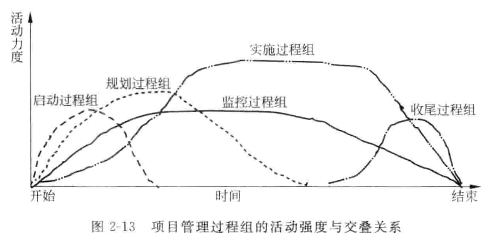

### 2.6 IT 项目最佳实践模型

进行有效的 IT 项目管理，需要将项目生命周期的 4 个阶段，5 个过程组、10 大知识领域，项目运作流程和项目文档管理 5 个层面进行有机的结合，并通过案例分析和模板应用两大部分实现项目的有效管理。5 个层面和两大部分构成了 IT 项目管理最佳实践模型，又图所示。

## 3. 整合项目资源

3.4 不看

- 项目整合管理的一项重要活动是成功地启动项目。

- 在项目启动的过程中，项目经理应该熟悉项目背景，了解利益相关者，研究项目的商业需求和项目功能，确定项目范围，给出项目预算和制定项目章程。

项目整合管理的六个阶段：

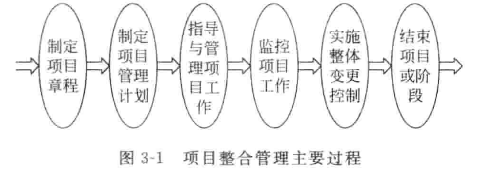

**制定项目章程：**

- 项目章程是正式承认某项目存在的重要文件，它可以是一个特别的文件形式，也可以是项目立项书、企业需求说明书、产品说明书、项目任务书、开工令或项目描述表，项目章程授权项目工作的正式开展。

- 项目的主要干系人需要在项目章程上签字，以表示承认在项目需求和目的上已经达成一致，并承诺提供相关的支持。

- 主要项目干系人应对该章程达成共识，并亲笔签名认可。项目章程是项目经理的护身符，应该给予高度重视。

**整体变更控制：**

+ 变更请求在项目中经常发生，并以多种不同的形式出现。**变更是允许的**，但它应该在**可控的范围**之内。

+ IT项目经理主要工作是对项目的整体变更进行控制，使项目朝着提高工作效率、产生经济效益、和有利于项目顺利进行，不断逼近的方向发展。

## 4. 项目范围管理

项目范围指产生项目产品阶段包括的所有工作及产生这些产品经过的所有过程。

项目范围管理指对项目包括什么与不包括什么的定义与控制过程。

项目范围管理主要就是保证项目利益相关者在项目要产生什么样的可交付成果方面达成共识，也要在如何生产这些可交付成果方面达成共识。

项目范围管理过程如下：

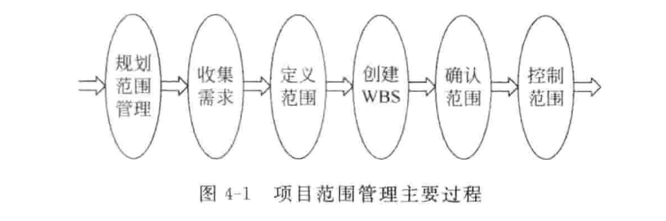

在软件项目中，软件系统的范围经常表现为软件需求规格说明书（Software Requirements Specifications，SRS），一般至少包括下面三个主要的内容：

- 功能特征描述

- 系统接口描述

- 质量特征描述

**工作分解结构（WBS，Work Breakdown Structure）：**是一种为了便于管理和控制而将项目工作任务分解的技术，WBS 是以可交付成果为分解对象、以结果为导向的一种分析方法。通过它对项目所涉及的工作进行分解，而所有这些工作构成了项目的整体范围。

## 5. 项目进度管理

项目进度是执行项目各项活动和到达里程碑的计划日期。

项目进度管理就是采用科学的方法确定进度目标，编制进度计划和妓院供应计划，进行进度控制，在与指令、费用目标协调的基础上，实现工期目标。

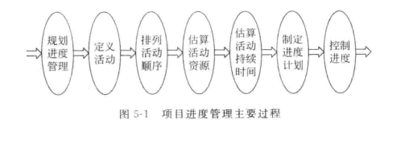

编排和描述活动顺序关系的方法和工具主要有前导图法和键线法。

前导图法（PDM）：

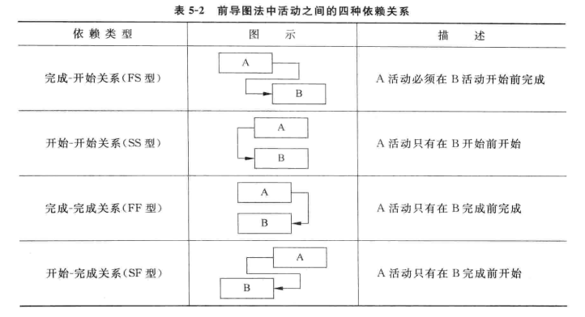

键线法（ADM）：

## 项目成本管理

项目成本指为完成项目目标而付出的费用和耗费的资源。

影响成本的因素：质量、进度、范围；

成本管理基本原理：

- 利润与利润率

- 资金的时间价值

- 净现值（Net Present　Value, NPV）：是一项投资所产生的未来现金流的折现值与项目投资成本之间的插值。

- 投资收益率（）

### 项目成本预算

成本预算的特征：

- 计划性：对WBS的每一种组成部分估算相应的成本形成预算。预算是另一种形式的项目计划。
  
- 约束性：预算是一种分配资源的计划，预算分配的结果可能并不能满足所涉及的管理人员的利益要求，而表现为一种约束，所涉及人员只能在这种约束的范围内行动。
  
- 控制性；项目预算是一种控制机制。预算可以作为一种比较标准而使用，一种度量资源实际使用量和计划量之间差异的基线标准。

成本估算的类型：

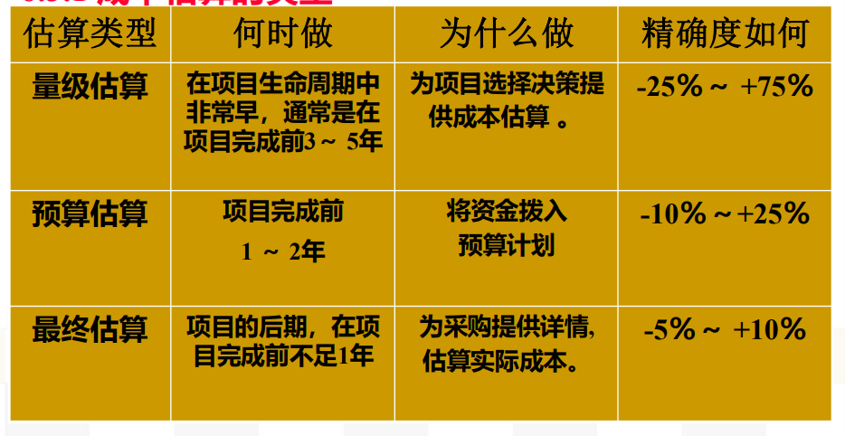

项目成本估算方法：类比估算法、自上而下估算法、自下而上估算法、参数模型估算法；

项目成本控制是按照事先确定的项目成本基准计划，通过运用多种恰当的方法，对项目实施过程中所消耗的成本费用的使用情况进行管理控制，以确保项目的实际成本限制在项目成本预算范围内的过程。

成本控制依据：成本基准、绩效报告、变更请求，成本管理计划；

成本控制的主要内容：

- 监控实际成本与计划成本的偏差；

- 确认费用偏差都被记录；

- 避免不正确、不合适的或者无效的费用变更发生；

- 获取项目变更的各种信息，特别关注影响对成本变更的消息。

### 挣值分析法

挣值分析法是一种项目绩效衡量方法，它综合了范围、时间和成本数据，主要用于实际成本的绩效测量。

其基本思想是，通过测量和计算已完成的工作的预算费用和实际费用以及计划工作的预算费用得到计划实施的进度和费用的偏差，达到判断项目预算和进度计划执行情况的目的。

挣值法的三个基本参数：

- 计划工作量的预算成本(BCWS)：是指计划要求完成的工作量所需的预算工时/费用

$$
BCWS = 计划工作量 \times 预算定额
$$

- 已完成工作的实际成本(ACWP) ：ACWP是指实际完成的工作量所消耗的工时/费用。

- 已完成工作量的预算成本(BCWP) ：BCWP是指实际完成的工作量按预算定额计算的工时/费用。

$$
BCWP = 实际工作量 \times 预算定额
$$

四个指标：成本偏差、进度偏差、成本执行指数、进度执行指数

- 成本偏差 CV：CV = BCWP – ACWP

    当CV ＜ 0时，表示已完成工作量的实际成本超过了预算成本，即出现了超支的现象，说明执行效果不佳。

    当CV ＞ 0时，表示已完成工作量的实际成本低于预算成本，即有所结余，说明工作效率高，执行效果好。

    当CV ＝ 0时，表示已完成工作量的实际成本等于预算成本。

- 进度偏差 SV：SV = BCWP – BCWS

    当SV ＞ 0时，表示进度提前，实际执行工作比计划花费的时间更少。

    当SV ＜ 0时，表示进度延误，实际执行工作比计划花费更多的时间。

    当SV ＝ 0时，表示实际进度与计划进度一致。

- 成本执行指数 CPI：CPI = BCWP / ACWP

    当CPI ＜ 1时，表示已完成工作的实际成本高于预算成本。

    当CPI ＞ 1时，表示已完成工作的实际成本低于预算成本。

    当CPI ＝ 1时，表示已完成工作的实际成本等于预算成本。

- 进度执行指数 SPI：SPI = BCWP / BCWS

    当SPI ＜ 1时，表示进度延误，即实际进度比计划进度慢。

    当SPI ＞ 1时，表示进度提前，即实际进度比计划进度快。

    当SPI ＝ 1时，表示实际进度与计划进度一致。

## 项目质量管理

###  质量和质量管理

软件质量的定义：软件质量除了具有一般产品的质量特征以外，还具有 6 个方面的质量特性，每个方面包含若干个子特性：

◼功能性：适合性、准确性、互操作性、依从性、安全性；

◼可靠性：成熟性、容错性、易恢复性；

◼易用性：易理解性、易学性、易操作性；

◼效 率：时间特性、资源特性；

◼可维护性：易分析性、易改变性、稳定性、易测试性；

◼可移植性：适应性、易安装性、遵循性、易替换性。

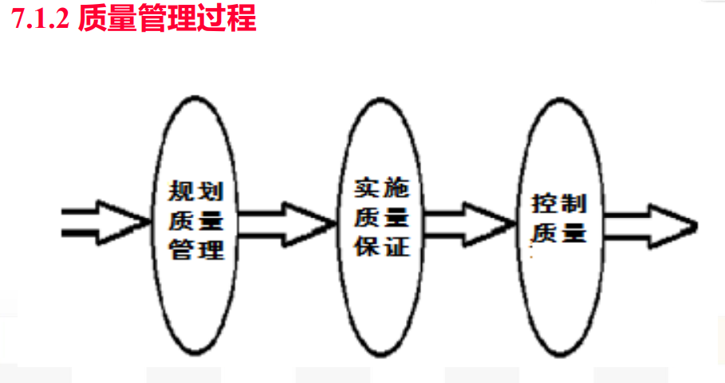

### 质量管理方法与体系

戴明改进循环：

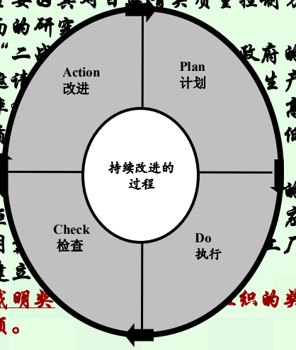

软件能力成熟度模型（CMM）：CMM致力于软件开发过程的管理和工程能力的提高与评估。CMM分为5个等级，每一较低级别是达到较高级别的基础：

- 初始级：

- 可重复级：

- 已定义级：

- 已管理级：

- 优化级：

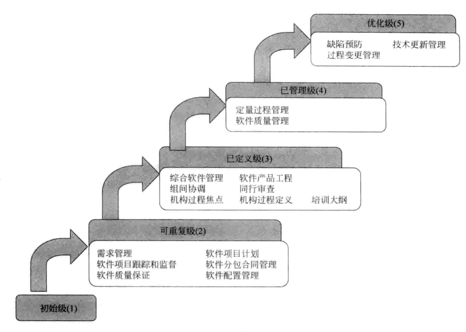

## 项目风险管理

### 项目风险与项目管理

项目风险管理是对项目中潜在的风险进行预测并实行有效的控制，从而可靠地实现项目的总体目标的过程。

风险的一般特征如下：

◼风险的客观性

◼风险的不确定性

◼风险事件的随机性

◼风险的相对性

◼风险的可变性

◼风险的阶段性

最大的不确定性存在于项目的早期，早期阶段做出的决策对以后阶段和项目目标的实现影响最大。

风险类型：

- 从预测角度分为：已知风险、可预测风险、不可预测风险

- 从范围角度分为：商业风险、管理风险、人员风险、技术风险、开发环境风险、客户风险、过程风险、产品规模风险等。

风险管理过程：

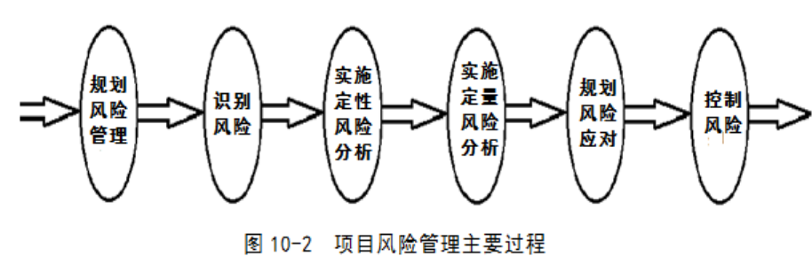

### 规划风险管理

风险管理规划过程应该在项目规划过程的早期完成，它对于能否成功进行项目风险管理、完成项目目标至关重要。

风险管理计划描述的是如何安排与实施项目风险管理

### 风险管理的四个过程

风险管理的四个过程：

**风险识别**

风险识别是试图通过系统化地确定对项目计划的威胁，识别已知和可预测的风险。
  

**风险评估**

对风险事件发生概率的评估，对项目风险影响的评估，给出项目风险排序。

分析：

- 风险发生的概率（P）

- 风险对项目的影响（I）

- 风险值，R=F(P,I)

确定优先次序：按风险值排序，确定最需要关注的TOP 风险

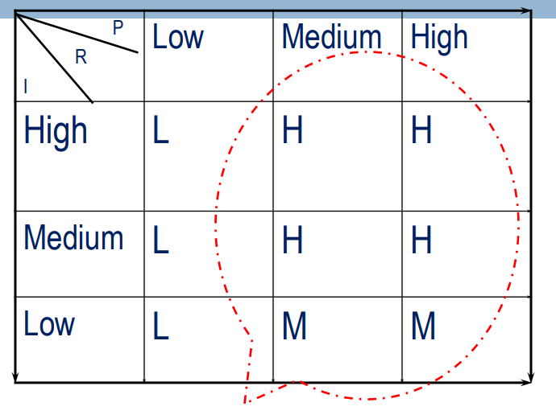

风险评估的方法：**决策树分析**

决策树分析是一种图表分析方法，提供项目所有可供选择的行动方案，行动方案之间的关系，行动方案的后果以及发生的概率，提供选择一个最佳的方案的依据。

Expected Monetary Value，EMV (损益期望值)是决策树的一种计算值，根据结果发生的概率计算出一种期望的损益

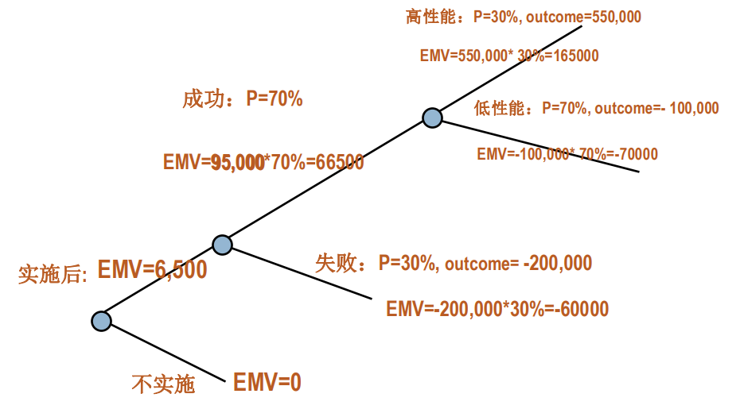

**风险规划**

制定一定的行动和策略来对付、减少、以至于消灭风险事件造成的影响

主要策略：

1. 回避风险：险是对可能发生的风险尽可能的规避，采取主动放弃或者拒绝使用导致风险的方案

2. 转移风险：是为了避免承担风险损失，有意识将损失或与损失有关的财务后果转嫁出去的方法。如：分包、保险、开脱责任合同；

3. 损失控制：损失预防，如：项目技术培训，预防技术失败；损失抑制，如：项目人员储备，抑制人员流失的损失。

4. 自留风险：由项目组织自己承担风险事故所致损失的措施。

## 项目配置管理与文档管理

配置管理与文档管理帮助我们对软件开发过程进行有效的变更控制，高效地开发高质量的软件。

### 项目配置管理基本概念

配置（configuration）是在技术文档中明确说明并最终组成软件产品的功能或物理属性。

配置包括了即将受控的所有产品特性、内容及相关文档、软件版本、变更文档、软件运行的支持数据，以及其他一切保证软件一致性的组成要素。

软件配置管理（SCM）对软件生存期内各阶段的文档、实体和最终产品的演化和变更进行管理；

SCM的目的是为了建立和维护软件开发过程中各种制品的完整性和一致性

SCM活动的主要内容是：建立软件基线库，基线库用于存储开发的软件基线。

### 项目配置管理项

软件配置项是软件生存期内，能相对独立开发的一个程序实体或文档。

**基线：**已经通过了正式复审的规格说明或中间产品，它可以作为进一步开发的基础。基线就是通过了正式复审的软件配置项。

基线是软件开发过程中关键的里程碑，不过里程碑强调过程的终点和终点的标识，而基线更强调的是一个开发阶段到达里程碑时的结果及其内容。

基线的主要属性有名称、标识符、版本、日期等。通常将交付给客户的基线称为一个“Release”（发布版本），为内部开发用的基线则称为一个“Build”（测试版本）。建立基线有以下一些好处：重现性、可追踪性、版本隔离。

在配置管理中，除了基线外，还有里程碑、开发库、软件受控库、基线库、产品库等配置管理项。

### 项目配置管理基本活动

软件配置管理的基本活动也就归结为

- 制定项目的配置计划
  
- 对配置项进行标识

- 对配置项进行版本控制

- 对配置项进行变更控制、

- 定期进行配置审计

- 向相关人员报告配置的状态。
