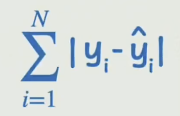
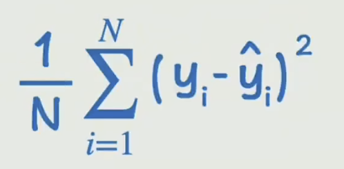
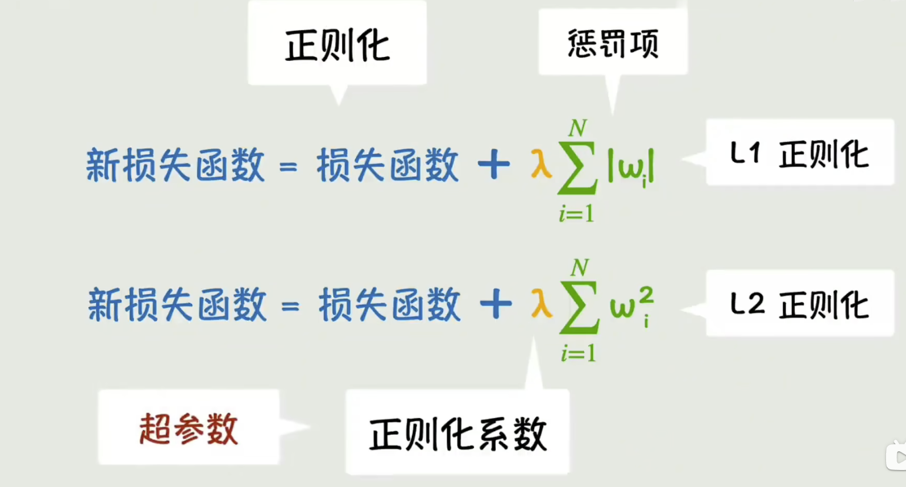
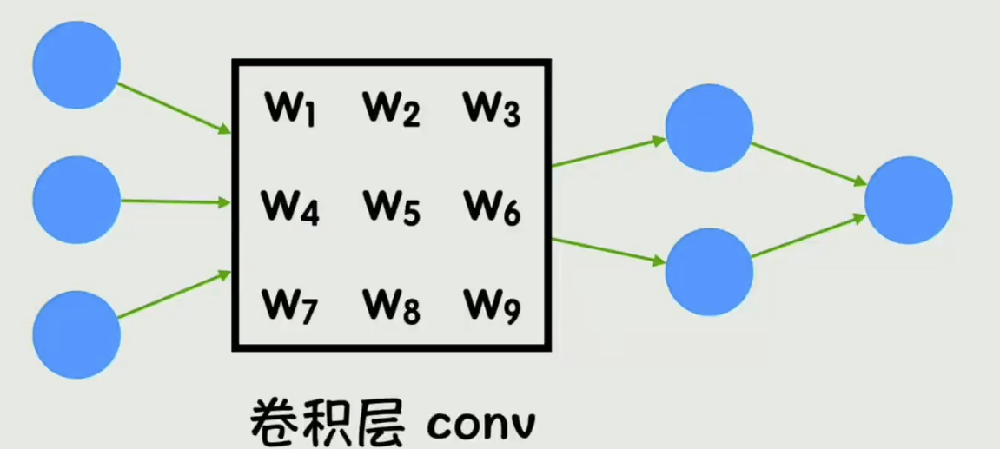

- 预测数据与真实数据误差的函数：损失函数

- 用平方代替绝对值，放大误差较大值的影响，再消除样本数量的影响，就可以得到**均方误差（MSE）**：

均方误差是一种常见的损失函数，损失函数通常用 $L$ 表示。

## 神经网络

### 优化

为了防止神经网络过拟合，可以有几种方式：增加训练数据量，简化网络，正则化。

- 正则化就是限制一些没必要的参数修改，为此我们可以修改损失函数：

如果参数的修改并没有让原有的损失函数减少足够的值，就会导致新的损失函数会变大，从而放弃这种调整。

还有一种 **Dropout** 方法，即每次训练都随机丢弃一些参数，来避免对某些参数的过度依赖。

除此之外神经网络还会有：梯度消失（反向传播时越来越小，导致参数更新困难）、梯度爆炸（梯度越来越大，导致参数修改失去控制）、收敛速度过慢（陷入局部最优或者震荡）、计算开销过大等等问题。

### CNN

卷积神经网络（Convolutional Neural Network），会将神经网络中的全连接层替换为一个卷积层：

这里的卷积核与数字图像处理中的不太一样，这里的参数值都是未知的，需要通过反向传播计算。在图像识别的神经网络结构中

### RNN

