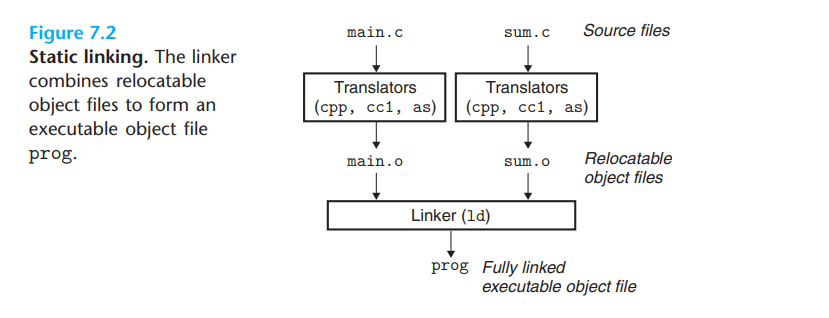
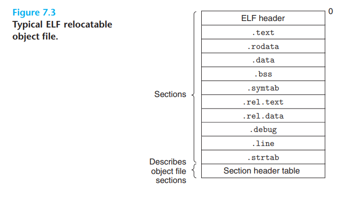

链接是将各种代码和数据片段收集并组合成为一个单一文件的过程，这个文件可被加载到内存并执行。

链接可以执行于：

- 编译时（compile time）：在源代码被翻译成机器代码的时候；

- 加载时（load time）：在程序被加载器加载到内存的时候；

- 运行时（run time）：也就是由应用程序来执行链接。

在现代系统中链接是由连接器（linker）程序实现的。有了连接器使得我们可以将一个大型的应用程序分解为更小的、更好管理的独立模块，使得我们可以单独的修改和编译这些模块，而不必再重新编译整个项目。

## Compiler Drivers

考虑如下的 C 语言程序。它将作为贯穿本章的一个小的运行示例，帮助我们说明关于链接是如何工作的一些重要知识点。

=== "main.cpp"
    ```c
    int sum(int *a, int n);

    int array[2] = {1, 2};

    int main()
    {
        int val = sum(array, 2);
        return val;
    }
    ```

=== "sum.c"
    ```c
    int sum(int *a, int n)
    {
        int i, s = 0;
        
        for (i = 0; i < n; i++) {
            s += a[i];
        }
        return s;
    }
    ```

大多数编译系统提供编译器驱动程序（compiler driver），它代表用户在需要时调用语言预处理器、编译器、汇编器和链接器。比如，要用 GNU 编译系统构造示例程序，我们就要通过在 shell 中输入下列命令来调用 GCC 驱动程序：

```shell
linux> gcc -Og -o prog main.c sum.c
```

> -Og 表示在保留调试信息的情况下，尽量对程序进行编译优化，-o 用来指定编译结果的输出文件

下图概括了驱动程序在将示例程序从 ASCII 码源文件翻译成可执行目标文件时的行为。



最后我们通过如下命令运行程序：

```shell
linux> ./prog
```

shell 调用操作系统中一个叫做加载器（loader）的函数，它将可执行文件 prog 中的代码和数据复制到内存，然后将控制转移到这个程序的开头。

## Static Linking

像 Linux LD 程序这样的静态链接器（static linker）以一组可重定位目标文件和命令行参数作为输入，生成一个完全链接的、可以加载和运行的可执行目标文件作为输出。

为了构造可执行文件，链接器必须完成两个主要任务： 

- 符号解析（symbol resolution）：目标文件定义和引用符号，每个符号对应于一个函数、一个全局变量或一个静态变量（即 C 语言中任何以 static 属性声明的变量）。符号解析的目的是将每个符号引用正好和一个符号定义关联起来。

- 重定位（relocation）：编译器和汇编器生成从地址 0 开始的代码和数据节。链接器通过把每个符号定义与一个内存位置关联起来，从而重定位这些节，然后修改所有对这些符号的引用，使得它们指向这个内存位置。链接器使用汇编器产生的重定位条目（relocation entry）的详细指令，不加甄别地执行这样的重定位。

接下来的章节将更加详细地描述这些任务。

## Object Files

目标文件有三种形式：

- 可重定位目标文件。包含二进制代码和数据，其形式可以在编译时与其他可重定位目标文件合并起来，创建一个可执行目标文件。

- 可执行目标文件。包含二进制代码和数据，其形式可以被直接复制到内存并执行。

- 共享目标文件。一种特殊类型的可重定位目标文件，可以在加载或者运行时被动态地加载进内存并链接。

编译器和汇编器生成可重定位目标文件（包括共享目标文件）。链接器生成可执行目标文件。严谨的来说，一个目标模块（object module）就是一个字节序列，而一个目标文件（object file）就是一个以文件形式存放在磁盘中的目标模块。不过，我们会互换地使用这些术语。

目标文件是按照特定的目标文件格式来组织的，各个系统的目标文件格式都不相同。Windows 使用可移植可执行（Portable Executable，PE）格式。MacOS-X 使用 Mach-O 格式。现代 x86-64 Linux 和 Unix 系统使用可执行可链接格式（Executable and Linkable Format，ELF）。

我们的讨论集中在 ELF 上，但不同格式的基本概念是相似的。

## Relocatable Object Files

下图展示了一个典型的 ELF 可重定位目标文件的格式：



ELF 头（ELF header）以一个 16 字节的序列开始，这个序列描述了生成该文件的系统的字的大小和字节顺序。ELF 头剩下的部分包含帮助链接器语法分析和解释目标文件的信息。ELF 头剩下的部分包含帮助链接器语法分析和解释目标文件的信息。其中包括 ELF 头的大小、目标文件的类型（如可重定位、可执行或者共享的）、机器类型（如 X86-64）、节头部表（section header table）的文件偏移，以及节头部表中条目的大小和数量。不同节的位置和大小是由节头部表描述的，其中目标文件中每个节都有一个固定大小的条目（entry）。

夹在 ELF 头和节头部表之间的都是节。一个典型的 ELF 可重定位目标文件包含下面几个节： 

- .text：已编译程序的机器代码。

- .rodata：只读数据，比如 printf 语句中的格式串和开关语句的跳转表。

- .data：已初始化的全局和静态 C 变量。局部 C 变量在运行时被保存在栈中，既不岀现在 .data 节中，也不岀现在 .bss 节中。

- .bss：未初始化的全局和静态 C 变量，以及所有被初始化为 0 的全局或静态变量。在目标文件中这个节不占据实际的空间，它仅仅是一个占位符。目标文件格式区分已初始化和未初始化变量是为了空间效率：在目标文件中，未初始化变量不需要占据任何实际的磁盘空间。运行时，在内存中分配这些变量，初始值为 0。

- .symtab：一个符号表，它存放在程序中定义和引用的函数和全局变量的信息。一些程序员错误地认为必须通过 -g 选项来编译一个程序，才能得到符号表信息。实际上，每个可重定位目标文件在 .symtab 中都有一张符号表（除非程序员特意用 STRIP 命令去掉它）。然而，和编译器中的符号表不同，.symtab 符号表不包含局部变量的条目。

- .rel.text：一个 .text 节中位置的列表，当链接器把这个目标文件和其他文件组合时，需要修改这些位置。一般而言，任何调用外部函数或者引用全局变量的指令都需要修改。另一方面，调用本地函数的指令则不需要修改。注意，可执行目标文件中并不需要重定位信息，因此通常省略，除非用户显式地指示链接器包含这些信息。

- .rel.data：被模块引用或定义的所有全局变量的重定位信息。一般而言，任何已初始化的全局变量，如果它的初始值是一个全局变量地址或者外部定义函数的地址，都需要被修改。

- .debug：一个调试符号表，其条目是程序中定义的局部变量和类型定义，程序中定义和引用的全局变量，以及原始的 C 源文件。只有以 - g 选项调用编译器驱动程序时，才 会得到这张表。

- .line：原始 C 源程序中的行号和 .text 节中机器指令之间的映射。只有以 -g 选项调用编译器驱动程序时，才会得到这张表。

- .strtab：一个字符串表，其内容包括 .symtab 和 .debug 节中的符号表，以及节头部中的节名字。字符串表就是以 null 结尾的字符串的序列。

