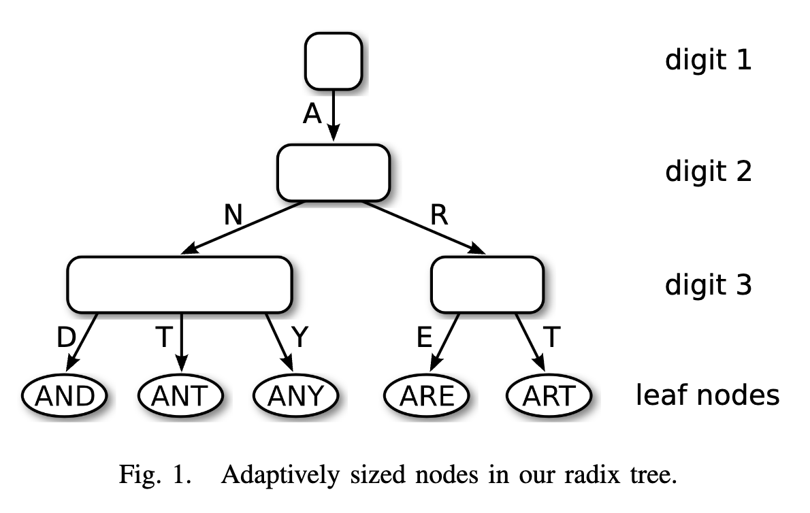

[论文原文](https://db.in.tum.de/~leis/papers/ART.pdf){target=\_blank}

## Introduction

主存容量经过数十年的增长，即时是大型的事物数据库，也可以存进内存中。因此促进了内存数据库的研究和商业活动，像 H-Store/VoltDB [1], SAPHANA [2], and HyPer [3] 等。这些系统针对新的硬件环境进行了优化，因此速度更快。

CPU 缓存大小的不断增长，且主存速度与 CPU 的性能差距不断扩大，这导致原先假设“所有内存访问时间是均匀的”这种观念已经不再成立，因此传统的二叉搜索树结构在现代硬件上不再有效。B+ 树虽然是缓存友好的，但是有着更昂贵的修改操作，以及分支预测困难，后者导致 CPU 流水线的停滞。

近年的研究提出了专门为现代硬件高效设计的新数据结构来解决这些问题。k-ary search tree 和 FAST（Fast Architecture Sensitive Tree）是两个这样的新型树结构：它们利用数据级并行性，一次执行多个比较操作。但不支持高效的修改操作，对于 OLTP 场景，只能使用差分文件（delta）机制，导致额外的开销。

还有 Hash 结构，其读操作的复杂度为 $O(1)$，但哈希表的扩容需要最差 $O(n)$ 的开销。因此，当前系统面临着仅允许点查询和功能齐全但相对较慢的搜索树的快速哈希表之间的权衡。

还有一种索引类型，Trie 也就是前缀树，本文提出一种经过设计的前缀树 -- ART，其结构如下：

<figure markdown="span">
{ width="550" }
</figure>

读写复杂度都为 $O(k)$，$k$ 为 key 的长度。ART 通过路径压缩（path compressio）和延迟展开（lazy expansio）来提高内存利用率。

## Adaptive Radix Tree

---
