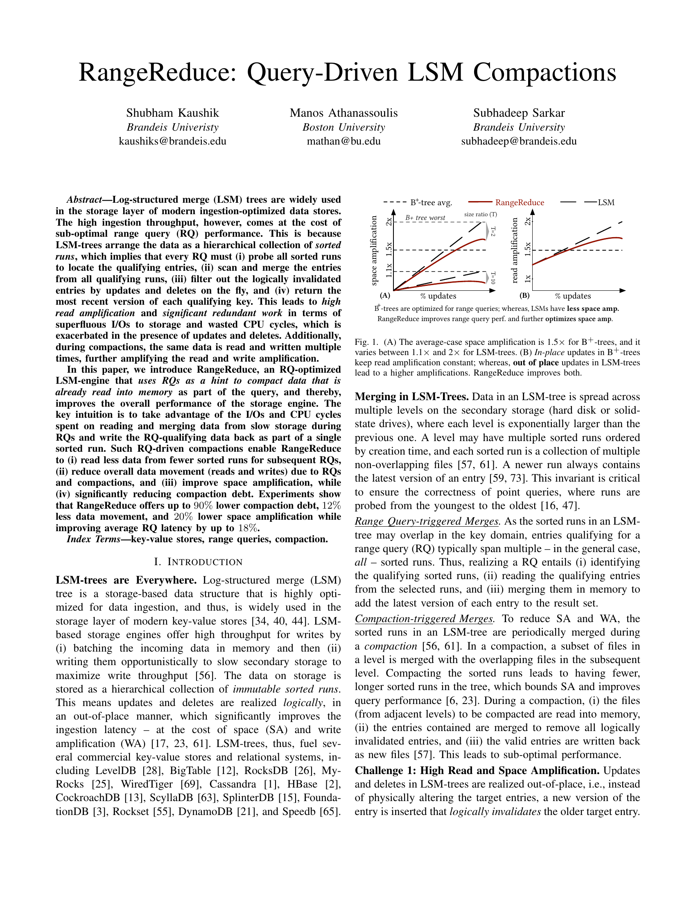
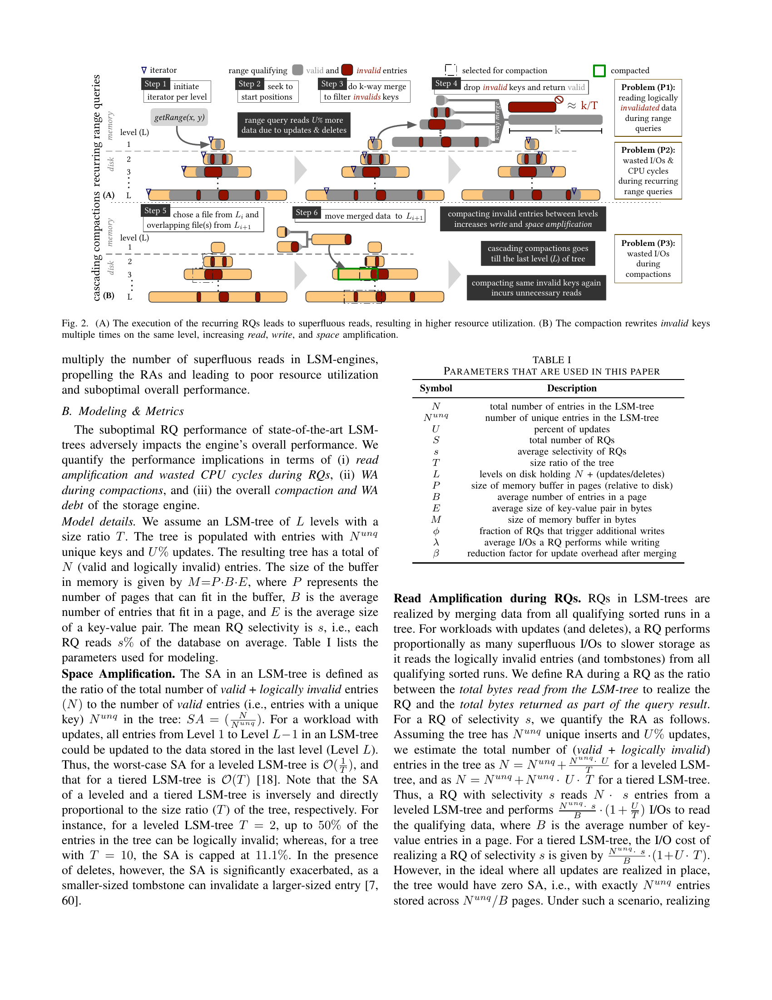
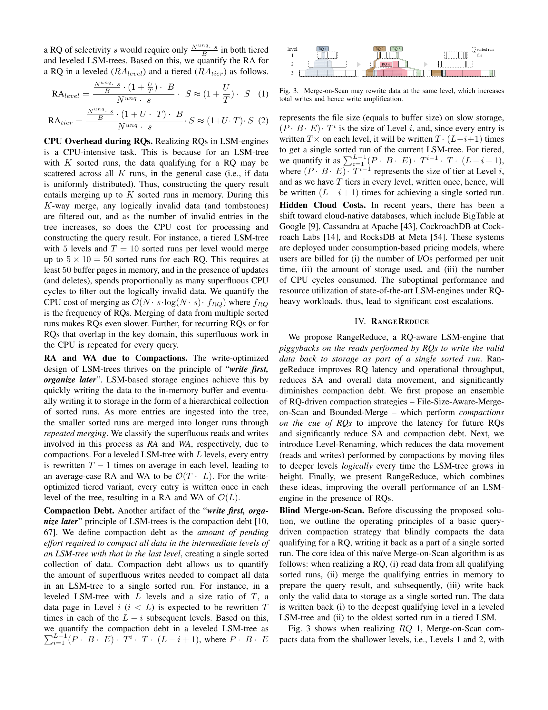
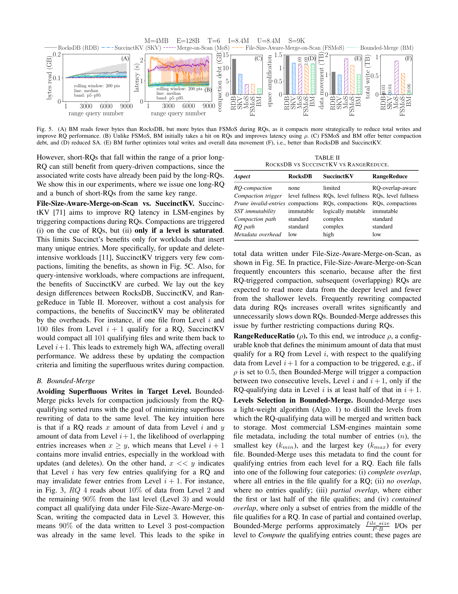
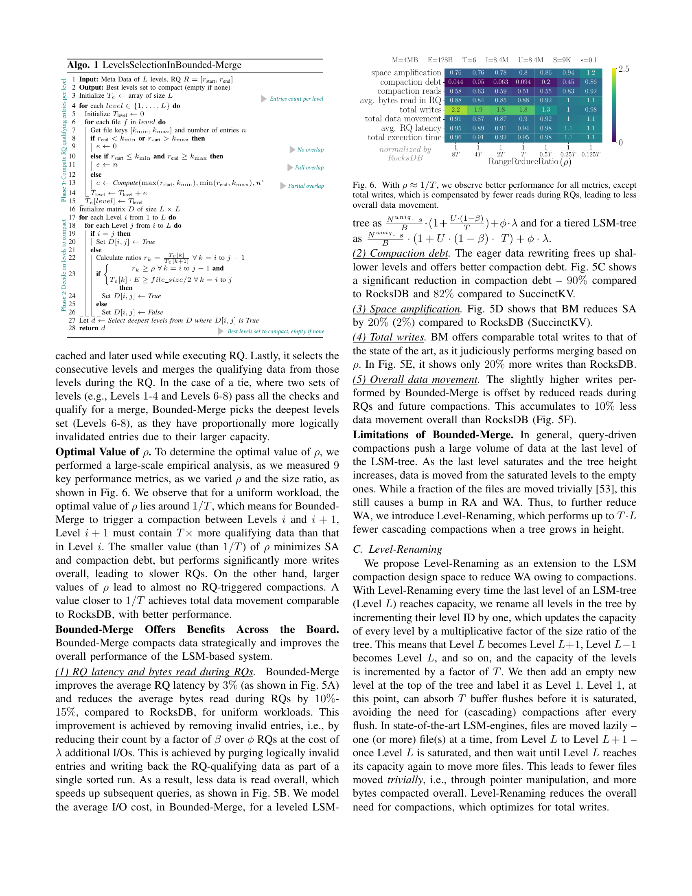
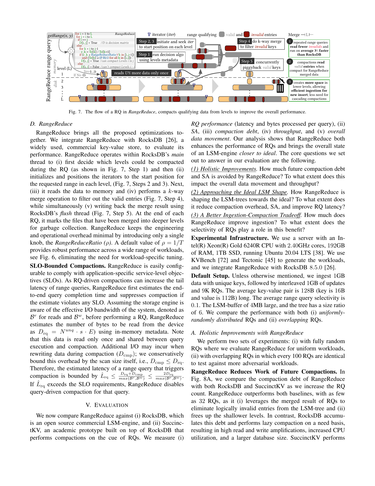
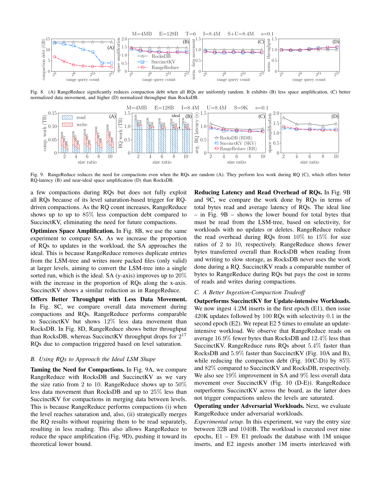
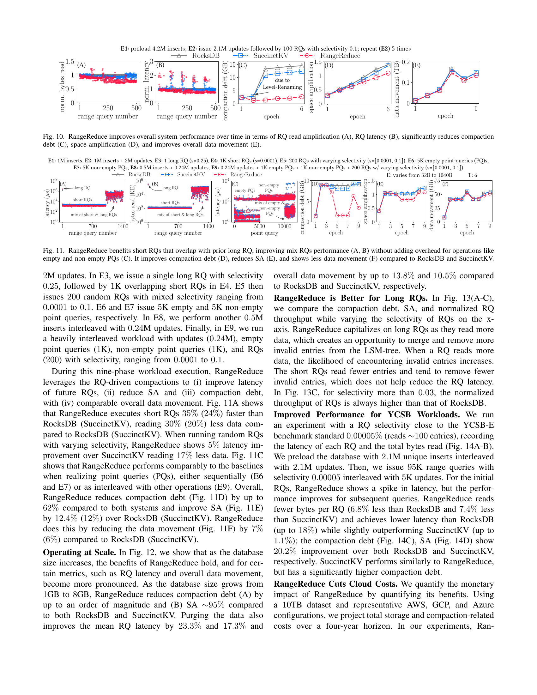

学习时间：2026.5.9

[论文原文](icde26-kaushik.pdf){target=_blank}

## I. Introduction

**LSM-Tree** 凭借高写入吞吐，已成为现代 KV 存储的事实标准 —— LevelDB、RocksDB、Cassandra、HBase、CockroachDB、ScyllaDB、DynamoDB 等无一例外地采用了 LSM 架构。然而，LSM 的 **out-of-place 更新** 在带来极高写入效率的同时，也付出了范围查询（Range Query, RQ）性能的代价。

<figure markdown="span">
{ width="550" }
<figcaption>Fig. 1: (A) B+ 树的平均 space amplification 约为 1.5×，而 LSM 在 1.1×~2× 之间；(B) B+ 树的 in-place 更新使 read amplification 保持恒定，LSM 的 out-of-place 更新导致更高的 RA，RangeReduce 同时改善两者</figcaption>
</figure>

**一次范围查询要经历什么？** 想象 LSM-Tree 中的数据分散在多个层次、多个 sorted run 中。每次 RQ 必须：

1. **探测** 所有 sorted runs 定位起始 key
2. **扫描** 各 run 中符合条件的 entries
3. **k-way merge** 内存中合并所有 runs 的数据
4. **过滤** 掉被 update/delete 逻辑失效的条目，只返回每个 key 的最新版本

在 update/delete 密集型负载下，这四条开销会被急剧放大。更糟的是，**compaction 过程还会反复读写同一批数据** —— RQ 时读过一遍的数据，compaction 时再读再写一遍。论文将这种浪费概括为三个挑战：

??? failure "Challenge 1: 高读放大与空间放大"
    LSM 的 out-of-place 更新意味着同一个 key 的多个版本同时存在于树中。以 leveled LSM、size ratio $T = 4$ 为例，多达 **25% 的条目可能是逻辑失效的**。对于 tiered LSM（5 层 × 每层 10 tiers），一次 RQ 可能需要读 $5 \times 10 = 50$ 个数据页并做 **50 路归并**。引用一位 Google 工程师的话：*"在有大量删除的负载下，范围查询通常要处理并跳过数百万个 tombstone 和逻辑删除的数据。"*

??? failure "Challenge 2: 重复归并"
    相同（或大量重叠）的范围查询每次执行，都要重新来一遍：磁盘读取 → 内存 merge → 过滤无效条目 → 构建结果。前一次查询耗费的 I/O 和 CPU 几乎无法被后续查询复用（除了有限的缓存收益）。

??? failure "Challenge 3: 浪费的工作"
    在 leveled LSM 中，每条 entry 平均被 read/write $T \cdot L$ 次。如果一条 entry 恰好被 $C$ 次重叠 RQ 覆盖，**其生命周期内总计被读写 $C + T \cdot L$ 次**。这造成了巨大的 I/O 浪费和 CPU 空转。

**SuccinctKV 为什么不够？** SuccinctKV [71] 是唯一尝试用 RQ 触发 compaction 的学术工作，但有三处硬伤：

| 问题 | 原因 |
|:-----|:-----|
| **WA 高** | Level i 的一个文件与 Level i+1 的 100 个文件合并时，99 个文件的数据被无谓重写 |
| **SA 增加** | 每个文件附加固定大小的 meta-block 追踪有效条目，且 RQ 数据在多个 level 重复保留 |
| **Compaction debt 无界** | 仅在 level 饱和时才触发 compaction，未饱和的 level 中积累大量无效条目 |

**RangeReduce 的核心直觉很简单：** RQ 已经付出了 I/O 和 CPU 的代价来读取、合并、过滤数据 —— 那为什么不一并把这些有效数据写回磁盘，形成一个 sorted run？这样，后续相同或重叠的 RQ 只需要读更少的数据、做更少的 merge。

!!! abstract "RangeReduce in one sentence"
    以**一次额外写入**的代价，换取**后续所有重叠 RQ 的性能提升**，同时显著降低 compaction debt。

## II. Background

### 2.1 LSM 架构概览

<figure markdown="span">
{ width="550" }
<figcaption>Fig. 2: (A) 重复 RQ 中的浪费 —— P1 读取逻辑失效数据、P2 重复 merge 浪费 CPU；(B) Compaction 中的浪费 —— P3 同样的无效条目被反复重写</figcaption>
</figure>

LSM-Tree 将数据分层组织在磁盘上：

- 每层容量按 **size ratio $T$** 指数增长（Level $i$ 的容量是 Level $i-1$ 的 $T$ 倍）
- 数据先写入 **内存 buffer**，buffer 满了 flush 为不可变的 **sorted run**
- 两种经典布局：

| | Leveled LSM | Tiered LSM |
|:--|:--|:--|
| **每层 sorted runs 数** | 1 | $T$ |
| **查询性能** | 好（总 runs 数少） | 差（需要 merge 多个 runs） |
| **写入放大** | 高（合并更积极） | 低（合并更懒惰） |

### 2.2 基本操作

**Put / Update：** 插入新 key（或新版本）到内存 buffer 即视为成功。LSM 不做 in-place 修改。

**Get：** 内存 → 磁盘，Level 1 → Level L，同层内从新 run 到旧 run。找到即停。

**Delete：** 插入 **tombstone** 标记，在后续 compaction 中物理清除对应条目。

**Range Query `getRange(x, y)`：**

1. 为每个 sorted run 初始化 **迭代器**
2. Seek 到每个 run 中 $\ge x$ 的起始位置
3. 逐页读取符合条件的 entries
4. 执行 **k-way merge**（leveled: $k = L$，tiered: $k = T \cdot L$）
5. 过滤逻辑失效条目和 tombstone，返回结果

**短 RQ vs 长 RQ 的 I/O 代价：**

- **Leveled，短 RQ：** $O(L)$ 次 I/O
- **Leveled，长 RQ（selectivity $s$）：** $O(\frac{N \cdot s}{B})$ 次 I/O
- **Tiered，短 RQ：** $O(T \cdot L)$ 次 I/O
- **Tiered，长 RQ：** $O(\frac{N \cdot s \cdot T}{B})$ 次 I/O

## III. Problem: Excessive Reads & Merging

### 3.1 三种浪费

如 Fig. 2 所示，现代 LSM 引擎在 RQ 上存在三层浪费：

| 浪费类型 | 表现 | 后果 |
|:--|:--|:--|
| **P1** 读取失效数据 | 大量已被 update/delete 的条目在 RQ 时被读入内存再丢弃 | RA 随 update 比例线性增长 |
| **P2** 重复归并 | 相同/重叠 RQ 每次都重新 merge 和过滤 | CPU 空转，$O(N \cdot s \cdot \log(N \cdot s) \cdot f_{RQ})$ 的 merge 开销 |
| **P3** Compaction 重复 | RQ 读过的数据在 compaction 时再次被读写 | leveled 中每条 entry 平均被 read/write $T \cdot L$ 次 |

### 3.2 量化模型

论文建立了一套量化模型来评估这些浪费的程度。核心参数如下：

| 符号 | 含义 |
|:--|:--|
| $N$ | LSM 树中的总条目数（valid + invalid） |
| $N_{unq}$ | 唯一 key 数量 |
| $U$ | update 比例（%） |
| $s$ | RQ 平均 selectivity |
| $T$ | Size ratio |
| $L$ | 磁盘上的 level 数 |
| $P$ | 内存 buffer 可容纳的页数 |
| $B$ | 每页条目数 |
| $E$ | KV 对平均大小（bytes） |
| $\phi$ | 触发额外写入的 RQ 比例 |
| $\lambda$ | RQ 写入时额外产生的 I/O 数 |
| $\beta$ | compaction 后 update 开销的缩减因子 |

**Space Amplification：**

$$
SA = \frac{N}{N_{unq}}
$$

Leveled LSM 的最坏情况 $SA = O(\frac{1}{T})$，Tiered 为 $O(T)$。这意味着 $T=2$ 的 leveled LSM 中，**多达 50% 的条目可能是无效的**。

**RQ Read Amplification（未使用 RangeReduce 时）：**

$$
\begin{aligned}
RA_{level} &\approx \left(1 + \frac{U}{T}\right) \cdot S \\
RA_{tier} &\approx (1 + U \cdot T) \cdot S
\end{aligned}
$$

**Compaction Debt：** 衡量将所有中间层数据 compact 到最后一层所需的额外写入总量。Leveled LSM 中：

$$
\sum_{i=1}^{L-1} (P \cdot B \cdot E) \cdot T^i \cdot T \cdot (L - i + 1)
$$

### 3.3 云时代的成本放大

现代云数据库（BigTable、Cassandra、CockroachDB、RocksDB Cloud 等）按 **I/O 次数 + 存储量 + CPU 周期** 计费。LSM 在 RQ 密集型负载下的低效资源利用会直接转化为高昂账单 —— 这让问题从"性能优化"升级为"成本优化"。

## IV. RangeReduce

RangeReduce 将 RQ 过程中完成的 merge 和过滤工作"物化"到磁盘上，避免了后续查询和 compaction 的重复劳动。其设计遵循一个递进式的优化路径：

```
Blind Merge-on-Scan  →  File-Size-Aware  →  Bounded-Merge  →  Level-Renaming
    (朴素版)              (减少碎片)          (控制写入)        (减少搬迁)
```

### 4.1 Blind Merge-on-Scan（朴素版）

最直接的思路：**每次 RQ 后，把 qualify 的所有 level 的有效数据合并写回最深 level。**

<figure markdown="span">
{ width="500" }
<figcaption>Fig. 3: Merge-on-Scan 可能将同一 level 的数据反复重写，推高 WA</figcaption>
</figure>

??? success "收益"
    - RA 降低 **17%**（Fig. 4A）
    - Compaction debt 降低 **78%**
    - SA 降低 **25%**
    - 浅层腾出 space，新写入可被"空隙"吸收，减少 cascading compactions

??? failure "但三个问题致命"
    **1. 碎片文件爆炸。** 每次 RQ 在每个 qualified sorted run 上最多产生 2 个碎片文件。9K 个 RQ 后，文件数量是 RocksDB 的 **2 倍**，平均文件大小仅目标的 30%（Fig. 4B/C）。

    **2. 短 RQ 写放大失控。** 短 RQ 只读很少数据却要重写同层大量数据，总写入量比 RocksDB 高 **5 个数量级**（Fig. 5E）。

    **3. RQ 延迟反而恶化。** 额外的写入开销让延迟比 RocksDB 高 **1.5 倍**（Fig. 5B）。

### 4.2 File-Size-Aware-Merge-on-Scan

针对朴素版的两项关键修复：

**修复 1：避免无效写入。** 仅当该 level 中 RQ-qualifying 数据量 $\ge \frac{\text{file\_size}}{2}$ 时，才允许该 level 参与 compaction。这确保了每次 compaction 都有足够的"前进进度"，避免反复重写同层数据。

**修复 2：减少碎片。** 将非 RQ 部分的文件合并为一个文件写入，每层最多产生一个碎片文件而非两个。

??? info "效果与局限"
    - 文件数量、碎片化接近 RocksDB 水平
    - RQ 延迟比朴素版低 **10%**
    - 但总写入量仍是 RocksDB 的 **167×**，数据移动多 **31%**（Fig. 5E/F）

### 4.3 Bounded-Merge

这是 RangeReduce 的**核心算法**。关键洞察：

!!! tip "Key Insight"
    如果 RQ 从 Level $i$ 读到 $x$ 条 entry，从 Level $i+1$ 读到 $y$ 条：

    - $x \ge y$ 意味着 Level $i+1$ 包含大量待清除的无效条目 → **值得 compact**
    - $x \ll y$ 意味着大部分数据原本就在目标层 → **重写收益极低**

    **一个典型场景：** 第一次 RQ 触发 compaction 后，后续重叠的 RQ 自然会从更深层读到更多数据，从更浅层读到更少 —— 此时继续触发 compaction 就等于反复重写同一层数据。

**RangeReduceRatio ($\rho$)：** 定义一个可配置阈值。Bounded-Merge 仅在 Level $i$ 的 RQ-qualifying 数据量 $\ge \rho \times$（Level $i+1$ 的 qualifying 数据量）时，才触发两层之间的 compaction。实验表明 **$\rho = 1/T$** 对大多数 workload 效果最优（Fig. 6）。

**Level Selection 算法：**

```python
# Algorithm 1: LevelsSelectionInBoundedMerge
# Input:  L 层 metadata, RQ range R = [r_start, r_end]
# Output: 最优 levels 集合（空 if 不应该 compact）

# Phase 1: 计算每层 RQ-qualifying 条目数
Te = array(L)                        # 每层的条目数估计
for level in 1..L:
    T_level = 0
    for file in level:
        [k_min, k_max], n = file.metadata()
        if r_end < k_min or r_start > k_max:
            e = 0                     # 无重叠
        elif r_start <= k_min and r_end >= k_max:
            e = n                     # 完全重叠
        else:
            e = estimate(max(r_start, k_min),
                         min(r_end, k_max), n)  # 部分重叠
        T_level += e
    Te[level] = T_level

# Phase 2: 构建决策矩阵 D[L×L]
D = matrix(L, L, False)
for i in 1..L:
    for j in i..L:
        if i == j:
            D[i,j] = True
        else:
            ok = True
            for k in i..j-1:
                r_k = Te[k] / Te[k+1]          # 相邻层 ratio
                if r_k < ρ:                     # 检查 ρ 约束
                    ok = False
                if Te[k] * E < file_size / 2:   # 检查数据量约束
                    ok = False
            D[i,j] = ok

d = deepest(D[i,j] == True)           # 选择最深且连续的满足条件的 set
return d if d exists else empty
```

<figure markdown="span">
{ width="550" }
<figcaption>Fig. 6: $\rho \approx 1/T$ 时在几乎所有指标上表现最优——compaction debt、SA、compaction reads、avg RQ bytes read、total writes、total data movement、avg RQ latency、total execution time</figcaption>
</figure>

**Bounded-Merge 的效果：**

??? success "全面优于朴素版和 SuccinctKV"
    | 指标 | vs RocksDB | vs SuccinctKV |
    |:--|:--|:--|
    | Compaction Debt | **−90%** | **−82%** |
    | Space Amplification | **−20%** | **−2%** |
    | 总数据移动 | **−10%** | 相当 |
    | 总写入量 | +20% | 相当 |
    | 平均 RQ 延迟 | −3% | — |

    略微增加的写入量被大幅减少的读取和 compaction debt 所补偿，因而 overall data movement 更优。

### 4.4 Level-Renaming

Query-driven compaction 将大量数据推向深层。当最后一层饱和、树高增加时，每层文件都要 trivial move 到下一层 —— 即所谓的 cascading compactions。Level-Renaming 优雅地解决了这个问题：

```
树高增长前:  L1  L2  ...  L_{k-1}  L_k
             ↓   ↓          ↓        ↓
树高增长后:  ∅  (L1) (L2)  (L_{k-1}) (L_k)   ← Level ID 全部 +1
```

> 所有 level 的逻辑 ID 递增 1，顶层插入一个空的新 Level 1。每层容量因此乘以 $T$，可吸收 $T$ 次 buffer flush 后才需要 compaction，避免了 trivial file moves。

### 4.5 RangeReduce 整体架构

RangeReduce 集成在 **RocksDB 8.5.0** 的主线程中运行：

<figure markdown="span">
{ width="550" }
<figcaption>Fig. 7: Step 1 → 执行 level selection 算法；Step 2-3 → 初始化迭代器并 seek；Step 4 → k-way merge 过滤无效条目；Step 5 → 同时通过 flush 线程写回有效数据</figcaption>
</figure>

**与 RocksDB / SuccinctKV 的设计对比：**

| | RocksDB | SuccinctKV | RangeReduce |
|:--|:--|:--|:--|
| **RQ-compaction** | 无 | 有限（level 饱和才触发） | RQ-overlap-aware |
| **Compaction 触发** | level 满 | RQ + level 满 | RQ + level 满 |
| **清除无效条目** | compaction 时 | RQ + compaction | RQ + compaction |
| **SST 不可变性** | 不可变 | 逻辑可变 | 不可变 |
| **Compaction 路径** | 标准 | 复杂 | 标准 |
| **RQ 路径** | 标准 | 复杂 | 标准 |
| **Metadata 开销** | 低 | 高（额外 meta-block） | 低 |
| **可配置性** | — | — | 仅一个参数 $\rho$ |

**SLO-Bounded Compactions。** 为防止 RQ-driven compaction 违反 SLO，RangeReduce 在触发前估算端到端延迟 $\hat{L}_{rq} \le \frac{2D_{rq}}{\max(B_r, B_w)}$。若估计值超过 SLO，则退化为普通 RQ，不做额外写入。

!!! note "仅一个参数"
    RangeReduce 只引入了一个配置项 $\rho$（RangeReduceRatio），默认值 $\rho = 1/T$ 在广泛的 workload 上表现稳健，无需针对不同场景分别调参。

## V. Evaluation

**实验环境：** Intel Xeon Gold 6240R @ 2.40GHz、192GB RAM、1TB SSD、Ubuntu 20.04 LTS。基于 RocksDB 8.5.0，使用 KVBench [72] 和 Tectonic [45] 生成 workload。

**默认配置：**

| 参数 | 值 |
|:--|:--|
| 初始数据量 | 1GB unique inserts + 1GB updates |
| RQ 数量 | 9K（selectivity = 0.1） |
| KV 大小 | 128B（key: 16B, value: 112B） |
| Memory buffer | 4MB |
| Size ratio $T$ | 6 |

### 5.1 Holistic Improvements

<figure markdown="span">
{ width="550" }
<figcaption>Fig. 8: 随机 RQ 下 RangeReduce 的 compaction debt、SA、data movement、throughput 均优于 RocksDB</figcaption>
</figure>

??? success "四个维度的提升"
    - **Compaction Debt（Fig. 8A）：** 仅需 32 个 RQ 就开始显现优势，最终比 RocksDB 低 **85%**（SuccinctKV 因仅在 level 饱和时触发，效果有限）。
    - **Space Amplification（Fig. 8B）：** 接近理论下界，比 RocksDB 改善 **20%**。
    - **Data Movement（Fig. 8C）：** 比 RocksDB 少 **12%**。
    - **Throughput（Fig. 8D）：** 整体吞吐优于 RocksDB。

### 5.2 Approaching the Ideal LSM Shape

<figure markdown="span">
{ width="550" }
<figcaption>Fig. 9: RangeReduce 在不同 size ratio 下减少了 compaction 工作量，提供了更好的 RQ 延迟和接近理想的 SA</figcaption>
</figure>

- **Compaction 工作量（Fig. 9A）：** 比 RocksDB 低 **50%**，比 SuccinctKV 低 **25%**。原因：compaction 时 RQ 的结果无需重复读取。
- **RQ 延迟（Fig. 9B）：** 读放大减少 **10%~15%**（$T = 2$ 到 $10$），SA 持续逼近理论下界（Fig. 9D）。

### 5.3 Update-Intensive Workloads

在 5 个 epoch 的 update-intensive workload 下（4.2M inserts → 420K updates + 100 RQs，重复 5 次）：

<figure markdown="span">
{ width="550" }
<figcaption>Fig. 10: 随着 epoch 增加，RangeReduce 的 RA、延迟、compaction debt、SA、data movement 优势持续累积</figcaption>
</figure>

- 平均比 RocksDB 少读 **16.9%** 的 bytes，比 SuccinctKV 少 **12.4%**
- RQ 延迟比 RocksDB 低 **5.4%**，比 SuccinctKV 低 **5.9%**
- Compaction debt 分别低 **85%** 和 **82%**
- SA 改善 **19%**，data movement 少 **9%**

注意 Level-Renaming 在 epoch 6 的跳变出 —— 树高在此时增长，Level-Renaming 避免了 trivial compactions。

### 5.4 Adversarial Workloads

9 阶段混合负载：（inserts + updates + 长 RQ + 短 RQ + 空/非空 point queries + 混合 RQ）：

<figure markdown="span">
{ width="550" }
<figcaption>Fig. 11: RangeReduce 在各阶段均优于或持平 baselines，且不对 point queries 引入额外开销</figcaption>
</figure>

| 阶段 | RangeReduce 表现 |
|:--|:--|
| 短 RQ（E4，与 E3 长 RQ 重叠） | 延迟比 RocksDB 低 **35%**，比 SuccinctKV 低 **24%** |
| 随机混合 RQ（E5） | 延迟比 SuccinctKV 低 **5%**，少读 **17%** |
| Point queries（E6/E7/E9） | **无性能劣化** |
| Overall | Compaction debt −**62%**，SA −12.4%，data movement −7% |

### 5.5 大规模与长 RQ

- **Scale-up（Fig. 12）：** 数据库从 1GB 增长到 8GB，RangeReduce 的优势愈发显著 —— compaction debt 降低一个数量级，SA 接近理想值 ~95%，平均 RQ 延迟改善 **23.3%**（vs RocksDB）。
- **长 RQ 优势（Fig. 13）：** selectivity > 0.03 时，RQ 吞吐始终高于 RocksDB。长 RQ 读更多数据意味着有机会合并和移除更多无效条目。

### 5.6 YCSB 与 云成本

- **YCSB-E（Fig. 14）：** selectivity = 0.00005%（每次约读 100 条 entry），95K RQs + 5K updates。RangeReduce 初始有延迟毛刺（首次 compaction 的代价），但后续 RQ 持续受益，最终延迟比 RocksDB 低 **18%**，bytes read 少 **6.8%**。
- **云成本（Fig. 15）：** 基于 10TB 数据集，AWS / GCP / Azure 三家定价模型，4 年总成本：比 RocksDB 降低约 **45%**，比 SuccinctKV 降低约 **18%**。节省来自更少的 storage（SA 更低）和更少的 I/O（data movement 更少）。

## VI. Related Work

**LSM 性能优化主线：**

- **读优化：** Monkey [16]（optimal Bloom filter）、Rosetta [41]（range filter）、SuRF [70] 等
- **写与空间优化：** Dostoevsky [18]（自适应合并收缩 RA/WA）、Lethe [59]（删除感知的 compaction）、Spooky [20] 等
- **Compaction 策略：** Compactionary [57]（taxonomy）、bLSM [64]、Partial Compaction 优化 [68]

**Query-Aware 数据重组（RangeReduce 的思想源头）：**

- **Database Cracking [36]：** 按查询谓词逐步切分关系表的列，以查询驱动的方式增量构建索引
- **UpBit [8]：** 查询时按需合并 bitmap 索引的 delta 更新
- **Adaptive Adaptive Indexing [62]：** 用 radix-based 划分代替谓词分解，避免过拟合
- **TellStore [48]：** 在 KV store 的 GC 时利用 scan 信息

RangeReduce 是第一个将 query-driven reorganization 思想**系统性地应用在 LSM-tree compaction** 上的工作，通过 $\rho$ 参数和 lightweight 的 level selection 算法实现了成本可控的 eager compaction。

## VII. Conclusion

> RangeReduce 重新审视了 LSM 中 RQ 和 compaction 的关系：**一次 RQ 完成的 merge + 过滤工作，不应在后续 RQ 和 compaction 中被反复重做。**

通过将 RQ-qualifying 的有效数据写回为一个 sorted run，RangeReduce 实现了：

| | 效果 |
|:--|:--|
| Compaction debt | **−90%** |
| Space Amplification | **−20%** |
| Data Movement | **−12%** |
| 平均 RQ 延迟 | **−18%**（YCSB-E） |
| 云成本（4 年） | **−45%** |

更重要的是，RangeReduce 的设计保持了 LSM 的 **SST 不可变性**、**标准 RQ/compaction 路径**，且仅引入**一个配置参数** $\rho$，工程化代价极低。论文预示了一个方向：将 RQ 从"纯粹的开销"重新定位为"对数据布局优化的投资"。
