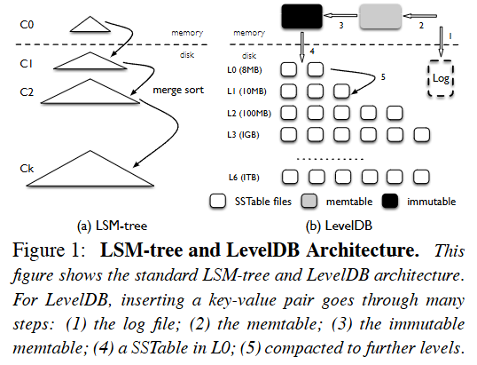
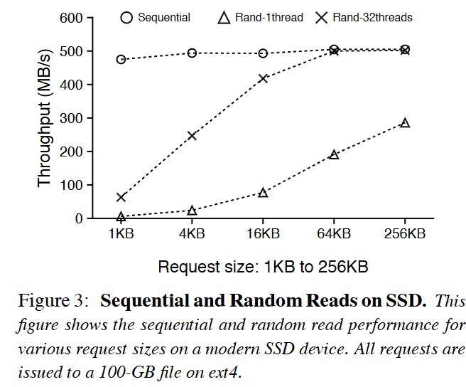
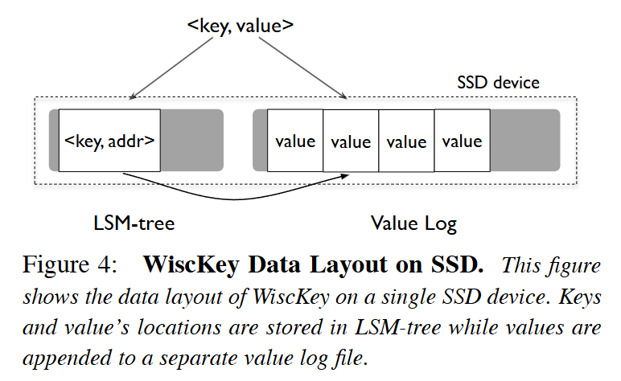

学习时间：2025.5.30

## Abstract

该论文提出了 KV 分离的方式来降低 LSM-Tree 的 IO 放大问题，并且针对 SSD 做了专门的优化，依此实现的 WiscKey 在 SSD 上基准测试中的性能表现优于 LevelDB 以及 RocksDB。

## Introduction

对于写密集的场景，LSM-Tree 可以说是最合适的技术了，相较于 B-Tree，它将随机写入转化为顺序写，非常合传统 HDD 的口味，并且其基于日志的特性，也深受分布式系统的青睐，如：Cassandra、TiKV、OceanBase 等等，Clickhouse 也是一种类 LSM 的存储引擎。

但是 LSM 有两个问题：写停顿以及 IO 放大。写停顿本文中不细说，WiscKey 主要解决的就是 IO 放大的问题。

LSM 为了保证读取的效率，需要周期的对写入磁盘的 SST 文件进行 compaction，这意味着对于对同一份数据会被多次的读取再写入磁盘，从而浪费磁盘的 IO 带宽，而且对于 SSD 这样写入再擦除会有磨损的存储介质，这回大大降低其寿命，除此之外 SSD 的顺序读写效率与随机读写效率的差距并没有 HDD 那么大，所以 LSM 的顺序写的优势在 SSD 上也不明显了。

## Background and Motivation

关于 LSM-Tree 和 LevelDB 的架构如下：

<figure markdown="span">
{ width="550" }
</figure>

LSM 架构不是讨论的重点，所以略过了。

## Fast Storage Hardware

对于 SSD 随机写的损耗是很大的，SSD 不像机械硬盘，可以随意覆盖旧数据，它在写数据前，必须先擦除整块（block），这会损耗 SSD 的寿命。

并且擦除也是非常昂贵的操作，所以为了性能，SSD 通常预留一部分未公开的空间（over-provisioning blocks）来优化写入，在刚开始写入时，SSD 使用这些预留块（reserved/over-provisioned blocks）缓存数据，所以即使是随机写入，性能也能维持较高水平；当预留块耗尽后，SSD 需要进行 GC（Garbage Collection）：移动有效数据、擦除旧块、再写入新数据，这回导致：写延迟增加、总写带宽下降、性能大幅下降。而 LSM 避免随机写入的特性是 SSD 的天然优势；许多 SSD 优化的键值存储都基于 LSM 树。

与 HDD 不同，SSD 的 随机读和顺序读之间的性能差距很小，在一些场景下，吞吐量甚至可以媲美顺序读取：

<figure markdown="span">
{ width="550" }
</figure>

如上图：单线程随机读吞吐量随请求大小增大而提高；多线程并发随机读（32 线程）在请求大于 16KB 时可达到和顺序读相近的性能。

使用传统的 LSM-tree 结构在 SSD 上时，如果仍然围绕“避免随机 I/O”的理念来设计，将会浪费大量 SSD 的带宽潜力，设计思路应该在于充分利用 SSD 的：

- 并行性（parallelism）

- 快速随机读能力

- 对写放大的敏感性

## WiscKey

为了实现对 SSD 的优化，WiscKey 提出四个关键思路： 

- Key-Value 分离；

- 在范围读取时，采用并行的随机读来读取 Value 文件中的分散数据；

- 利用独特的崩溃一致性和垃圾收集技术，高效管理 Value 文件；

- 在不牺牲一致性的情况下，移除 LSM-tree 日志来降低系统调用消耗。

### Key-Value Separation

WiscKey 的 Key-Value 分离，是将 Value 分离到一个单独的 log 文件中，LSM-Tree 中只存储 Key 和对应 Value 的在 log 中的偏移值：

<figure markdown="span">
{ width="550" }
</figure>

在现实场景中，大多数的 Key 都是比较小的，所以这可以大大减小 LSM-Tree 中 SST 文件的大小，整体数据量小了，IO 放大的问题也就没那么严重了。

### Parallel Range Query

### Garbage Collection

### Crash Consistency

## Optimizations

### Value-Log Write Buffer

### Optimizing the LSM-tree Log

## Implementation

---
